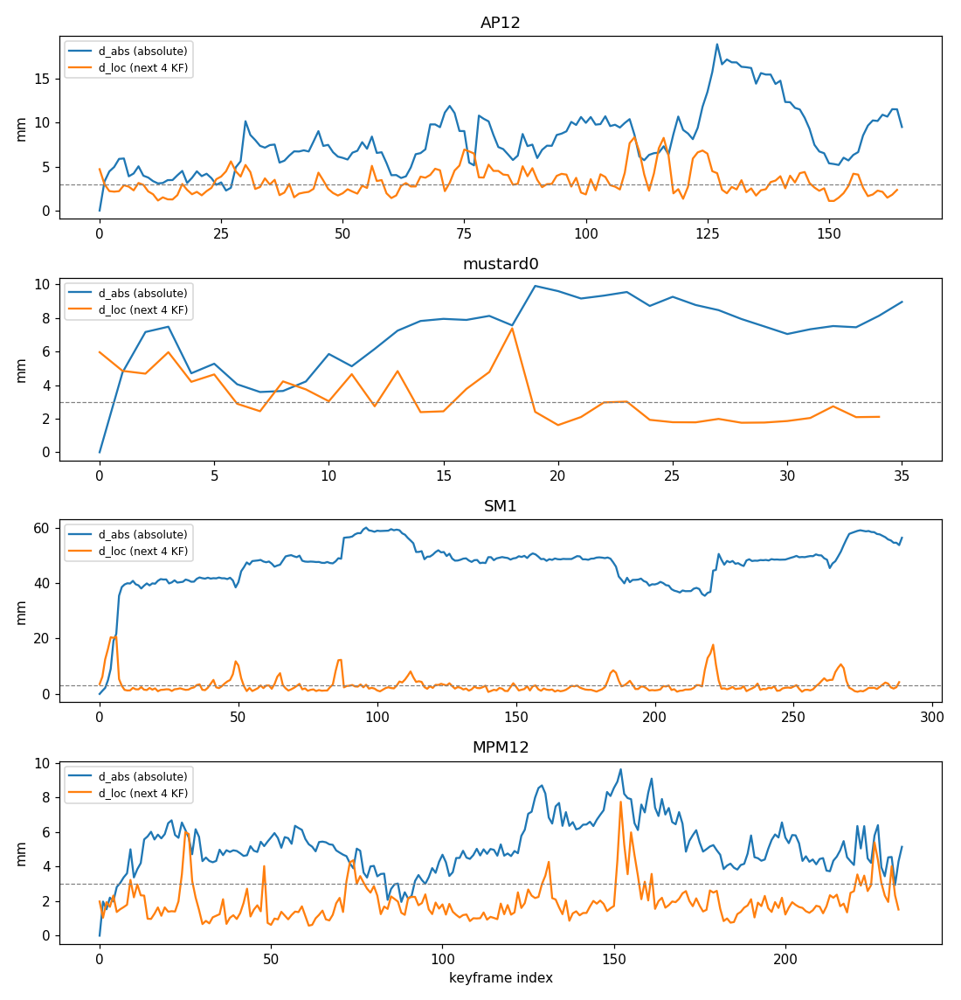

# EXP_BATCH_20260927 결과 — 3차 무인 배치: 지도 오염 분해와 기준 × 최적화기 probe (2026-09-27/28)

지시서 `EXP_BATCH_20260927_BRIEF.md` (브랜치 milestone5-v1, HEAD 7966d88). 본 코드 무수정(새 파일만: `experiments/exp_contamination_split.py`, `experiments/exp_reference_optimizer_probe.py`, `experiments/hygiene_runner.py`, `experiments/hygiene_unit_tests.py`, `experiments/analyze_reference_optimizer_probe.py`), 커밋 없음(지시서). 진행 기록 `logs/exp_batch_20260927/PROGRESS.md`, 자동 표 `logs/exp_batch_20260927/stage1_tables.md`, 판정 JSON `logs/exp_batch_20260927/stage1_verdict.json`.

## 1. 한 페이지 요약

**Q0. 지도 오염 중 잡음과 편향의 비율 — 약 1 : 2 (비붕괴), 붕괴 시퀀스는 거의 순수 편향.**
* 키프레임 간 불일치 d_loc는 절대 오염 d_abs의 34–39 %다(중앙값 비: AP12 2.89 / 7.36 mm, mustard0 2.74 / 7.50, MPM12 1.70 / 4.97). SM1(붕괴)은 d_abs 48.3 mm에 d_loc 2.2 mm(비 0.05).
* d_loc > 3 mm 키프레임 비율이 4개 시퀀스 모두 10 % 이상(12–47 %)이라 결정 규칙상 A1–A3를 모두 실행했다. 다만 d_loc의 큰 봉우리는 d_abs가 계단처럼 바뀌는 지점에 몰려 있어, "잡음" 몫에도 편향의 변화가 섞여 있다.

**Q1. 어떤 기준 × 최적화기가 포즈를 GT 쪽으로 옮기는가 — 통과 조합 없음. 전제 확인도 실패해 단계 2는 금지.**
* **전제 확인 실패**: GT 지도 + GN(RG + O3)이 GT+3° 교란을 개선한 비율 36 %(기준 ≥ 80 %), GT에서 시작한 깨끗한 뷰의 d 드리프트 중앙값 0.70 mm(기준 < 0.3). GN 구현은 합성 단위 확인에서 정확히 복구(반복 제한 없을 때 18/18 < 0.001°)했으므로, 원인은 구현이 아니라 목적함수의 정밀도(지도 서펠 중심이 GT 지도에서도 0.6–0.9 mm 어긋남)와 지시서의 반복 상한 8회(GT+3°에서 반복 수 중앙값 8 = 상한)다.
* **통과 조건 불충족**: 검증용 두 시퀀스에서 어떤 기준(RG 포함)도 "개선−악화 ≥ +10 pt, 악화 ≤ 15 %, SM1 d 감소"를 동시에 넘지 못했다. SM1은 트래커 포즈가 GT에서 d 48 mm 떨어져 있어 GT 지도로도 16–21 %만 개선된다(수렴 범위 밖).
* **핵심 대비(비붕괴 검증 시퀀스 MPM12, 트래커 포즈 probe, d 4.96 mm에서 출발)**:

| 기준 지도 | O3 GN: 개선 / 악화, d 후 | O2 Adam 200: 개선 / 악화, d 후 |
|---|---|---|
| RG (GT 포즈 지도) | **92 % / 0 %, 3.51 mm** | 79 % / 5 %, 3.46 mm |
| R0 (현재 규칙, 트래커 포즈 지도) | 12 % / 0 %, 4.86 mm | 12 % / 35 %, 5.41 mm |
| A1 / A2 / A3 (위생 지도) | 25 / 21 / 26 % 개선, 악화 1 %, 4.70–4.79 mm | 12–22 % / 36–44 %, 5.6–5.8 mm |
| RP (prior 단독) | 3 % / 95 %, 9.79 mm | 1 % / 99 %, 10.84 mm |

  같은 최적화기로 GT 지도는 92 %를 고치는데 트래커 지도는 12 %다. 병목은 최적화기가 아니라 트래커 오차를 흡수한 지도(원인 (a) 편향)라는 것이 이 배치에서도 재확인된다. 트래커 지도에서는 GT에서 시작한 뷰조차 트래커 쪽으로 끌려간다(R0 GT 시작 d 드리프트 O3 2.1 mm, O2 7.4 mm; RG는 0.7 / 3.5 mm).
* **판독 가이드**:
  - "RG만 통과 → (a) 편향 확정": RG도 SM1 때문에 통과하지 못해 문장을 그대로 적용할 수는 없다. 비붕괴 시퀀스의 위 대비로 보면 (a)가 주원인이다.
  - "RP 통과 → prior 판사 후보": 해당 없음. prior 단독 지도는 오히려 크게 악화시킨다(MPM12 95–99 %, AP12 O2 91 %).
  - "위생 채택 후보": A1·A3 + O3의 검증용 개선률 12 %가 R0의 5 %보다 잡음(2σ) 밖으로 높다. 그러나 통과 기준과 거리가 멀고, 단위 확인 (2)에서 A1 규칙이 표면 위 위치 오차(3° → 2.6 mm, 10° → 8.7 mm 미끄러짐)를 원리적으로 거르지 못함을 보였다. 위생 지도는 Gaussian이 R0보다 14–29 % 많다(HO3D).
  - "O3 ≈ O4 → GN 이득은 목적함수 덕": R0·A1·A2·A3·RG에서 성립(순효과 차이가 2σ 안). RP에서만 O3 ≠ O4.
  - "H5 해소 수단 확인": GT 지도에서 깨끗한 뷰의 드리프트가 O1 2.42 / O2 3.53 / O4 3.11 mm → O3 0.70 mm로 줄었다. 목표(< 0.3 mm)에는 못 미친다.
* **최적화기**: 점-서펠 GN(O3)은 비-GT 지도에서 가장 덜 해롭다. MPM12 트래커 probe 악화 0–1 %, 조정용 순효과 R0 +30 pt. 현재 손실 + Adam 200 스텝(O2)은 R0 AP12 악화 57 %, MPM12 35 %로 해롭다. 현재 온라인 양(O1, 3 스텝)은 선택된 여유값(m = 0.2)에서 사실상 아무것도 채택하지 않는다.

**Q2. 온라인 확인 — 실행하지 않음.** 3.6의 전제 확인 실패로 지시서상 단계 2 금지.

**사용자가 결정할 것 — 시스템 방향 (a)/(b)/(c)에 주는 의미**
* (a) GS 피드백 계속 고치기: 트래커 포즈로 만든 지도는 이번 네 가지 방식(현재·위생 A1–A3)으로도 GT 쪽 기준이 되지 못한다. prior 단독은 더 나쁘다. 지도 오염의 약 3분의 2가 일관된 편향이고, 편향은 지도 위생이나 최적화기로 걸러지지 않는다. GN + 채택 판정은 해악(H5 드리프트, 악화율)을 줄이는 수단으로는 유효하지만, 트래커 단독을 이길 근거는 이번에도 없다. (a)를 계속하려면 트래커와 독립인 정확한 기준(정확한 prior 형상·스케일, 또는 원본처럼 전 키프레임 공동 정제)이 먼저 필요하다.
* (b) 하이브리드(포즈 원본 SDF 피드백 + 복원 GS): 이번 배치는 새 근거를 더하지 않지만, "GT에 가까운 포즈가 있으면 지도가 기준이 된다"(RG 92 %)는 결과와 일관된다. 측정된 최고 복원(HO3D P1 0.319)도 이 구성이다.
* (c) 트래커 단독 + GS: 이번 배치의 모든 probe는 noop(트래커 단독) 포즈에서 출발했고, 어떤 비-GT 지도도 그 포즈를 체계적으로 고치지 못했다. (c)는 추적 성능을 트래커 수준(HO3D 1.674)에 고정한다.
## 2. 단계 0 — 지도 오염의 잡음/편향 분해 (Q0)

noop 실행(트래커 단독 포즈로 GS 지도를 만든 실행)의 소비 시점 포즈 A_k(키프레임 k를 처음 받은 사이클의 `poses_before_gs.txt`)로, GT 메시 점 20,000개의 평균 변위를 쟀다. d_abs(k) = 절대 오염, d_loc(k) = 다음 키프레임 4장과의 상대 변위 중앙값(위생 검증 창과 같은 크기).

| seq | KF | d_abs 중앙값 / p90 (mm) | d_loc 중앙값 / p90 (mm) | d_loc/d_abs | d_loc > 3 mm | d_loc > 5 mm |
|---|---|---|---|---|---|---|
| AP12 | 166 | 7.36 / 12.34 | 2.89 / 5.11 | 0.39 | 47 % | 12 % |
| mustard0 | 36 | 7.50 / 9.29 | 2.74 / 4.84 | 0.36 | 43 % | 9 % |
| SM1 (붕괴) | 290 | 48.32 / 57.58 | 2.18 / 5.75 | 0.05 | 30 % | 13 % |
| MPM12 | 235 | 4.97 / 7.14 | 1.70 / 3.16 | 0.34 | 12 % | 3 % |

* 결정 규칙(d_loc > 3 mm가 10 % 이상인 시퀀스 ≥ 2/4)은 4/4로 충족 → A1–A3 모두 실행했다.
* 해석: 비붕괴 세 시퀀스에서 키프레임 간 불일치(d_loc)는 절대 오염의 34–39 %다. 즉 오염의 약 3분의 2는 이웃 키프레임끼리 일관된 편향(느리게 움직이는 오프셋)이고, 약 3분의 1이 들쭉날쭉한 성분이다. 그림에서 d_loc의 큰 봉우리는 대부분 d_abs가 계단처럼 바뀌는 지점(AP12 KF 75·115·125, SM1 KF 5·85·220)에 있어, "잡음"으로 잡힌 몫에도 편향의 변화가 섞여 있다. SM1은 KF 5 부근 붕괴 이후 40–60 mm 오프셋이 그대로 유지되는 순수 편향(비율 0.05)이다.

## 3. 단계 1 — 구현, 단위 확인, 표

### 3.1 구현과 스스로 정한 값
* 포즈 소스: 새 noop 온라인 실행 4개(`outputs/exp_batch_20260927/noop/...`, 본 코드 진입점 `run_ho3d.py` / `run_custom.py`, `--gs_feedback noop`, 500/500, 기본 러너 설정). 1차 배치 noop 대조군을 재현했다(ADD AP12 0.890 vs 0.820·0.894, MPM12 0.536 vs 0.531, mustard0 0.744 vs 0.748, SM1 4.486 vs 4.520).
* 재생: `exp_feedback_gradient_probe_gtmap`의 순서 그대로(첫 사이클 = prior + 첫 키프레임들로 `init_runner_like_online`, 이후 사이클마다 저장 뷰 포즈 갱신 → probe → `update(500)`), 초기화 500 스텝. R0·A = noop 포즈, RG = GT 포즈, RP = prior만(전이·제거 없음, 학습 0).
* probe 시점: HO3D는 사이클 순번이 3의 배수인 사이클, mustard0는 매 사이클; 그 사이클의 최신 키프레임(append 전) 하나.
* 시작 포즈: 트래커(noop 소비 시점), GT, GT+3° × 2, GT+10° × 2 (`perturbed_pose`, 물체 중심 회전, 시드 = 프레임 id × 100 + 각도 × 10 + 표본 번호, 이동 0). 포즈는 SO(3)로 투영 후 사용(float32 저장 포즈의 비정규성 2e-7이 arccos 각도를 0.03° 부풀림), 각도는 2 asin(|ΔR|/2√2).
* O1/O2: `probe_view`의 포즈 단독 경로와 같은 식(정규화 좌표의 se3 좌곱 델타, Adam eps 1e-15, 무한대 노름 0.1 클립, 손실 = 러너의 L1·DSSIM·depth 가중합)을 비용 c0/c1과 최종 포즈가 나오도록 다시 적었다(probe_view 자체는 R0의 기울기 cos 기록에 사용). 지도 고정을 위해 probe 동안 splat의 requires_grad를 끔(델타 기울기는 동일).
* O3/O4(3.4): 입력 점 = 침식 2 px 마스크의 유효 depth, 최대 5,000개 고정 시드 균등 무작위; 참조 = 불투명도 ≥ 0.1, CONTRADICTED·SUSPECT 제외 중심, 법선 = k = 16 최근접 PCA 최소 고유벡터(부호 무관); 대응 2 cm; 이상치 |r| ≤ med(|r|) + 2.5·MAD(|r|); Huber 2 mm; 감쇠 1e-4; 클립 2 cm / 0.2 rad; 반걸음 재시도; 최대 8회; 종료 0.1 mm & 1e-3 rad; 채택 = 최종 비용 < 시작 비용 & 유효 비율 ≥ 15 %. 대응·가중은 반복마다 다시 계산. O4는 같은 비용을 Adam lr 1e-3 × 200(대응·가중 매 스텝 재계산).
* 여유값 m: 조정용 두 시퀀스 각각의 (개선률 − 악화률)을 평균해 최대인 m을 조합별로 선택(동점이면 작은 m).
* 위생 러너(3.3) 해석: 후보는 출생 좌표로 투영; 한 update에 프레임이 여럿이면 출생은 마지막 프레임; 관측은 출생 좌표 포함 최근 8개; 폐기 사유 우선순위 never_good → few_obs → streak → spread → angle; 후보가 없는 뷰는 A3에서 학습 대상; A2 게이트는 prior 계열 UNSEEN에만 적용하고, 막힌 splat도 본 코드처럼 충돌 카운트는 초기화.

### 3.2 단위 확인
* GN(3.4, `unit_tests/gn_unit_test.txt`): RP 기준(AP12 prior 20,000 중심), 알려진 포즈의 시야 안 중심점으로 합성, 3°/5 mm 교란 18회. 반복 제한 30: 18/18 < 0.001°/0.001 mm(7–11회), 교란 0 → 0.000000°. 지시서 제한 8회: 14/18이 0.1°/0.3 mm 안, 나머지 4개는 0.04–0.36°/0.6–2.6 mm(원통형 물통의 미끄러짐 방향 수렴이 느림). **구현 정상**, 반복 상한은 지시서 값 8을 유지(판단 지점).
* 위생 러너(3.3, mustard0, BSDF SAM2 기준 실행 프레임 읽기 전용, 초기 5 + 갱신 10 키프레임, GT 포즈):
  1. A1 승격률 79.2 % → 통과(≥ 70 %).
  2. KF5만 3° 교란 → KF5 후보 폐기율 17.5 % → **실패**(≥ 70 %). 진단: 3°는 후보 점을 중앙값 2.6 mm, 10°도 8.7 mm만 옮기고(물체 중심 회전 = 표면을 따라 미끄러짐) 10°에서도 폐기율 23 %. 뒤 키프레임의 depth는 그 자리에서도 맞으므로(허용 2 cm) 지시서의 기하 검증은 표면 위 위치 오차를 원리적으로 거르지 못한다. 구현 오류가 아니라 판정 규칙의 성질이다.
  3. 스위치 off vs 본 코드: 같은 초기 체크포인트에서 갱신 10회 — Gaussian 수 10회 모두 동일, 최종 손실 최대 차 7.8e-5(본 코드끼리 1.3e-4) → 통과. (별도 재생 비교는 prior Sim(3) 정합이 실행마다 달라 쓸 수 없었다.)
* A 계열은 (2)의 한계를 명시한 채 단계 0 결정대로 실행했다.

### 3.3 A 계열 지도 통계 (재생 전체 합계)

| 기준 | seq | 출생 후보 | 승격 | 폐기 | 승격률 | 최종 Gaussian (R0 대비) | A2 게이트가 막은 prior (마지막 사이클) |
|---|---|---|---|---|---|---|---|
| A1 | AP12 | 706,027 | 567,129 | 134,329 | 81 % | 582,789 (+29 %) | – |
| A1 | MPM12 | 155,231 | 108,754 | 43,630 | 71 % | 127,717 (+14 %) | – |
| A1 | SM1 | 251,711 | 191,844 | 57,732 | 77 % | 198,035 (+23 %) | – |
| A1 | mustard0 | 37,266 | 26,919 | 6,053 | 82 % | 46,767 (−9 %) | – |
| A2 / A3 | 네 시퀀스 | A1과 ±0.1 % | | | 같음 | A1과 ±0.1 % | AP12 26 / 25, mustard0 15 / 20, MPM12 3 / 3, SM1 0 / 0 |

폐기 사유는 대부분 never_good(검증 한 번도 못 받음)과 few_obs이고 spread·angle은 1 % 미만이다. R0 최종 Gaussian은 AP12 451,217, MPM12 112,453, SM1 161,141, mustard0 51,220. A3의 학습 제외 뷰는 마지막 사이클에 3–19개(전체의 3–8 %).

### 3.4 R0 기울기 방향 (이전 gradient probe와 비교)
트래커 포즈에서 total 손실 기울기의 회전 성분이 참 보정 방향을 가리키는 비율: AP12 43 %, MPM12 65 %, SM1 49 %, mustard0 77 %. 이전 probe(당시 v1 피드백 포즈 지도, 초기화 4000 스텝)의 트래커 지도 40 %와 비슷한 수준이다(GT 지도는 당시 99 %). 이번에는 noop 포즈 지도·500 스텝이라 조건이 다르다.

### 3.5 자동 표 (전부)
아래는 `experiments/analyze_reference_optimizer_probe.py`가 만든 `logs/exp_batch_20260927/stage1_tables.md` 전체다. 잡음 표시: 개선률 차이는 이항 표준오차 2σ로 판정했다(판독 가이드 자동 점검 참조).

개선 = d 감소 ≥ max(0.5 mm, 10 %), 악화 = d 증가 ≥ max(0.5 mm, 10 %). d = GT 메시 점 평균 변위(mm). 판정 규칙: ρ = (c0 − c1)/c0 ≥ m이면 결과 채택, 아니면 시작 포즈 유지.

#### 1. 여유값 m 선택 (조정용 AP12·mustard0, 트래커 포즈 probe; 두 시퀀스 (개선률 − 악화률)의 평균)

| 기준 | 최적화기 | m=0.0 | m=0.05 | m=0.1 | m=0.2 | m=0.3 | 선택 m |
|---|---|---|---|---|---|---|---|
| R0 | O1 | -8 | -4 | -1 | +0 | +0 | 0.2 |
| R0 | O2 | -9 | -17 | -9 | -4 | +0 | 0.3 |
| R0 | O3 | +30 | +28 | +28 | +23 | +14 | 0.0 |
| R0 | O4 | +20 | +20 | +17 | +10 | +1 | 0.0 |
| A1 | O1 | -17 | -11 | -4 | +0 | +0 | 0.2 |
| A1 | O2 | -24 | -24 | -16 | -5 | +0 | 0.3 |
| A1 | O3 | +18 | +18 | +18 | +16 | +12 | 0.0 |
| A1 | O4 | +9 | +9 | +7 | +7 | +1 | 0.0 |
| A2 | O1 | -20 | -12 | -3 | +0 | +0 | 0.2 |
| A2 | O2 | -27 | -29 | -17 | -7 | +0 | 0.3 |
| A2 | O3 | +22 | +22 | +22 | +18 | +17 | 0.0 |
| A2 | O4 | +10 | +10 | +10 | +7 | +1 | 0.0 |
| A3 | O1 | -22 | -18 | -10 | +0 | +0 | 0.2 |
| A3 | O2 | -30 | -36 | -30 | -9 | -3 | 0.3 |
| A3 | O3 | +16 | +16 | +16 | +16 | +12 | 0.0 |
| A3 | O4 | +14 | +14 | +14 | +10 | +6 | 0.0 |
| RP | O1 | -6 | +10 | +3 | +0 | +0 | 0.05 |
| RP | O2 | -90 | -76 | -58 | +0 | +0 | 0.2 |
| RP | O3 | -11 | -11 | -11 | -11 | -11 | 0.0 |
| RP | O4 | -44 | -44 | -44 | -44 | -44 | 0.0 |
| RG | O1 | +34 | +29 | +18 | +1 | +0 | 0.0 |
| RG | O2 | +71 | +71 | +64 | +38 | +12 | 0.0 |
| RG | O3 | +55 | +55 | +55 | +55 | +53 | 0.0 |
| RG | O4 | +62 | +62 | +62 | +61 | +61 | 0.0 |

#### 2. 조정용 (AP12, mustard0) — 선택된 m 적용, probe 종류별

| 기준 | 최적화기 | m | probe | seq | n | 개선률 | 악화률 | 개선−악화 | d 중앙값 전 → 후 (mm) | d p90 전 → 후 | 채택률 |
|---|---|---|---|---|---|---|---|---|---|---|---|
| R0 | O1 | 0.2 | (i) 트래커 | AP12 | 53 | 0 % | 0 % | +0 | 7.16 → 7.16 | 12.23 → 12.23 | 0 % |
| R0 | O1 | 0.2 | (i) 트래커 | mustard0 | 31 | 0 % | 0 % | +0 | 7.81 → 7.81 | 9.32 → 9.32 | 0 % |
| R0 | O1 | 0.2 | (ii) GT | AP12 | 53 | 0 % | 8 % | -8 | 0.00 → 0.00 | 0.00 → 0.00 | 8 % |
| R0 | O1 | 0.2 | (ii) GT | mustard0 | 31 | 0 % | 35 % | -35 | 0.00 → 0.00 | 0.00 → 5.07 | 35 % |
| R0 | O1 | 0.2 | (iii) GT+3° | AP12 | 106 | 0 % | 15 % | -15 | 4.00 → 4.13 | 4.38 → 5.83 | 15 % |
| R0 | O1 | 0.2 | (iii) GT+3° | mustard0 | 62 | 0 % | 32 % | -32 | 2.54 → 2.77 | 2.91 → 5.63 | 35 % |
| R0 | O1 | 0.2 | (iv) GT+10° | AP12 | 106 | 5 % | 0 % | +5 | 13.36 → 13.11 | 14.48 → 14.48 | 16 % |
| R0 | O1 | 0.2 | (iv) GT+10° | mustard0 | 62 | 8 % | 3 % | +5 | 8.93 → 8.74 | 9.62 → 9.62 | 42 % |
| R0 | O2 | 0.3 | (i) 트래커 | AP12 | 53 | 0 % | 0 % | +0 | 7.16 → 7.16 | 12.23 → 12.23 | 0 % |
| R0 | O2 | 0.3 | (i) 트래커 | mustard0 | 31 | 0 % | 0 % | +0 | 7.81 → 7.81 | 9.32 → 9.32 | 0 % |
| R0 | O2 | 0.3 | (ii) GT | AP12 | 53 | 0 % | 25 % | -25 | 0.00 → 0.00 | 0.00 → 13.17 | 25 % |
| R0 | O2 | 0.3 | (ii) GT | mustard0 | 31 | 0 % | 74 % | -74 | 0.00 → 6.98 | 0.00 → 8.56 | 74 % |
| R0 | O2 | 0.3 | (iii) GT+3° | AP12 | 106 | 0 % | 32 % | -32 | 4.00 → 4.17 | 4.38 → 12.63 | 32 % |
| R0 | O2 | 0.3 | (iii) GT+3° | mustard0 | 62 | 0 % | 74 % | -74 | 2.54 → 7.14 | 2.91 → 8.55 | 74 % |
| R0 | O2 | 0.3 | (iv) GT+10° | AP12 | 106 | 60 % | 8 % | +52 | 13.36 → 10.46 | 14.48 → 14.09 | 74 % |
| R0 | O2 | 0.3 | (iv) GT+10° | mustard0 | 62 | 55 % | 11 % | +44 | 8.93 → 7.75 | 9.62 → 9.26 | 90 % |
| R0 | O3 | 0.0 | (i) 트래커 | AP12 | 53 | 6 % | 8 % | -2 | 7.16 → 7.37 | 12.23 → 12.32 | 100 % |
| R0 | O3 | 0.0 | (i) 트래커 | mustard0 | 31 | 65 % | 3 % | +61 | 7.81 → 6.82 | 9.32 → 7.90 | 100 % |
| R0 | O3 | 0.0 | (ii) GT | AP12 | 53 | 0 % | 100 % | -100 | 0.00 → 1.95 | 0.00 → 2.81 | 100 % |
| R0 | O3 | 0.0 | (ii) GT | mustard0 | 31 | 0 % | 94 % | -94 | 0.00 → 2.46 | 0.00 → 3.19 | 100 % |
| R0 | O3 | 0.0 | (iii) GT+3° | AP12 | 106 | 40 % | 16 % | +24 | 4.00 → 3.66 | 4.38 → 4.59 | 100 % |
| R0 | O3 | 0.0 | (iii) GT+3° | mustard0 | 62 | 8 % | 50 % | -42 | 2.54 → 3.07 | 2.91 → 4.76 | 100 % |
| R0 | O3 | 0.0 | (iv) GT+10° | AP12 | 106 | 87 % | 0 % | +87 | 13.36 → 9.59 | 14.48 → 11.76 | 100 % |
| R0 | O3 | 0.0 | (iv) GT+10° | mustard0 | 62 | 84 % | 0 % | +84 | 8.93 → 6.30 | 9.62 → 7.98 | 100 % |
| R0 | O4 | 0.0 | (i) 트래커 | AP12 | 53 | 23 % | 38 % | -15 | 7.16 → 7.75 | 12.23 → 13.00 | 100 % |
| R0 | O4 | 0.0 | (i) 트래커 | mustard0 | 31 | 61 % | 6 % | +55 | 7.81 → 5.74 | 9.32 → 7.89 | 97 % |
| R0 | O4 | 0.0 | (ii) GT | AP12 | 53 | 0 % | 100 % | -100 | 0.00 → 6.56 | 0.00 → 9.04 | 100 % |
| R0 | O4 | 0.0 | (ii) GT | mustard0 | 31 | 0 % | 100 % | -100 | 0.00 → 5.63 | 0.00 → 7.32 | 100 % |
| R0 | O4 | 0.0 | (iii) GT+3° | AP12 | 106 | 10 % | 79 % | -69 | 4.00 → 6.64 | 4.38 → 10.14 | 100 % |
| R0 | O4 | 0.0 | (iii) GT+3° | mustard0 | 62 | 0 % | 92 % | -92 | 2.54 → 5.41 | 2.91 → 7.47 | 100 % |
| R0 | O4 | 0.0 | (iv) GT+10° | AP12 | 106 | 84 % | 7 % | +77 | 13.36 → 8.49 | 14.48 → 12.73 | 100 % |
| R0 | O4 | 0.0 | (iv) GT+10° | mustard0 | 62 | 55 % | 26 % | +29 | 8.93 → 7.26 | 9.62 → 10.46 | 100 % |
| A1 | O1 | 0.2 | (i) 트래커 | AP12 | 53 | 0 % | 0 % | +0 | 7.16 → 7.16 | 12.23 → 12.23 | 0 % |
| A1 | O1 | 0.2 | (i) 트래커 | mustard0 | 31 | 0 % | 0 % | +0 | 7.81 → 7.81 | 9.32 → 9.32 | 0 % |
| A1 | O1 | 0.2 | (ii) GT | AP12 | 53 | 0 % | 9 % | -9 | 0.00 → 0.00 | 0.00 → 0.00 | 9 % |
| A1 | O1 | 0.2 | (ii) GT | mustard0 | 31 | 0 % | 23 % | -23 | 0.00 → 0.00 | 0.00 → 4.63 | 23 % |
| A1 | O1 | 0.2 | (iii) GT+3° | AP12 | 106 | 0 % | 10 % | -10 | 4.00 → 4.10 | 4.38 → 4.62 | 10 % |
| A1 | O1 | 0.2 | (iii) GT+3° | mustard0 | 62 | 0 % | 27 % | -27 | 2.54 → 2.75 | 2.91 → 5.65 | 27 % |
| A1 | O1 | 0.2 | (iv) GT+10° | AP12 | 106 | 3 % | 0 % | +3 | 13.36 → 13.30 | 14.48 → 14.48 | 11 % |
| A1 | O1 | 0.2 | (iv) GT+10° | mustard0 | 62 | 5 % | 5 % | +0 | 8.93 → 8.74 | 9.62 → 9.62 | 39 % |
| A1 | O2 | 0.3 | (i) 트래커 | AP12 | 53 | 0 % | 0 % | +0 | 7.16 → 7.16 | 12.23 → 12.23 | 0 % |
| A1 | O2 | 0.3 | (i) 트래커 | mustard0 | 31 | 0 % | 0 % | +0 | 7.81 → 7.81 | 9.32 → 9.32 | 0 % |
| A1 | O2 | 0.3 | (ii) GT | AP12 | 53 | 0 % | 21 % | -21 | 0.00 → 0.00 | 0.00 → 13.23 | 21 % |
| A1 | O2 | 0.3 | (ii) GT | mustard0 | 31 | 0 % | 65 % | -65 | 0.00 → 7.08 | 0.00 → 8.64 | 65 % |
| A1 | O2 | 0.3 | (iii) GT+3° | AP12 | 106 | 0 % | 29 % | -29 | 4.00 → 4.16 | 4.38 → 12.75 | 29 % |
| A1 | O2 | 0.3 | (iii) GT+3° | mustard0 | 62 | 0 % | 69 % | -69 | 2.54 → 7.11 | 2.91 → 8.67 | 69 % |
| A1 | O2 | 0.3 | (iv) GT+10° | AP12 | 106 | 52 % | 8 % | +44 | 13.36 → 11.05 | 14.48 → 14.08 | 67 % |
| A1 | O2 | 0.3 | (iv) GT+10° | mustard0 | 62 | 60 % | 10 % | +50 | 8.93 → 7.33 | 9.62 → 9.29 | 89 % |
| A1 | O3 | 0.0 | (i) 트래커 | AP12 | 53 | 11 % | 21 % | -9 | 7.16 → 7.49 | 12.23 → 12.05 | 100 % |
| A1 | O3 | 0.0 | (i) 트래커 | mustard0 | 31 | 58 % | 13 % | +45 | 7.81 → 6.73 | 9.32 → 7.50 | 100 % |
| A1 | O3 | 0.0 | (ii) GT | AP12 | 53 | 0 % | 100 % | -100 | 0.00 → 2.51 | 0.00 → 3.45 | 100 % |
| A1 | O3 | 0.0 | (ii) GT | mustard0 | 31 | 0 % | 94 % | -94 | 0.00 → 2.38 | 0.00 → 4.29 | 100 % |
| A1 | O3 | 0.0 | (iii) GT+3° | AP12 | 106 | 32 % | 25 % | +7 | 4.00 → 3.76 | 4.38 → 5.20 | 100 % |
| A1 | O3 | 0.0 | (iii) GT+3° | mustard0 | 62 | 3 % | 63 % | -60 | 2.54 → 3.48 | 2.91 → 5.93 | 100 % |
| A1 | O3 | 0.0 | (iv) GT+10° | AP12 | 106 | 89 % | 0 % | +89 | 13.36 → 9.22 | 14.48 → 11.35 | 100 % |
| A1 | O3 | 0.0 | (iv) GT+10° | mustard0 | 62 | 79 % | 3 % | +76 | 8.93 → 6.62 | 9.62 → 8.54 | 100 % |
| A1 | O4 | 0.0 | (i) 트래커 | AP12 | 53 | 23 % | 43 % | -21 | 7.16 → 8.10 | 12.23 → 13.01 | 100 % |
| A1 | O4 | 0.0 | (i) 트래커 | mustard0 | 31 | 65 % | 26 % | +39 | 7.81 → 5.95 | 9.32 → 7.98 | 100 % |
| A1 | O4 | 0.0 | (ii) GT | AP12 | 53 | 0 % | 100 % | -100 | 0.00 → 6.53 | 0.00 → 8.39 | 100 % |
| A1 | O4 | 0.0 | (ii) GT | mustard0 | 31 | 0 % | 100 % | -100 | 0.00 → 5.33 | 0.00 → 8.37 | 100 % |
| A1 | O4 | 0.0 | (iii) GT+3° | AP12 | 106 | 7 % | 84 % | -77 | 4.00 → 6.56 | 4.38 → 9.66 | 100 % |
| A1 | O4 | 0.0 | (iii) GT+3° | mustard0 | 62 | 0 % | 98 % | -98 | 2.54 → 5.55 | 2.91 → 8.12 | 100 % |
| A1 | O4 | 0.0 | (iv) GT+10° | AP12 | 106 | 84 % | 6 % | +78 | 13.36 → 8.83 | 14.48 → 12.55 | 100 % |
| A1 | O4 | 0.0 | (iv) GT+10° | mustard0 | 62 | 61 % | 18 % | +44 | 8.93 → 7.25 | 9.62 → 10.20 | 100 % |
| A2 | O1 | 0.2 | (i) 트래커 | AP12 | 53 | 0 % | 0 % | +0 | 7.16 → 7.16 | 12.23 → 12.23 | 0 % |
| A2 | O1 | 0.2 | (i) 트래커 | mustard0 | 31 | 0 % | 0 % | +0 | 7.81 → 7.81 | 9.32 → 9.32 | 0 % |
| A2 | O1 | 0.2 | (ii) GT | AP12 | 53 | 0 % | 8 % | -8 | 0.00 → 0.00 | 0.00 → 0.00 | 8 % |
| A2 | O1 | 0.2 | (ii) GT | mustard0 | 31 | 0 % | 23 % | -23 | 0.00 → 0.00 | 0.00 → 4.75 | 23 % |
| A2 | O1 | 0.2 | (iii) GT+3° | AP12 | 106 | 0 % | 11 % | -11 | 4.00 → 4.10 | 4.38 → 6.70 | 11 % |
| A2 | O1 | 0.2 | (iii) GT+3° | mustard0 | 62 | 0 % | 32 % | -32 | 2.54 → 2.77 | 2.91 → 5.81 | 32 % |
| A2 | O1 | 0.2 | (iv) GT+10° | AP12 | 106 | 3 % | 1 % | +2 | 13.36 → 13.34 | 14.48 → 14.48 | 11 % |
| A2 | O1 | 0.2 | (iv) GT+10° | mustard0 | 62 | 3 % | 6 % | -3 | 8.93 → 8.78 | 9.62 → 9.76 | 37 % |
| A2 | O2 | 0.3 | (i) 트래커 | AP12 | 53 | 0 % | 0 % | +0 | 7.16 → 7.16 | 12.23 → 12.23 | 0 % |
| A2 | O2 | 0.3 | (i) 트래커 | mustard0 | 31 | 0 % | 0 % | +0 | 7.81 → 7.81 | 9.32 → 9.32 | 0 % |
| A2 | O2 | 0.3 | (ii) GT | AP12 | 53 | 0 % | 23 % | -23 | 0.00 → 0.00 | 0.00 → 13.33 | 23 % |
| A2 | O2 | 0.3 | (ii) GT | mustard0 | 31 | 0 % | 65 % | -65 | 0.00 → 7.27 | 0.00 → 8.37 | 65 % |
| A2 | O2 | 0.3 | (iii) GT+3° | AP12 | 106 | 0 % | 33 % | -33 | 4.00 → 4.19 | 4.38 → 13.30 | 33 % |
| A2 | O2 | 0.3 | (iii) GT+3° | mustard0 | 62 | 0 % | 69 % | -69 | 2.54 → 7.52 | 2.91 → 8.31 | 69 % |
| A2 | O2 | 0.3 | (iv) GT+10° | AP12 | 106 | 50 % | 6 % | +44 | 13.36 → 10.93 | 14.48 → 14.01 | 63 % |
| A2 | O2 | 0.3 | (iv) GT+10° | mustard0 | 62 | 61 % | 11 % | +50 | 8.93 → 7.57 | 9.62 → 8.79 | 90 % |
| A2 | O3 | 0.0 | (i) 트래커 | AP12 | 53 | 13 % | 15 % | -2 | 7.16 → 7.28 | 12.23 → 12.24 | 100 % |
| A2 | O3 | 0.0 | (i) 트래커 | mustard0 | 31 | 58 % | 13 % | +45 | 7.81 → 6.79 | 9.32 → 7.87 | 100 % |
| A2 | O3 | 0.0 | (ii) GT | AP12 | 53 | 0 % | 100 % | -100 | 0.00 → 2.50 | 0.00 → 3.53 | 100 % |
| A2 | O3 | 0.0 | (ii) GT | mustard0 | 31 | 0 % | 100 % | -100 | 0.00 → 2.85 | 0.00 → 4.68 | 100 % |
| A2 | O3 | 0.0 | (iii) GT+3° | AP12 | 106 | 33 % | 24 % | +9 | 4.00 → 3.78 | 4.38 → 5.15 | 100 % |
| A2 | O3 | 0.0 | (iii) GT+3° | mustard0 | 62 | 8 % | 65 % | -56 | 2.54 → 3.42 | 2.91 → 5.44 | 100 % |
| A2 | O3 | 0.0 | (iv) GT+10° | AP12 | 106 | 89 % | 0 % | +89 | 13.36 → 9.21 | 14.48 → 11.28 | 100 % |
| A2 | O3 | 0.0 | (iv) GT+10° | mustard0 | 62 | 81 % | 3 % | +77 | 8.93 → 6.67 | 9.62 → 8.17 | 100 % |
| A2 | O4 | 0.0 | (i) 트래커 | AP12 | 53 | 28 % | 40 % | -11 | 7.16 → 7.75 | 12.23 → 13.18 | 100 % |
| A2 | O4 | 0.0 | (i) 트래커 | mustard0 | 31 | 61 % | 29 % | +32 | 7.81 → 6.75 | 9.32 → 8.21 | 100 % |
| A2 | O4 | 0.0 | (ii) GT | AP12 | 53 | 0 % | 100 % | -100 | 0.00 → 6.57 | 0.00 → 8.28 | 100 % |
| A2 | O4 | 0.0 | (ii) GT | mustard0 | 31 | 0 % | 100 % | -100 | 0.00 → 5.67 | 0.00 → 8.16 | 100 % |
| A2 | O4 | 0.0 | (iii) GT+3° | AP12 | 106 | 10 % | 75 % | -65 | 4.00 → 6.23 | 4.38 → 9.07 | 100 % |
| A2 | O4 | 0.0 | (iii) GT+3° | mustard0 | 62 | 0 % | 97 % | -97 | 2.54 → 5.82 | 2.91 → 8.00 | 100 % |
| A2 | O4 | 0.0 | (iv) GT+10° | AP12 | 106 | 83 % | 8 % | +75 | 13.36 → 8.50 | 14.48 → 12.23 | 100 % |
| A2 | O4 | 0.0 | (iv) GT+10° | mustard0 | 62 | 56 % | 23 % | +34 | 8.93 → 7.27 | 9.62 → 11.51 | 100 % |
| A3 | O1 | 0.2 | (i) 트래커 | AP12 | 53 | 0 % | 0 % | +0 | 7.16 → 7.16 | 12.23 → 12.23 | 0 % |
| A3 | O1 | 0.2 | (i) 트래커 | mustard0 | 31 | 0 % | 0 % | +0 | 7.81 → 7.81 | 9.32 → 9.32 | 0 % |
| A3 | O1 | 0.2 | (ii) GT | AP12 | 53 | 0 % | 6 % | -6 | 0.00 → 0.00 | 0.00 → 0.00 | 6 % |
| A3 | O1 | 0.2 | (ii) GT | mustard0 | 31 | 0 % | 19 % | -19 | 0.00 → 0.00 | 0.00 → 5.08 | 19 % |
| A3 | O1 | 0.2 | (iii) GT+3° | AP12 | 106 | 0 % | 6 % | -6 | 4.00 → 4.02 | 4.38 → 4.42 | 6 % |
| A3 | O1 | 0.2 | (iii) GT+3° | mustard0 | 62 | 0 % | 15 % | -15 | 2.54 → 2.69 | 2.91 → 5.26 | 15 % |
| A3 | O1 | 0.2 | (iv) GT+10° | AP12 | 106 | 1 % | 1 % | +0 | 13.36 → 13.37 | 14.48 → 14.48 | 8 % |
| A3 | O1 | 0.2 | (iv) GT+10° | mustard0 | 62 | 0 % | 3 % | -3 | 8.93 → 8.93 | 9.62 → 9.72 | 19 % |
| A3 | O2 | 0.3 | (i) 트래커 | AP12 | 53 | 0 % | 6 % | -6 | 7.16 → 7.35 | 12.23 → 15.42 | 6 % |
| A3 | O2 | 0.3 | (i) 트래커 | mustard0 | 31 | 0 % | 0 % | +0 | 7.81 → 7.81 | 9.32 → 9.32 | 0 % |
| A3 | O2 | 0.3 | (ii) GT | AP12 | 53 | 0 % | 25 % | -25 | 0.00 → 0.00 | 0.00 → 14.39 | 25 % |
| A3 | O2 | 0.3 | (ii) GT | mustard0 | 31 | 0 % | 16 % | -16 | 0.00 → 0.00 | 0.00 → 7.66 | 16 % |
| A3 | O2 | 0.3 | (iii) GT+3° | AP12 | 106 | 0 % | 28 % | -28 | 4.00 → 4.16 | 4.38 → 15.13 | 28 % |
| A3 | O2 | 0.3 | (iii) GT+3° | mustard0 | 62 | 0 % | 21 % | -21 | 2.54 → 2.72 | 2.91 → 8.00 | 21 % |
| A3 | O2 | 0.3 | (iv) GT+10° | AP12 | 106 | 39 % | 12 % | +26 | 13.36 → 12.18 | 14.48 → 14.71 | 58 % |
| A3 | O2 | 0.3 | (iv) GT+10° | mustard0 | 62 | 40 % | 10 % | +31 | 8.93 → 7.86 | 9.62 → 9.35 | 61 % |
| A3 | O3 | 0.0 | (i) 트래커 | AP12 | 53 | 11 % | 19 % | -8 | 7.16 → 7.35 | 12.23 → 11.93 | 100 % |
| A3 | O3 | 0.0 | (i) 트래커 | mustard0 | 31 | 55 % | 16 % | +39 | 7.81 → 6.96 | 9.32 → 8.15 | 100 % |
| A3 | O3 | 0.0 | (ii) GT | AP12 | 53 | 0 % | 98 % | -98 | 0.00 → 2.48 | 0.00 → 3.88 | 100 % |
| A3 | O3 | 0.0 | (ii) GT | mustard0 | 31 | 0 % | 97 % | -97 | 0.00 → 2.81 | 0.00 → 4.54 | 100 % |
| A3 | O3 | 0.0 | (iii) GT+3° | AP12 | 106 | 34 % | 26 % | +8 | 4.00 → 3.76 | 4.38 → 5.12 | 100 % |
| A3 | O3 | 0.0 | (iii) GT+3° | mustard0 | 62 | 3 % | 60 % | -56 | 2.54 → 3.46 | 2.91 → 5.78 | 100 % |
| A3 | O3 | 0.0 | (iv) GT+10° | AP12 | 106 | 87 % | 0 % | +87 | 13.36 → 9.37 | 14.48 → 11.47 | 100 % |
| A3 | O3 | 0.0 | (iv) GT+10° | mustard0 | 62 | 79 % | 3 % | +76 | 8.93 → 6.55 | 9.62 → 8.50 | 100 % |
| A3 | O4 | 0.0 | (i) 트래커 | AP12 | 53 | 28 % | 42 % | -13 | 7.16 → 7.93 | 12.23 → 13.35 | 100 % |
| A3 | O4 | 0.0 | (i) 트래커 | mustard0 | 31 | 65 % | 23 % | +42 | 7.81 → 6.20 | 9.32 → 8.54 | 100 % |
| A3 | O4 | 0.0 | (ii) GT | AP12 | 53 | 0 % | 100 % | -100 | 0.00 → 6.56 | 0.00 → 9.22 | 100 % |
| A3 | O4 | 0.0 | (ii) GT | mustard0 | 31 | 0 % | 100 % | -100 | 0.00 → 6.18 | 0.00 → 8.42 | 100 % |
| A3 | O4 | 0.0 | (iii) GT+3° | AP12 | 106 | 7 % | 77 % | -71 | 4.00 → 6.33 | 4.38 → 9.20 | 100 % |
| A3 | O4 | 0.0 | (iii) GT+3° | mustard0 | 62 | 0 % | 98 % | -98 | 2.54 → 6.00 | 2.91 → 8.26 | 100 % |
| A3 | O4 | 0.0 | (iv) GT+10° | AP12 | 106 | 75 % | 13 % | +61 | 13.36 → 9.19 | 14.48 → 15.21 | 100 % |
| A3 | O4 | 0.0 | (iv) GT+10° | mustard0 | 62 | 55 % | 24 % | +31 | 8.93 → 7.31 | 9.62 → 10.06 | 100 % |
| RP | O1 | 0.05 | (i) 트래커 | AP12 | 53 | 6 % | 8 % | -2 | 7.16 → 7.33 | 12.23 → 12.23 | 17 % |
| RP | O1 | 0.05 | (i) 트래커 | mustard0 | 31 | 45 % | 23 % | +23 | 7.81 → 7.05 | 9.32 → 9.27 | 90 % |
| RP | O1 | 0.05 | (ii) GT | AP12 | 53 | 0 % | 9 % | -9 | 0.00 → 0.00 | 0.00 → 0.00 | 9 % |
| RP | O1 | 0.05 | (ii) GT | mustard0 | 31 | 0 % | 52 % | -52 | 0.00 → 2.66 | 0.00 → 5.83 | 52 % |
| RP | O1 | 0.05 | (iii) GT+3° | AP12 | 106 | 0 % | 13 % | -13 | 4.00 → 4.11 | 4.38 → 7.07 | 13 % |
| RP | O1 | 0.05 | (iii) GT+3° | mustard0 | 62 | 0 % | 53 % | -53 | 2.54 → 4.03 | 2.91 → 6.42 | 55 % |
| RP | O1 | 0.05 | (iv) GT+10° | AP12 | 106 | 3 % | 1 % | +2 | 13.36 → 13.18 | 14.48 → 14.48 | 14 % |
| RP | O1 | 0.05 | (iv) GT+10° | mustard0 | 62 | 23 % | 10 % | +13 | 8.93 → 8.40 | 9.62 → 9.75 | 85 % |
| RP | O2 | 0.2 | (i) 트래커 | AP12 | 53 | 0 % | 0 % | +0 | 7.16 → 7.16 | 12.23 → 12.23 | 0 % |
| RP | O2 | 0.2 | (i) 트래커 | mustard0 | 31 | 0 % | 0 % | +0 | 7.81 → 7.81 | 9.32 → 9.32 | 3 % |
| RP | O2 | 0.2 | (ii) GT | AP12 | 53 | 0 % | 0 % | +0 | 0.00 → 0.00 | 0.00 → 0.00 | 0 % |
| RP | O2 | 0.2 | (ii) GT | mustard0 | 31 | 0 % | 3 % | -3 | 0.00 → 0.00 | 0.00 → 0.00 | 3 % |
| RP | O2 | 0.2 | (iii) GT+3° | AP12 | 106 | 0 % | 0 % | +0 | 4.00 → 4.00 | 4.38 → 4.38 | 0 % |
| RP | O2 | 0.2 | (iii) GT+3° | mustard0 | 62 | 0 % | 3 % | -3 | 2.54 → 2.64 | 2.91 → 2.92 | 3 % |
| RP | O2 | 0.2 | (iv) GT+10° | AP12 | 106 | 0 % | 1 % | -1 | 13.36 → 13.36 | 14.48 → 14.48 | 1 % |
| RP | O2 | 0.2 | (iv) GT+10° | mustard0 | 62 | 2 % | 19 % | -18 | 8.93 → 9.12 | 9.62 → 10.69 | 26 % |
| RP | O3 | 0.0 | (i) 트래커 | AP12 | 53 | 23 % | 38 % | -15 | 7.16 → 7.83 | 12.23 → 15.26 | 100 % |
| RP | O3 | 0.0 | (i) 트래커 | mustard0 | 31 | 26 % | 32 % | -6 | 7.81 → 7.55 | 9.32 → 9.07 | 100 % |
| RP | O3 | 0.0 | (ii) GT | AP12 | 53 | 0 % | 100 % | -100 | 0.00 → 4.37 | 0.00 → 7.47 | 100 % |
| RP | O3 | 0.0 | (ii) GT | mustard0 | 31 | 0 % | 97 % | -97 | 0.00 → 5.01 | 0.00 → 6.32 | 100 % |
| RP | O3 | 0.0 | (iii) GT+3° | AP12 | 106 | 20 % | 60 % | -41 | 4.00 → 4.74 | 4.38 → 7.88 | 100 % |
| RP | O3 | 0.0 | (iii) GT+3° | mustard0 | 62 | 2 % | 95 % | -94 | 2.54 → 5.20 | 2.91 → 6.28 | 100 % |
| RP | O3 | 0.0 | (iv) GT+10° | AP12 | 106 | 79 % | 4 % | +75 | 13.36 → 9.66 | 14.48 → 11.79 | 100 % |
| RP | O3 | 0.0 | (iv) GT+10° | mustard0 | 62 | 65 % | 6 % | +58 | 8.93 → 7.10 | 9.62 → 9.22 | 100 % |
| RP | O4 | 0.0 | (i) 트래커 | AP12 | 53 | 4 % | 92 % | -89 | 7.16 → 16.67 | 12.23 → 28.11 | 100 % |
| RP | O4 | 0.0 | (i) 트래커 | mustard0 | 31 | 35 % | 35 % | +0 | 7.81 → 7.51 | 9.32 → 8.94 | 100 % |
| RP | O4 | 0.0 | (ii) GT | AP12 | 53 | 0 % | 100 % | -100 | 0.00 → 15.92 | 0.00 → 27.65 | 100 % |
| RP | O4 | 0.0 | (ii) GT | mustard0 | 31 | 0 % | 100 % | -100 | 0.00 → 7.05 | 0.00 → 7.97 | 100 % |
| RP | O4 | 0.0 | (iii) GT+3° | AP12 | 106 | 0 % | 100 % | -100 | 4.00 → 15.17 | 4.38 → 28.30 | 100 % |
| RP | O4 | 0.0 | (iii) GT+3° | mustard0 | 62 | 0 % | 100 % | -100 | 2.54 → 6.85 | 2.91 → 8.08 | 100 % |
| RP | O4 | 0.0 | (iv) GT+10° | AP12 | 106 | 24 % | 65 % | -42 | 13.36 → 18.14 | 14.48 → 28.80 | 100 % |
| RP | O4 | 0.0 | (iv) GT+10° | mustard0 | 62 | 63 % | 29 % | +34 | 8.93 → 7.51 | 9.62 → 13.56 | 100 % |
| RG | O1 | 0.0 | (i) 트래커 | AP12 | 53 | 53 % | 8 % | +45 | 7.16 → 6.68 | 12.23 → 12.10 | 100 % |
| RG | O1 | 0.0 | (i) 트래커 | mustard0 | 31 | 29 % | 6 % | +23 | 7.81 → 7.24 | 9.32 → 8.75 | 94 % |
| RG | O1 | 0.0 | (ii) GT | AP12 | 53 | 0 % | 79 % | -79 | 0.00 → 3.50 | 0.00 → 6.21 | 79 % |
| RG | O1 | 0.0 | (ii) GT | mustard0 | 31 | 0 % | 74 % | -74 | 0.00 → 1.99 | 0.00 → 4.77 | 74 % |
| RG | O1 | 0.0 | (iii) GT+3° | AP12 | 106 | 32 % | 50 % | -18 | 4.00 → 4.17 | 4.38 → 6.28 | 99 % |
| RG | O1 | 0.0 | (iii) GT+3° | mustard0 | 62 | 15 % | 50 % | -35 | 2.54 → 2.96 | 2.91 → 4.82 | 95 % |
| RG | O1 | 0.0 | (iv) GT+10° | AP12 | 106 | 61 % | 1 % | +60 | 13.36 → 11.27 | 14.48 → 13.45 | 100 % |
| RG | O1 | 0.0 | (iv) GT+10° | mustard0 | 62 | 37 % | 2 % | +35 | 8.93 → 8.05 | 9.62 → 8.84 | 100 % |
| RG | O2 | 0.0 | (i) 트래커 | AP12 | 53 | 68 % | 17 % | +51 | 7.16 → 5.39 | 12.23 → 10.68 | 100 % |
| RG | O2 | 0.0 | (i) 트래커 | mustard0 | 31 | 90 % | 0 % | +90 | 7.81 → 4.18 | 9.32 → 5.74 | 100 % |
| RG | O2 | 0.0 | (ii) GT | AP12 | 53 | 0 % | 100 % | -100 | 0.00 → 5.37 | 0.00 → 9.75 | 100 % |
| RG | O2 | 0.0 | (ii) GT | mustard0 | 31 | 0 % | 100 % | -100 | 0.00 → 4.10 | 0.00 → 5.72 | 100 % |
| RG | O2 | 0.0 | (iii) GT+3° | AP12 | 106 | 28 % | 59 % | -31 | 4.00 → 5.26 | 4.38 → 9.21 | 100 % |
| RG | O2 | 0.0 | (iii) GT+3° | mustard0 | 62 | 8 % | 69 % | -61 | 2.54 → 4.09 | 2.91 → 5.73 | 100 % |
| RG | O2 | 0.0 | (iv) GT+10° | AP12 | 106 | 93 % | 4 % | +90 | 13.36 → 4.97 | 14.48 → 10.92 | 100 % |
| RG | O2 | 0.0 | (iv) GT+10° | mustard0 | 62 | 98 % | 0 % | +98 | 8.93 → 4.07 | 9.62 → 5.69 | 100 % |
| RG | O3 | 0.0 | (i) 트래커 | AP12 | 53 | 42 % | 9 % | +32 | 7.16 → 7.17 | 12.23 → 12.82 | 100 % |
| RG | O3 | 0.0 | (i) 트래커 | mustard0 | 31 | 87 % | 10 % | +77 | 7.81 → 5.21 | 9.32 → 6.91 | 100 % |
| RG | O3 | 0.0 | (ii) GT | AP12 | 53 | 0 % | 60 % | -60 | 0.00 → 0.71 | 0.00 → 1.72 | 100 % |
| RG | O3 | 0.0 | (ii) GT | mustard0 | 31 | 0 % | 81 % | -81 | 0.00 → 0.90 | 0.00 → 2.74 | 100 % |
| RG | O3 | 0.0 | (iii) GT+3° | AP12 | 106 | 59 % | 6 % | +54 | 4.00 → 3.22 | 4.38 → 4.02 | 100 % |
| RG | O3 | 0.0 | (iii) GT+3° | mustard0 | 62 | 26 % | 18 % | +8 | 2.54 → 2.34 | 2.91 → 4.05 | 100 % |
| RG | O3 | 0.0 | (iv) GT+10° | AP12 | 106 | 91 % | 0 % | +91 | 13.36 → 8.91 | 14.48 → 10.94 | 100 % |
| RG | O3 | 0.0 | (iv) GT+10° | mustard0 | 62 | 87 % | 2 % | +85 | 8.93 → 6.11 | 9.62 → 8.18 | 100 % |
| RG | O4 | 0.0 | (i) 트래커 | AP12 | 53 | 83 % | 8 % | +75 | 7.16 → 4.94 | 12.23 → 11.12 | 100 % |
| RG | O4 | 0.0 | (i) 트래커 | mustard0 | 31 | 68 % | 19 % | +48 | 7.81 → 6.92 | 9.32 → 8.61 | 100 % |
| RG | O4 | 0.0 | (ii) GT | AP12 | 53 | 0 % | 100 % | -100 | 0.00 → 3.91 | 0.00 → 5.77 | 100 % |
| RG | O4 | 0.0 | (ii) GT | mustard0 | 31 | 0 % | 90 % | -90 | 0.00 → 3.94 | 0.00 → 7.87 | 90 % |
| RG | O4 | 0.0 | (iii) GT+3° | AP12 | 106 | 36 % | 40 % | -4 | 4.00 → 3.93 | 4.38 → 6.21 | 100 % |
| RG | O4 | 0.0 | (iii) GT+3° | mustard0 | 62 | 3 % | 84 % | -81 | 2.54 → 4.25 | 2.91 → 8.17 | 98 % |
| RG | O4 | 0.0 | (iv) GT+10° | AP12 | 106 | 92 % | 8 % | +84 | 13.36 → 6.15 | 14.48 → 10.77 | 100 % |
| RG | O4 | 0.0 | (iv) GT+10° | mustard0 | 62 | 69 % | 13 % | +56 | 8.93 → 6.74 | 9.62 → 9.36 | 100 % |

#### 2. 검증용 (SM1, MPM12) — 선택된 m 적용, probe 종류별

| 기준 | 최적화기 | m | probe | seq | n | 개선률 | 악화률 | 개선−악화 | d 중앙값 전 → 후 (mm) | d p90 전 → 후 | 채택률 |
|---|---|---|---|---|---|---|---|---|---|---|---|
| R0 | O1 | 0.2 | (i) 트래커 | SM1 | 95 | 0 % | 0 % | +0 | 48.47 → 48.47 | 57.47 → 57.47 | 0 % |
| R0 | O1 | 0.2 | (i) 트래커 | MPM12 | 77 | 0 % | 0 % | +0 | 4.96 → 4.96 | 6.74 → 6.74 | 0 % |
| R0 | O1 | 0.2 | (ii) GT | SM1 | 95 | 0 % | 2 % | -2 | 0.00 → 0.00 | 0.00 → 0.00 | 2 % |
| R0 | O1 | 0.2 | (ii) GT | MPM12 | 77 | 0 % | 34 % | -34 | 0.00 → 0.00 | 0.00 → 3.83 | 34 % |
| R0 | O1 | 0.2 | (iii) GT+3° | SM1 | 190 | 0 % | 2 % | -2 | 2.64 → 2.65 | 2.92 → 2.93 | 2 % |
| R0 | O1 | 0.2 | (iii) GT+3° | MPM12 | 154 | 0 % | 34 % | -34 | 1.96 → 2.08 | 2.17 → 4.19 | 37 % |
| R0 | O1 | 0.2 | (iv) GT+10° | SM1 | 190 | 0 % | 1 % | -1 | 8.81 → 8.81 | 9.77 → 9.80 | 4 % |
| R0 | O1 | 0.2 | (iv) GT+10° | MPM12 | 154 | 1 % | 1 % | -1 | 6.56 → 6.54 | 7.26 → 7.26 | 7 % |
| R0 | O2 | 0.3 | (i) 트래커 | SM1 | 95 | 0 % | 1 % | -1 | 48.47 → 48.48 | 57.47 → 57.47 | 1 % |
| R0 | O2 | 0.3 | (i) 트래커 | MPM12 | 77 | 0 % | 0 % | +0 | 4.96 → 4.96 | 6.74 → 6.74 | 0 % |
| R0 | O2 | 0.3 | (ii) GT | SM1 | 95 | 0 % | 7 % | -7 | 0.00 → 0.00 | 0.00 → 0.00 | 7 % |
| R0 | O2 | 0.3 | (ii) GT | MPM12 | 77 | 0 % | 79 % | -79 | 0.00 → 5.06 | 0.00 → 6.73 | 79 % |
| R0 | O2 | 0.3 | (iii) GT+3° | SM1 | 190 | 0 % | 5 % | -5 | 2.64 → 2.66 | 2.92 → 2.95 | 5 % |
| R0 | O2 | 0.3 | (iii) GT+3° | MPM12 | 154 | 0 % | 84 % | -84 | 1.96 → 5.19 | 2.17 → 6.85 | 84 % |
| R0 | O2 | 0.3 | (iv) GT+10° | SM1 | 190 | 4 % | 8 % | -5 | 8.81 → 8.82 | 9.77 → 10.03 | 15 % |
| R0 | O2 | 0.3 | (iv) GT+10° | MPM12 | 154 | 58 % | 9 % | +49 | 6.56 → 5.60 | 7.26 → 7.29 | 90 % |
| R0 | O3 | 0.0 | (i) 트래커 | SM1 | 95 | 0 % | 0 % | +0 | 48.47 → 48.63 | 57.47 → 57.38 | 100 % |
| R0 | O3 | 0.0 | (i) 트래커 | MPM12 | 77 | 12 % | 0 % | +12 | 4.96 → 4.86 | 6.74 → 6.53 | 100 % |
| R0 | O3 | 0.0 | (ii) GT | SM1 | 95 | 0 % | 95 % | -95 | 0.00 → 2.57 | 0.00 → 4.34 | 100 % |
| R0 | O3 | 0.0 | (ii) GT | MPM12 | 77 | 0 % | 88 % | -88 | 0.00 → 1.70 | 0.00 → 2.87 | 100 % |
| R0 | O3 | 0.0 | (iii) GT+3° | SM1 | 190 | 7 % | 57 % | -50 | 2.64 → 3.22 | 2.92 → 5.03 | 100 % |
| R0 | O3 | 0.0 | (iii) GT+3° | MPM12 | 154 | 8 % | 47 % | -39 | 1.96 → 2.39 | 2.17 → 3.46 | 100 % |
| R0 | O3 | 0.0 | (iv) GT+10° | SM1 | 190 | 63 % | 13 % | +50 | 8.81 → 7.17 | 9.77 → 10.15 | 100 % |
| R0 | O3 | 0.0 | (iv) GT+10° | MPM12 | 154 | 73 % | 0 % | +73 | 6.56 → 5.33 | 7.26 → 6.67 | 100 % |
| R0 | O4 | 0.0 | (i) 트래커 | SM1 | 95 | 1 % | 0 % | +1 | 48.47 → 48.59 | 57.47 → 57.76 | 100 % |
| R0 | O4 | 0.0 | (i) 트래커 | MPM12 | 77 | 30 % | 16 % | +14 | 4.96 → 4.86 | 6.74 → 6.68 | 97 % |
| R0 | O4 | 0.0 | (ii) GT | SM1 | 95 | 0 % | 100 % | -100 | 0.00 → 5.94 | 0.00 → 11.39 | 100 % |
| R0 | O4 | 0.0 | (ii) GT | MPM12 | 77 | 0 % | 100 % | -100 | 0.00 → 4.59 | 0.00 → 6.64 | 100 % |
| R0 | O4 | 0.0 | (iii) GT+3° | SM1 | 190 | 1 % | 89 % | -88 | 2.64 → 5.81 | 2.92 → 11.32 | 99 % |
| R0 | O4 | 0.0 | (iii) GT+3° | MPM12 | 154 | 0 % | 96 % | -96 | 1.96 → 4.66 | 2.17 → 6.71 | 100 % |
| R0 | O4 | 0.0 | (iv) GT+10° | SM1 | 190 | 46 % | 32 % | +14 | 8.81 → 7.64 | 9.77 → 14.17 | 100 % |
| R0 | O4 | 0.0 | (iv) GT+10° | MPM12 | 154 | 63 % | 18 % | +45 | 6.56 → 5.33 | 7.26 → 8.74 | 100 % |
| A1 | O1 | 0.2 | (i) 트래커 | SM1 | 95 | 0 % | 0 % | +0 | 48.47 → 48.47 | 57.47 → 57.47 | 0 % |
| A1 | O1 | 0.2 | (i) 트래커 | MPM12 | 77 | 0 % | 0 % | +0 | 4.96 → 4.96 | 6.74 → 6.74 | 0 % |
| A1 | O1 | 0.2 | (ii) GT | SM1 | 95 | 0 % | 3 % | -3 | 0.00 → 0.00 | 0.00 → 0.00 | 3 % |
| A1 | O1 | 0.2 | (ii) GT | MPM12 | 77 | 0 % | 32 % | -32 | 0.00 → 0.00 | 0.00 → 3.82 | 32 % |
| A1 | O1 | 0.2 | (iii) GT+3° | SM1 | 190 | 0 % | 3 % | -3 | 2.64 → 2.65 | 2.92 → 2.94 | 4 % |
| A1 | O1 | 0.2 | (iii) GT+3° | MPM12 | 154 | 0 % | 29 % | -29 | 1.96 → 2.05 | 2.17 → 3.97 | 32 % |
| A1 | O1 | 0.2 | (iv) GT+10° | SM1 | 190 | 0 % | 1 % | -1 | 8.81 → 8.79 | 9.77 → 9.76 | 4 % |
| A1 | O1 | 0.2 | (iv) GT+10° | MPM12 | 154 | 1 % | 1 % | +0 | 6.56 → 6.53 | 7.26 → 7.26 | 6 % |
| A1 | O2 | 0.3 | (i) 트래커 | SM1 | 95 | 0 % | 1 % | -1 | 48.47 → 48.48 | 57.47 → 57.47 | 2 % |
| A1 | O2 | 0.3 | (i) 트래커 | MPM12 | 77 | 0 % | 0 % | +0 | 4.96 → 4.96 | 6.74 → 6.74 | 0 % |
| A1 | O2 | 0.3 | (ii) GT | SM1 | 95 | 0 % | 4 % | -4 | 0.00 → 0.00 | 0.00 → 0.00 | 4 % |
| A1 | O2 | 0.3 | (ii) GT | MPM12 | 77 | 0 % | 78 % | -78 | 0.00 → 5.28 | 0.00 → 6.65 | 78 % |
| A1 | O2 | 0.3 | (iii) GT+3° | SM1 | 190 | 0 % | 4 % | -4 | 2.64 → 2.65 | 2.92 → 2.94 | 4 % |
| A1 | O2 | 0.3 | (iii) GT+3° | MPM12 | 154 | 0 % | 81 % | -81 | 1.96 → 5.34 | 2.17 → 7.06 | 81 % |
| A1 | O2 | 0.3 | (iv) GT+10° | SM1 | 190 | 4 % | 6 % | -3 | 8.81 → 8.72 | 9.77 → 9.95 | 13 % |
| A1 | O2 | 0.3 | (iv) GT+10° | MPM12 | 154 | 55 % | 8 % | +47 | 6.56 → 5.74 | 7.26 → 7.10 | 90 % |
| A1 | O3 | 0.0 | (i) 트래커 | SM1 | 95 | 1 % | 0 % | +1 | 48.47 → 48.36 | 57.47 → 57.01 | 100 % |
| A1 | O3 | 0.0 | (i) 트래커 | MPM12 | 77 | 25 % | 1 % | +23 | 4.96 → 4.79 | 6.74 → 6.67 | 100 % |
| A1 | O3 | 0.0 | (ii) GT | SM1 | 95 | 0 % | 95 % | -95 | 0.00 → 2.62 | 0.00 → 4.55 | 100 % |
| A1 | O3 | 0.0 | (ii) GT | MPM12 | 77 | 0 % | 97 % | -97 | 0.00 → 2.48 | 0.00 → 3.97 | 100 % |
| A1 | O3 | 0.0 | (iii) GT+3° | SM1 | 190 | 11 % | 56 % | -45 | 2.64 → 3.20 | 2.92 → 5.33 | 100 % |
| A1 | O3 | 0.0 | (iii) GT+3° | MPM12 | 154 | 6 % | 69 % | -63 | 1.96 → 2.96 | 2.17 → 4.25 | 100 % |
| A1 | O3 | 0.0 | (iv) GT+10° | SM1 | 190 | 68 % | 11 % | +57 | 8.81 → 6.66 | 9.77 → 9.94 | 100 % |
| A1 | O3 | 0.0 | (iv) GT+10° | MPM12 | 154 | 75 % | 3 % | +72 | 6.56 → 5.32 | 7.26 → 6.84 | 100 % |
| A1 | O4 | 0.0 | (i) 트래커 | SM1 | 95 | 1 % | 0 % | +1 | 48.47 → 48.06 | 57.47 → 57.27 | 98 % |
| A1 | O4 | 0.0 | (i) 트래커 | MPM12 | 77 | 35 % | 23 % | +12 | 4.96 → 5.02 | 6.74 → 7.13 | 100 % |
| A1 | O4 | 0.0 | (ii) GT | SM1 | 95 | 0 % | 100 % | -100 | 0.00 → 6.29 | 0.00 → 10.77 | 100 % |
| A1 | O4 | 0.0 | (ii) GT | MPM12 | 77 | 0 % | 100 % | -100 | 0.00 → 4.59 | 0.00 → 6.90 | 100 % |
| A1 | O4 | 0.0 | (iii) GT+3° | SM1 | 190 | 1 % | 87 % | -86 | 2.64 → 6.21 | 2.92 → 10.97 | 100 % |
| A1 | O4 | 0.0 | (iii) GT+3° | MPM12 | 154 | 0 % | 96 % | -96 | 1.96 → 4.67 | 2.17 → 6.87 | 100 % |
| A1 | O4 | 0.0 | (iv) GT+10° | SM1 | 190 | 46 % | 34 % | +12 | 8.81 → 7.97 | 9.77 → 13.04 | 100 % |
| A1 | O4 | 0.0 | (iv) GT+10° | MPM12 | 154 | 58 % | 25 % | +34 | 6.56 → 5.49 | 7.26 → 9.46 | 100 % |
| A2 | O1 | 0.2 | (i) 트래커 | SM1 | 95 | 0 % | 0 % | +0 | 48.47 → 48.47 | 57.47 → 57.47 | 1 % |
| A2 | O1 | 0.2 | (i) 트래커 | MPM12 | 77 | 0 % | 0 % | +0 | 4.96 → 4.96 | 6.74 → 6.74 | 0 % |
| A2 | O1 | 0.2 | (ii) GT | SM1 | 95 | 0 % | 2 % | -2 | 0.00 → 0.00 | 0.00 → 0.00 | 2 % |
| A2 | O1 | 0.2 | (ii) GT | MPM12 | 77 | 0 % | 32 % | -32 | 0.00 → 0.00 | 0.00 → 3.83 | 32 % |
| A2 | O1 | 0.2 | (iii) GT+3° | SM1 | 190 | 0 % | 3 % | -3 | 2.64 → 2.65 | 2.92 → 2.94 | 3 % |
| A2 | O1 | 0.2 | (iii) GT+3° | MPM12 | 154 | 0 % | 28 % | -28 | 1.96 → 2.05 | 2.17 → 3.93 | 33 % |
| A2 | O1 | 0.2 | (iv) GT+10° | SM1 | 190 | 0 % | 1 % | -1 | 8.81 → 8.82 | 9.77 → 9.77 | 6 % |
| A2 | O1 | 0.2 | (iv) GT+10° | MPM12 | 154 | 1 % | 1 % | +0 | 6.55 → 6.52 | 7.25 → 7.26 | 6 % |
| A2 | O2 | 0.3 | (i) 트래커 | SM1 | 95 | 0 % | 1 % | -1 | 48.47 → 48.48 | 57.47 → 57.47 | 2 % |
| A2 | O2 | 0.3 | (i) 트래커 | MPM12 | 77 | 0 % | 0 % | +0 | 4.96 → 4.96 | 6.74 → 6.74 | 0 % |
| A2 | O2 | 0.3 | (ii) GT | SM1 | 95 | 0 % | 9 % | -9 | 0.00 → 0.00 | 0.00 → 0.00 | 9 % |
| A2 | O2 | 0.3 | (ii) GT | MPM12 | 77 | 0 % | 78 % | -78 | 0.00 → 5.24 | 0.00 → 6.53 | 78 % |
| A2 | O2 | 0.3 | (iii) GT+3° | SM1 | 190 | 0 % | 8 % | -8 | 2.64 → 2.67 | 2.92 → 2.97 | 8 % |
| A2 | O2 | 0.3 | (iii) GT+3° | MPM12 | 154 | 0 % | 79 % | -79 | 1.96 → 5.29 | 2.17 → 7.13 | 79 % |
| A2 | O2 | 0.3 | (iv) GT+10° | SM1 | 190 | 3 % | 10 % | -7 | 8.81 → 8.84 | 9.77 → 10.93 | 17 % |
| A2 | O2 | 0.3 | (iv) GT+10° | MPM12 | 154 | 55 % | 8 % | +47 | 6.55 → 5.59 | 7.25 → 7.10 | 90 % |
| A2 | O3 | 0.0 | (i) 트래커 | SM1 | 95 | 1 % | 0 % | +1 | 48.47 → 48.46 | 57.47 → 56.93 | 100 % |
| A2 | O3 | 0.0 | (i) 트래커 | MPM12 | 77 | 21 % | 1 % | +19 | 4.96 → 4.70 | 6.74 → 6.72 | 100 % |
| A2 | O3 | 0.0 | (ii) GT | SM1 | 95 | 0 % | 96 % | -96 | 0.00 → 2.50 | 0.00 → 4.15 | 100 % |
| A2 | O3 | 0.0 | (ii) GT | MPM12 | 77 | 0 % | 99 % | -99 | 0.00 → 2.48 | 0.00 → 3.92 | 100 % |
| A2 | O3 | 0.0 | (iii) GT+3° | SM1 | 190 | 11 % | 57 % | -47 | 2.64 → 3.26 | 2.92 → 5.22 | 100 % |
| A2 | O3 | 0.0 | (iii) GT+3° | MPM12 | 154 | 6 % | 69 % | -64 | 1.96 → 2.90 | 2.17 → 4.32 | 100 % |
| A2 | O3 | 0.0 | (iv) GT+10° | SM1 | 190 | 66 % | 11 % | +55 | 8.81 → 6.91 | 9.77 → 9.74 | 100 % |
| A2 | O3 | 0.0 | (iv) GT+10° | MPM12 | 154 | 75 % | 4 % | +71 | 6.55 → 5.19 | 7.25 → 6.85 | 100 % |
| A2 | O4 | 0.0 | (i) 트래커 | SM1 | 95 | 1 % | 0 % | +1 | 48.47 → 48.24 | 57.47 → 57.02 | 99 % |
| A2 | O4 | 0.0 | (i) 트래커 | MPM12 | 77 | 34 % | 13 % | +21 | 4.96 → 4.90 | 6.74 → 7.22 | 97 % |
| A2 | O4 | 0.0 | (ii) GT | SM1 | 95 | 0 % | 100 % | -100 | 0.00 → 6.35 | 0.00 → 10.31 | 100 % |
| A2 | O4 | 0.0 | (ii) GT | MPM12 | 77 | 0 % | 100 % | -100 | 0.00 → 4.61 | 0.00 → 6.79 | 100 % |
| A2 | O4 | 0.0 | (iii) GT+3° | SM1 | 190 | 2 % | 85 % | -83 | 2.64 → 6.43 | 2.92 → 10.80 | 100 % |
| A2 | O4 | 0.0 | (iii) GT+3° | MPM12 | 154 | 0 % | 97 % | -97 | 1.96 → 4.81 | 2.17 → 6.72 | 100 % |
| A2 | O4 | 0.0 | (iv) GT+10° | SM1 | 190 | 44 % | 33 % | +11 | 8.81 → 7.90 | 9.77 → 12.85 | 100 % |
| A2 | O4 | 0.0 | (iv) GT+10° | MPM12 | 154 | 60 % | 23 % | +37 | 6.55 → 5.45 | 7.25 → 8.92 | 100 % |
| A3 | O1 | 0.2 | (i) 트래커 | SM1 | 95 | 0 % | 0 % | +0 | 48.47 → 48.47 | 57.47 → 57.47 | 0 % |
| A3 | O1 | 0.2 | (i) 트래커 | MPM12 | 77 | 0 % | 0 % | +0 | 4.96 → 4.96 | 6.74 → 6.74 | 0 % |
| A3 | O1 | 0.2 | (ii) GT | SM1 | 95 | 0 % | 0 % | +0 | 0.00 → 0.00 | 0.00 → 0.00 | 0 % |
| A3 | O1 | 0.2 | (ii) GT | MPM12 | 77 | 0 % | 23 % | -23 | 0.00 → 0.00 | 0.00 → 3.83 | 23 % |
| A3 | O1 | 0.2 | (iii) GT+3° | SM1 | 190 | 0 % | 3 % | -3 | 2.64 → 2.65 | 2.92 → 2.94 | 3 % |
| A3 | O1 | 0.2 | (iii) GT+3° | MPM12 | 154 | 0 % | 24 % | -24 | 1.96 → 2.03 | 2.17 → 3.95 | 27 % |
| A3 | O1 | 0.2 | (iv) GT+10° | SM1 | 190 | 0 % | 1 % | -1 | 8.81 → 8.79 | 9.77 → 9.75 | 4 % |
| A3 | O1 | 0.2 | (iv) GT+10° | MPM12 | 154 | 1 % | 1 % | -1 | 6.56 → 6.57 | 7.26 → 7.26 | 6 % |
| A3 | O2 | 0.3 | (i) 트래커 | SM1 | 95 | 0 % | 1 % | -1 | 48.47 → 48.48 | 57.47 → 57.47 | 3 % |
| A3 | O2 | 0.3 | (i) 트래커 | MPM12 | 77 | 0 % | 0 % | +0 | 4.96 → 4.96 | 6.74 → 6.74 | 0 % |
| A3 | O2 | 0.3 | (ii) GT | SM1 | 95 | 0 % | 11 % | -11 | 0.00 → 0.00 | 0.00 → 4.91 | 11 % |
| A3 | O2 | 0.3 | (ii) GT | MPM12 | 77 | 0 % | 60 % | -60 | 0.00 → 4.46 | 0.00 → 6.53 | 60 % |
| A3 | O2 | 0.3 | (iii) GT+3° | SM1 | 190 | 0 % | 7 % | -7 | 2.64 → 2.67 | 2.92 → 2.96 | 7 % |
| A3 | O2 | 0.3 | (iii) GT+3° | MPM12 | 154 | 0 % | 68 % | -68 | 1.96 → 4.82 | 2.17 → 6.59 | 68 % |
| A3 | O2 | 0.3 | (iv) GT+10° | SM1 | 190 | 4 % | 7 % | -3 | 8.81 → 8.81 | 9.77 → 10.01 | 14 % |
| A3 | O2 | 0.3 | (iv) GT+10° | MPM12 | 154 | 51 % | 8 % | +43 | 6.56 → 6.00 | 7.26 → 7.26 | 78 % |
| A3 | O3 | 0.0 | (i) 트래커 | SM1 | 95 | 1 % | 0 % | +1 | 48.47 → 48.58 | 57.47 → 57.05 | 100 % |
| A3 | O3 | 0.0 | (i) 트래커 | MPM12 | 77 | 26 % | 1 % | +25 | 4.96 → 4.77 | 6.74 → 6.73 | 100 % |
| A3 | O3 | 0.0 | (ii) GT | SM1 | 95 | 0 % | 98 % | -98 | 0.00 → 2.67 | 0.00 → 4.25 | 100 % |
| A3 | O3 | 0.0 | (ii) GT | MPM12 | 77 | 0 % | 99 % | -99 | 0.00 → 2.42 | 0.00 → 3.82 | 100 % |
| A3 | O3 | 0.0 | (iii) GT+3° | SM1 | 190 | 11 % | 58 % | -47 | 2.64 → 3.35 | 2.92 → 5.28 | 100 % |
| A3 | O3 | 0.0 | (iii) GT+3° | MPM12 | 154 | 5 % | 67 % | -62 | 1.96 → 2.89 | 2.17 → 4.21 | 100 % |
| A3 | O3 | 0.0 | (iv) GT+10° | SM1 | 190 | 65 % | 11 % | +54 | 8.81 → 6.89 | 9.77 → 10.11 | 100 % |
| A3 | O3 | 0.0 | (iv) GT+10° | MPM12 | 154 | 75 % | 3 % | +71 | 6.56 → 5.15 | 7.26 → 6.89 | 100 % |
| A3 | O4 | 0.0 | (i) 트래커 | SM1 | 95 | 1 % | 0 % | +1 | 48.47 → 48.06 | 57.47 → 57.43 | 100 % |
| A3 | O4 | 0.0 | (i) 트래커 | MPM12 | 77 | 42 % | 12 % | +30 | 4.96 → 4.85 | 6.74 → 6.92 | 100 % |
| A3 | O4 | 0.0 | (ii) GT | SM1 | 95 | 0 % | 100 % | -100 | 0.00 → 5.91 | 0.00 → 10.26 | 100 % |
| A3 | O4 | 0.0 | (ii) GT | MPM12 | 77 | 0 % | 100 % | -100 | 0.00 → 4.56 | 0.00 → 6.67 | 100 % |
| A3 | O4 | 0.0 | (iii) GT+3° | SM1 | 190 | 4 % | 88 % | -85 | 2.64 → 5.97 | 2.92 → 10.23 | 100 % |
| A3 | O4 | 0.0 | (iii) GT+3° | MPM12 | 154 | 1 % | 94 % | -93 | 1.96 → 4.70 | 2.17 → 6.80 | 100 % |
| A3 | O4 | 0.0 | (iv) GT+10° | SM1 | 190 | 50 % | 26 % | +24 | 8.81 → 7.37 | 9.77 → 12.19 | 100 % |
| A3 | O4 | 0.0 | (iv) GT+10° | MPM12 | 154 | 60 % | 19 % | +42 | 6.56 → 5.50 | 7.26 → 9.12 | 100 % |
| RP | O1 | 0.05 | (i) 트래커 | SM1 | 95 | 0 % | 0 % | +0 | 48.47 → 47.46 | 57.47 → 57.03 | 75 % |
| RP | O1 | 0.05 | (i) 트래커 | MPM12 | 77 | 0 % | 60 % | -60 | 4.96 → 6.27 | 6.74 → 8.32 | 69 % |
| RP | O1 | 0.05 | (ii) GT | SM1 | 95 | 0 % | 18 % | -18 | 0.00 → 0.00 | 0.00 → 4.35 | 18 % |
| RP | O1 | 0.05 | (ii) GT | MPM12 | 77 | 0 % | 75 % | -75 | 0.00 → 3.79 | 0.00 → 4.41 | 75 % |
| RP | O1 | 0.05 | (iii) GT+3° | SM1 | 190 | 0 % | 32 % | -32 | 2.64 → 2.77 | 2.92 → 5.80 | 35 % |
| RP | O1 | 0.05 | (iii) GT+3° | MPM12 | 154 | 0 % | 77 % | -77 | 1.96 → 4.18 | 2.17 → 4.99 | 77 % |
| RP | O1 | 0.05 | (iv) GT+10° | SM1 | 190 | 10 % | 8 % | +2 | 8.81 → 8.62 | 9.77 → 9.82 | 73 % |
| RP | O1 | 0.05 | (iv) GT+10° | MPM12 | 154 | 5 % | 32 % | -27 | 6.56 → 6.91 | 7.26 → 8.30 | 69 % |
| RP | O2 | 0.2 | (i) 트래커 | SM1 | 95 | 14 % | 7 % | +6 | 48.47 → 46.01 | 57.47 → 57.89 | 69 % |
| RP | O2 | 0.2 | (i) 트래커 | MPM12 | 77 | 0 % | 25 % | -25 | 4.96 → 5.56 | 6.74 → 11.86 | 25 % |
| RP | O2 | 0.2 | (ii) GT | SM1 | 95 | 0 % | 0 % | +0 | 0.00 → 0.00 | 0.00 → 0.00 | 0 % |
| RP | O2 | 0.2 | (ii) GT | MPM12 | 77 | 0 % | 39 % | -39 | 0.00 → 0.00 | 0.00 → 13.49 | 39 % |
| RP | O2 | 0.2 | (iii) GT+3° | SM1 | 190 | 0 % | 4 % | -4 | 2.64 → 2.64 | 2.92 → 2.94 | 4 % |
| RP | O2 | 0.2 | (iii) GT+3° | MPM12 | 154 | 0 % | 39 % | -39 | 1.96 → 2.13 | 2.17 → 12.95 | 39 % |
| RP | O2 | 0.2 | (iv) GT+10° | SM1 | 190 | 36 % | 5 % | +31 | 8.81 → 7.48 | 9.77 → 9.69 | 48 % |
| RP | O2 | 0.2 | (iv) GT+10° | MPM12 | 154 | 0 % | 34 % | -34 | 6.56 → 6.97 | 7.26 → 13.25 | 34 % |
| RP | O3 | 0.0 | (i) 트래커 | SM1 | 95 | 32 % | 21 % | +11 | 48.47 → 47.69 | 57.47 → 62.78 | 100 % |
| RP | O3 | 0.0 | (i) 트래커 | MPM12 | 77 | 3 % | 95 % | -92 | 4.96 → 9.79 | 6.74 → 11.69 | 100 % |
| RP | O3 | 0.0 | (ii) GT | SM1 | 95 | 0 % | 99 % | -99 | 0.00 → 2.78 | 0.00 → 4.53 | 100 % |
| RP | O3 | 0.0 | (ii) GT | MPM12 | 77 | 0 % | 100 % | -100 | 0.00 → 8.91 | 0.00 → 11.31 | 100 % |
| RP | O3 | 0.0 | (iii) GT+3° | SM1 | 190 | 8 % | 59 % | -51 | 2.64 → 3.34 | 2.92 → 4.93 | 100 % |
| RP | O3 | 0.0 | (iii) GT+3° | MPM12 | 154 | 0 % | 99 % | -99 | 1.96 → 8.99 | 2.17 → 11.40 | 100 % |
| RP | O3 | 0.0 | (iv) GT+10° | SM1 | 190 | 77 % | 7 % | +71 | 8.81 → 5.92 | 9.77 → 8.86 | 100 % |
| RP | O3 | 0.0 | (iv) GT+10° | MPM12 | 154 | 6 % | 85 % | -79 | 6.56 → 9.54 | 7.26 → 11.74 | 100 % |
| RP | O4 | 0.0 | (i) 트래커 | SM1 | 95 | 29 % | 15 % | +15 | 48.47 → 45.87 | 57.47 → 57.37 | 100 % |
| RP | O4 | 0.0 | (i) 트래커 | MPM12 | 77 | 0 % | 100 % | -100 | 4.96 → 11.74 | 6.74 → 13.77 | 100 % |
| RP | O4 | 0.0 | (ii) GT | SM1 | 95 | 0 % | 100 % | -100 | 0.00 → 4.69 | 0.00 → 6.74 | 100 % |
| RP | O4 | 0.0 | (ii) GT | MPM12 | 77 | 0 % | 100 % | -100 | 0.00 → 11.03 | 0.00 → 13.45 | 100 % |
| RP | O4 | 0.0 | (iii) GT+3° | SM1 | 190 | 1 % | 94 % | -93 | 2.64 → 5.14 | 2.92 → 6.93 | 100 % |
| RP | O4 | 0.0 | (iii) GT+3° | MPM12 | 154 | 0 % | 100 % | -100 | 1.96 → 11.23 | 2.17 → 14.04 | 100 % |
| RP | O4 | 0.0 | (iv) GT+10° | SM1 | 190 | 64 % | 12 % | +52 | 8.81 → 6.80 | 9.77 → 9.38 | 100 % |
| RP | O4 | 0.0 | (iv) GT+10° | MPM12 | 154 | 2 % | 95 % | -94 | 6.56 → 11.21 | 7.26 → 14.92 | 100 % |
| RG | O1 | 0.0 | (i) 트래커 | SM1 | 95 | 0 % | 0 % | +0 | 48.47 → 47.21 | 57.47 → 57.14 | 100 % |
| RG | O1 | 0.0 | (i) 트래커 | MPM12 | 77 | 39 % | 9 % | +30 | 4.96 → 4.69 | 6.74 → 6.61 | 94 % |
| RG | O1 | 0.0 | (ii) GT | SM1 | 95 | 0 % | 55 % | -55 | 0.00 → 1.13 | 0.00 → 3.51 | 55 % |
| RG | O1 | 0.0 | (ii) GT | MPM12 | 77 | 0 % | 84 % | -84 | 0.00 → 1.72 | 0.00 → 3.29 | 84 % |
| RG | O1 | 0.0 | (iii) GT+3° | SM1 | 190 | 8 % | 38 % | -29 | 2.64 → 2.74 | 2.92 → 4.66 | 79 % |
| RG | O1 | 0.0 | (iii) GT+3° | MPM12 | 154 | 9 % | 60 % | -51 | 1.96 → 2.74 | 2.17 → 3.83 | 98 % |
| RG | O1 | 0.0 | (iv) GT+10° | SM1 | 190 | 24 % | 7 % | +17 | 8.81 → 8.29 | 9.77 → 9.43 | 100 % |
| RG | O1 | 0.0 | (iv) GT+10° | MPM12 | 154 | 44 % | 2 % | +42 | 6.55 → 6.06 | 7.25 → 6.80 | 100 % |
| RG | O2 | 0.0 | (i) 트래커 | SM1 | 95 | 21 % | 14 % | +7 | 48.47 → 46.57 | 57.47 → 55.73 | 100 % |
| RG | O2 | 0.0 | (i) 트래커 | MPM12 | 77 | 79 % | 5 % | +74 | 4.96 → 3.46 | 6.74 → 5.60 | 100 % |
| RG | O2 | 0.0 | (ii) GT | SM1 | 95 | 0 % | 100 % | -100 | 0.00 → 3.22 | 0.00 → 5.02 | 100 % |
| RG | O2 | 0.0 | (ii) GT | MPM12 | 77 | 0 % | 100 % | -100 | 0.00 → 3.38 | 0.00 → 5.32 | 100 % |
| RG | O2 | 0.0 | (iii) GT+3° | SM1 | 190 | 21 % | 56 % | -35 | 2.64 → 3.26 | 2.92 → 5.81 | 100 % |
| RG | O2 | 0.0 | (iii) GT+3° | MPM12 | 154 | 7 % | 75 % | -68 | 1.96 → 3.42 | 2.17 → 5.26 | 100 % |
| RG | O2 | 0.0 | (iv) GT+10° | SM1 | 190 | 95 % | 2 % | +94 | 8.81 → 3.35 | 9.77 → 5.56 | 100 % |
| RG | O2 | 0.0 | (iv) GT+10° | MPM12 | 154 | 94 % | 1 % | +92 | 6.55 → 3.39 | 7.25 → 5.78 | 100 % |
| RG | O3 | 0.0 | (i) 트래커 | SM1 | 95 | 16 % | 14 % | +2 | 48.47 → 47.78 | 57.47 → 59.17 | 100 % |
| RG | O3 | 0.0 | (i) 트래커 | MPM12 | 77 | 92 % | 0 % | +92 | 4.96 → 3.51 | 6.74 → 5.26 | 100 % |
| RG | O3 | 0.0 | (ii) GT | SM1 | 95 | 0 % | 59 % | -59 | 0.00 → 0.70 | 0.00 → 1.55 | 100 % |
| RG | O3 | 0.0 | (ii) GT | MPM12 | 77 | 0 % | 51 % | -51 | 0.00 → 0.57 | 0.00 → 1.91 | 100 % |
| RG | O3 | 0.0 | (iii) GT+3° | SM1 | 190 | 35 % | 8 % | +27 | 2.64 → 2.25 | 2.92 → 2.91 | 100 % |
| RG | O3 | 0.0 | (iii) GT+3° | MPM12 | 154 | 26 % | 6 % | +20 | 1.96 → 1.82 | 2.17 → 2.32 | 100 % |
| RG | O3 | 0.0 | (iv) GT+10° | SM1 | 190 | 82 % | 8 % | +74 | 8.81 → 5.95 | 9.77 → 9.64 | 100 % |
| RG | O3 | 0.0 | (iv) GT+10° | MPM12 | 154 | 88 % | 0 % | +88 | 6.55 → 4.92 | 7.25 → 6.33 | 100 % |
| RG | O4 | 0.0 | (i) 트래커 | SM1 | 95 | 16 % | 11 % | +5 | 48.47 → 46.39 | 57.47 → 57.93 | 100 % |
| RG | O4 | 0.0 | (i) 트래커 | MPM12 | 77 | 69 % | 12 % | +57 | 4.96 → 4.07 | 6.74 → 5.87 | 100 % |
| RG | O4 | 0.0 | (ii) GT | SM1 | 95 | 0 % | 100 % | -100 | 0.00 → 2.54 | 0.00 → 4.35 | 100 % |
| RG | O4 | 0.0 | (ii) GT | MPM12 | 77 | 0 % | 100 % | -100 | 0.00 → 2.96 | 0.00 → 4.76 | 100 % |
| RG | O4 | 0.0 | (iii) GT+3° | SM1 | 190 | 32 % | 40 % | -8 | 2.64 → 2.75 | 2.92 → 4.40 | 99 % |
| RG | O4 | 0.0 | (iii) GT+3° | MPM12 | 154 | 11 % | 69 % | -58 | 1.96 → 3.05 | 2.17 → 4.77 | 100 % |
| RG | O4 | 0.0 | (iv) GT+10° | SM1 | 190 | 86 % | 2 % | +84 | 8.81 → 4.83 | 9.77 → 7.90 | 100 % |
| RG | O4 | 0.0 | (iv) GT+10° | MPM12 | 154 | 85 % | 8 % | +77 | 6.55 → 4.08 | 7.25 → 6.51 | 100 % |

#### 3. 원 결과 (m = 0, 시퀀스 풀) — (ii) GT 시작의 드리프트, 회전·이동 변화

| 기준 | 최적화기 | probe | n | d 후 중앙값 (mm) | 회전 후 중앙값 (°) | 이동 후 중앙값 (mm) | 개선률 | 악화률 | 시간 중앙값 (s) |
|---|---|---|---|---|---|---|---|---|---|
| R0 | O1 | (i) 트래커 | 256 | 8.61 | 8.42 | 63.1 | 5 % | 8 % | 0.03 |
| R0 | O1 | (ii) GT | 256 | 4.41 | 2.29 | 17.1 | 0 % | 98 % | 0.03 |
| R0 | O1 | (iii) GT+3° | 512 | 4.96 | 2.88 | 19.9 | 1 % | 89 % | 0.03 |
| R0 | O1 | (iv) GT+10° | 512 | 8.69 | 8.48 | 55.2 | 22 % | 22 % | 0.03 |
| R0 | O2 | (i) 트래커 | 256 | 8.69 | 8.80 | 64.8 | 14 % | 26 % | 1.36 |
| R0 | O2 | (ii) GT | 256 | 7.43 | 6.35 | 43.7 | 0 % | 100 % | 1.37 |
| R0 | O2 | (iii) GT+3° | 512 | 7.33 | 6.37 | 43.4 | 1 % | 97 % | 1.37 |
| R0 | O2 | (iv) GT+10° | 512 | 7.58 | 6.53 | 43.7 | 50 % | 32 % | 1.36 |
| R0 | O3 | (i) 트래커 | 256 | 7.61 | 7.94 | 59.1 | 12 % | 2 % | 0.02 |
| R0 | O3 | (ii) GT | 256 | 2.11 | 1.56 | 10.4 | 0 % | 94 % | 0.03 |
| R0 | O3 | (iii) GT+3° | 512 | 3.01 | 2.84 | 17.6 | 14 % | 45 % | 0.03 |
| R0 | O3 | (iv) GT+10° | 512 | 6.61 | 7.44 | 45.7 | 73 % | 5 % | 0.03 |
| R0 | O4 | (i) 트래커 | 256 | 7.82 | 7.62 | 55.1 | 21 % | 13 % | 0.83 |
| R0 | O4 | (ii) GT | 256 | 5.35 | 4.66 | 33.1 | 0 % | 100 % | 0.84 |
| R0 | O4 | (iii) GT+3° | 512 | 5.39 | 4.49 | 31.3 | 3 % | 89 % | 0.83 |
| R0 | O4 | (iv) GT+10° | 512 | 6.97 | 5.70 | 35.8 | 60 % | 22 % | 0.84 |
| A1 | O1 | (i) 트래커 | 256 | 8.72 | 8.48 | 62.3 | 4 % | 10 % | 0.03 |
| A1 | O1 | (ii) GT | 256 | 4.72 | 2.21 | 17.3 | 0 % | 98 % | 0.03 |
| A1 | O1 | (iii) GT+3° | 512 | 5.14 | 2.99 | 21.3 | 1 % | 89 % | 0.03 |
| A1 | O1 | (iv) GT+10° | 512 | 8.75 | 8.48 | 55.8 | 23 % | 22 % | 0.03 |
| A1 | O2 | (i) 트래커 | 256 | 8.77 | 9.10 | 67.4 | 13 % | 30 % | 1.44 |
| A1 | O2 | (ii) GT | 256 | 7.50 | 6.81 | 45.3 | 0 % | 100 % | 1.45 |
| A1 | O2 | (iii) GT+3° | 512 | 7.52 | 6.85 | 46.9 | 1 % | 97 % | 1.44 |
| A1 | O2 | (iv) GT+10° | 512 | 7.59 | 6.61 | 44.6 | 48 % | 33 % | 1.44 |
| A1 | O3 | (i) 트래커 | 256 | 7.58 | 7.76 | 57.6 | 17 % | 6 % | 0.03 |
| A1 | O3 | (ii) GT | 256 | 2.53 | 2.10 | 13.3 | 0 % | 96 % | 0.03 |
| A1 | O3 | (iii) GT+3° | 512 | 3.30 | 3.00 | 18.5 | 13 % | 54 % | 0.03 |
| A1 | O3 | (iv) GT+10° | 512 | 6.56 | 7.03 | 43.8 | 76 % | 5 % | 0.03 |
| A1 | O4 | (i) 트래커 | 256 | 8.14 | 7.31 | 51.6 | 23 % | 19 % | 0.84 |
| A1 | O4 | (ii) GT | 256 | 5.46 | 4.53 | 31.5 | 0 % | 100 % | 0.84 |
| A1 | O4 | (iii) GT+3° | 512 | 5.50 | 4.27 | 30.4 | 2 % | 91 % | 0.85 |
| A1 | O4 | (iv) GT+10° | 512 | 7.27 | 5.75 | 36.6 | 59 % | 23 % | 0.86 |
| A2 | O1 | (i) 트래커 | 256 | 8.71 | 8.43 | 61.4 | 3 % | 11 % | 0.03 |
| A2 | O1 | (ii) GT | 256 | 4.78 | 2.24 | 17.0 | 0 % | 98 % | 0.03 |
| A2 | O1 | (iii) GT+3° | 512 | 5.14 | 2.90 | 20.4 | 1 % | 88 % | 0.03 |
| A2 | O1 | (iv) GT+10° | 512 | 8.75 | 8.44 | 54.8 | 23 % | 21 % | 0.03 |
| A2 | O2 | (i) 트래커 | 256 | 8.80 | 9.15 | 67.6 | 11 % | 29 % | 1.44 |
| A2 | O2 | (ii) GT | 256 | 7.58 | 6.49 | 43.7 | 0 % | 100 % | 1.44 |
| A2 | O2 | (iii) GT+3° | 512 | 7.60 | 6.53 | 44.0 | 1 % | 97 % | 1.43 |
| A2 | O2 | (iv) GT+10° | 512 | 7.63 | 6.53 | 43.2 | 51 % | 33 % | 1.44 |
| A2 | O3 | (i) 트래커 | 256 | 7.74 | 7.86 | 58.8 | 16 % | 5 % | 0.03 |
| A2 | O3 | (ii) GT | 256 | 2.50 | 2.02 | 13.3 | 0 % | 98 % | 0.03 |
| A2 | O3 | (iii) GT+3° | 512 | 3.35 | 2.97 | 18.6 | 13 % | 55 % | 0.03 |
| A2 | O3 | (iv) GT+10° | 512 | 6.54 | 7.03 | 44.2 | 75 % | 6 % | 0.03 |
| A2 | O4 | (i) 트래커 | 256 | 7.97 | 7.31 | 53.2 | 24 % | 16 % | 0.83 |
| A2 | O4 | (ii) GT | 256 | 5.63 | 4.39 | 30.7 | 0 % | 100 % | 0.84 |
| A2 | O4 | (iii) GT+3° | 512 | 5.62 | 4.15 | 29.7 | 3 % | 88 % | 0.84 |
| A2 | O4 | (iv) GT+10° | 512 | 7.23 | 5.64 | 36.2 | 58 % | 23 % | 0.86 |
| A3 | O1 | (i) 트래커 | 256 | 8.48 | 8.49 | 64.3 | 6 % | 16 % | 0.03 |
| A3 | O1 | (ii) GT | 256 | 4.60 | 2.27 | 16.8 | 0 % | 98 % | 0.03 |
| A3 | O1 | (iii) GT+3° | 512 | 5.02 | 2.94 | 20.9 | 1 % | 88 % | 0.03 |
| A3 | O1 | (iv) GT+10° | 512 | 8.65 | 8.51 | 55.2 | 23 % | 21 % | 0.03 |
| A3 | O2 | (i) 트래커 | 256 | 10.13 | 9.42 | 76.2 | 15 % | 36 % | 1.42 |
| A3 | O2 | (ii) GT | 256 | 7.50 | 6.56 | 44.0 | 0 % | 100 % | 1.41 |
| A3 | O2 | (iii) GT+3° | 512 | 7.51 | 6.59 | 43.9 | 1 % | 98 % | 1.41 |
| A3 | O2 | (iv) GT+10° | 512 | 7.77 | 6.60 | 44.9 | 48 % | 35 % | 1.41 |
| A3 | O3 | (i) 트래커 | 256 | 7.76 | 7.86 | 58.7 | 17 % | 6 % | 0.03 |
| A3 | O3 | (ii) GT | 256 | 2.55 | 1.97 | 12.8 | 0 % | 98 % | 0.03 |
| A3 | O3 | (iii) GT+3° | 512 | 3.35 | 2.98 | 18.4 | 13 % | 54 % | 0.03 |
| A3 | O3 | (iv) GT+10° | 512 | 6.61 | 6.94 | 43.0 | 74 % | 5 % | 0.03 |
| A3 | O4 | (i) 트래커 | 256 | 8.33 | 7.21 | 52.5 | 27 % | 15 % | 0.84 |
| A3 | O4 | (ii) GT | 256 | 5.43 | 4.55 | 31.1 | 0 % | 100 % | 0.84 |
| A3 | O4 | (iii) GT+3° | 512 | 5.45 | 4.15 | 28.8 | 3 % | 89 % | 0.85 |
| A3 | O4 | (iv) GT+10° | 512 | 6.99 | 5.64 | 36.0 | 59 % | 21 % | 0.86 |
| RP | O1 | (i) 트래커 | 256 | 8.92 | 9.39 | 65.8 | 11 % | 40 % | 0.02 |
| RP | O1 | (ii) GT | 256 | 4.21 | 2.34 | 16.4 | 0 % | 97 % | 0.02 |
| RP | O1 | (iii) GT+3° | 512 | 4.72 | 2.93 | 19.7 | 1 % | 90 % | 0.02 |
| RP | O1 | (iv) GT+10° | 512 | 8.38 | 8.67 | 58.2 | 16 % | 23 % | 0.02 |
| RP | O2 | (i) 트래커 | 256 | 17.71 | 14.95 | 109.0 | 10 % | 67 % | 0.89 |
| RP | O2 | (ii) GT | 256 | 10.41 | 8.32 | 56.1 | 0 % | 100 % | 0.89 |
| RP | O2 | (iii) GT+3° | 512 | 10.39 | 8.15 | 55.1 | 0 % | 98 % | 0.89 |
| RP | O2 | (iv) GT+10° | 512 | 10.37 | 7.81 | 52.8 | 26 % | 61 % | 0.89 |
| RP | O3 | (i) 트래커 | 256 | 11.10 | 11.52 | 81.0 | 20 % | 48 % | 0.03 |
| RP | O3 | (ii) GT | 256 | 4.60 | 3.86 | 25.4 | 0 % | 99 % | 0.03 |
| RP | O3 | (iii) GT+3° | 512 | 4.95 | 4.43 | 30.4 | 7 % | 76 % | 0.03 |
| RP | O3 | (iv) GT+10° | 512 | 7.89 | 7.75 | 50.8 | 55 % | 30 % | 0.03 |
| RP | O4 | (i) 트래커 | 256 | 15.86 | 11.48 | 81.6 | 16 % | 59 % | 0.79 |
| RP | O4 | (ii) GT | 256 | 7.52 | 4.99 | 36.3 | 0 % | 100 % | 0.77 |
| RP | O4 | (iii) GT+3° | 512 | 7.77 | 5.07 | 35.0 | 0 % | 98 % | 0.77 |
| RP | O4 | (iv) GT+10° | 512 | 9.30 | 6.65 | 41.7 | 37 % | 50 % | 0.78 |
| RG | O1 | (i) 트래커 | 256 | 7.92 | 7.10 | 54.4 | 26 % | 5 % | 0.03 |
| RG | O1 | (ii) GT | 256 | 2.42 | 1.55 | 10.2 | 0 % | 71 % | 0.02 |
| RG | O1 | (iii) GT+3° | 512 | 3.04 | 2.10 | 13.3 | 14 % | 49 % | 0.02 |
| RG | O1 | (iv) GT+10° | 512 | 7.96 | 8.04 | 51.2 | 39 % | 4 % | 0.02 |
| RG | O2 | (i) 트래커 | 256 | 5.70 | 5.19 | 39.8 | 57 % | 10 % | 1.36 |
| RG | O2 | (ii) GT | 256 | 3.53 | 2.72 | 19.3 | 0 % | 100 % | 1.35 |
| RG | O2 | (iii) GT+3° | 512 | 3.57 | 2.74 | 19.4 | 17 % | 64 % | 1.35 |
| RG | O2 | (iv) GT+10° | 512 | 3.66 | 2.56 | 18.2 | 95 % | 2 % | 1.36 |
| RG | O3 | (i) 트래커 | 256 | 6.91 | 6.91 | 53.9 | 53 % | 8 % | 0.03 |
| RG | O3 | (ii) GT | 256 | 0.70 | 0.48 | 2.8 | 0 % | 59 % | 0.02 |
| RG | O3 | (iii) GT+3° | 512 | 2.23 | 2.41 | 14.4 | 36 % | 8 % | 0.03 |
| RG | O3 | (iv) GT+10° | 512 | 5.96 | 6.81 | 41.9 | 86 % | 3 % | 0.03 |
| RG | O4 | (i) 트래커 | 256 | 6.79 | 6.56 | 45.6 | 52 % | 11 % | 0.86 |
| RG | O4 | (ii) GT | 256 | 3.11 | 1.99 | 11.6 | 0 % | 99 % | 0.83 |
| RG | O4 | (iii) GT+3° | 512 | 3.28 | 2.14 | 12.5 | 23 % | 54 % | 0.83 |
| RG | O4 | (iv) GT+10° | 512 | 4.98 | 4.45 | 24.7 | 85 % | 6 % | 0.84 |

#### 4. 전제 확인: RG + O3 GT+3° 개선률 36 % (기준 ≥ 80 %), (ii) GT 시작 d 중앙값 0.697 mm (기준 < 0.3) → 실패 — 단계 2 금지

#### 5. 통과 조건 (검증용 SM1·MPM12, 트래커 포즈 probe, 선택 m): 두 시퀀스 모두 개선−악화 ≥ +10 pt, 악화 ≤ 15 %, SM1 d 중앙값 감소

| 기준 | 최적화기 | m | SM1 개선/악화/순 | SM1 d 전→후 | MPM12 개선/악화/순 | MPM12 d 전→후 | 통과 |
|---|---|---|---|---|---|---|---|
| R0 | O1 | 0.2 | 0 %/0 %/+0 | 48.47→48.47 | 0 %/0 %/+0 | 4.96→4.96 | – |
| R0 | O2 | 0.3 | 0 %/1 %/-1 | 48.47→48.48 | 0 %/0 %/+0 | 4.96→4.96 | – |
| R0 | O3 | 0.0 | 0 %/0 %/+0 | 48.47→48.63 | 12 %/0 %/+12 | 4.96→4.86 | – |
| R0 | O4 | 0.0 | 1 %/0 %/+1 | 48.47→48.59 | 30 %/16 %/+14 | 4.96→4.86 | – |
| A1 | O1 | 0.2 | 0 %/0 %/+0 | 48.47→48.47 | 0 %/0 %/+0 | 4.96→4.96 | – |
| A1 | O2 | 0.3 | 0 %/1 %/-1 | 48.47→48.48 | 0 %/0 %/+0 | 4.96→4.96 | – |
| A1 | O3 | 0.0 | 1 %/0 %/+1 | 48.47→48.36 | 25 %/1 %/+23 | 4.96→4.79 | – |
| A1 | O4 | 0.0 | 1 %/0 %/+1 | 48.47→48.06 | 35 %/23 %/+12 | 4.96→5.02 | – |
| A2 | O1 | 0.2 | 0 %/0 %/+0 | 48.47→48.47 | 0 %/0 %/+0 | 4.96→4.96 | – |
| A2 | O2 | 0.3 | 0 %/1 %/-1 | 48.47→48.48 | 0 %/0 %/+0 | 4.96→4.96 | – |
| A2 | O3 | 0.0 | 1 %/0 %/+1 | 48.47→48.46 | 21 %/1 %/+19 | 4.96→4.70 | – |
| A2 | O4 | 0.0 | 1 %/0 %/+1 | 48.47→48.24 | 34 %/13 %/+21 | 4.96→4.90 | – |
| A3 | O1 | 0.2 | 0 %/0 %/+0 | 48.47→48.47 | 0 %/0 %/+0 | 4.96→4.96 | – |
| A3 | O2 | 0.3 | 0 %/1 %/-1 | 48.47→48.48 | 0 %/0 %/+0 | 4.96→4.96 | – |
| A3 | O3 | 0.0 | 1 %/0 %/+1 | 48.47→48.58 | 26 %/1 %/+25 | 4.96→4.77 | – |
| A3 | O4 | 0.0 | 1 %/0 %/+1 | 48.47→48.06 | 42 %/12 %/+30 | 4.96→4.85 | – |
| RP | O1 | 0.05 | 0 %/0 %/+0 | 48.47→47.46 | 0 %/60 %/-60 | 4.96→6.27 | – |
| RP | O2 | 0.2 | 14 %/7 %/+6 | 48.47→46.01 | 0 %/25 %/-25 | 4.96→5.56 | – |
| RP | O3 | 0.0 | 32 %/21 %/+11 | 48.47→47.69 | 3 %/95 %/-92 | 4.96→9.79 | – |
| RP | O4 | 0.0 | 29 %/15 %/+15 | 48.47→45.87 | 0 %/100 %/-100 | 4.96→11.74 | – |
| RG | O1 | 0.0 | 0 %/0 %/+0 | 48.47→47.21 | 39 %/9 %/+30 | 4.96→4.69 | – |
| RG | O2 | 0.0 | 21 %/14 %/+7 | 48.47→46.57 | 79 %/5 %/+74 | 4.96→3.46 | – |
| RG | O3 | 0.0 | 16 %/14 %/+2 | 48.47→47.78 | 92 %/0 %/+92 | 4.96→3.51 | – |
| RG | O4 | 0.0 | 16 %/11 %/+5 | 48.47→46.39 | 69 %/12 %/+57 | 4.96→4.07 | – |

#### 6. R0 기울기 방향 (트래커 포즈, probe_view): cos(−∇, 참 보정) > 0 비율과 평균

| seq | n | total 회전 >0 / 평균 | total 이동 >0 / 평균 | depth 회전 >0 | l1 회전 >0 | dssim 회전 >0 |
|---|---|---|---|---|---|---|
| AP12 | 53 | 43 % / -0.02 | 45 % / 0.04 | 72 % | 51 % | 45 % |
| MPM12 | 77 | 65 % / 0.20 | 68 % / 0.25 | 35 % | 65 % | 62 % |
| SM1 | 95 | 49 % / 0.00 | 46 % / -0.03 | 61 % | 51 % | 47 % |
| mustard0 | 31 | 77 % / 0.35 | 61 % / 0.12 | 45 % | 84 % | 84 % |

#### 7. A 계열 후보·승격·폐기 통계 (재생 전체 합계)

| 기준 | seq | 사이클 | 출생 후보 | 승격 | 폐기 (never_good / few_obs / streak / spread / angle) | 승격률 (승격/(승격+폐기)) | 최종 Gaussian | 학습 제외 뷰 (A3, 마지막 사이클) |
|---|---|---|---|---|---|---|---|---|
| A1 | AP12 | 164 | 706027 | 567129 | 134329 (61143 / 57063 / 15856 / 267 / 0) | 81 % | 582789 | – / 169 |
| A1 | MPM12 | 237 | 155231 | 108754 | 43630 (22436 / 15543 / 5618 / 32 / 1) | 71 % | 127717 | – / 242 |
| A1 | SM1 | 286 | 251711 | 191844 | 57732 (24307 / 27862 / 5309 / 183 / 71) | 77 % | 198035 | – / 291 |
| A1 | mustard0 | 31 | 37266 | 26919 | 6053 (2544 / 2620 / 886 / 3 / 0) | 82 % | 46767 | – / 36 |
| A2 | AP12 | 164 | 706008 | 567124 | 134319 (61142 / 57062 / 15849 / 266 / 0) | 81 % | 582751 | – / 169 |
| A2 | MPM12 | 237 | 155120 | 108778 | 43513 (22407 / 15460 / 5615 / 31 / 0) | 71 % | 127803 | – / 242 |
| A2 | SM1 | 286 | 251661 | 191797 | 57732 (24314 / 27850 / 5314 / 183 / 71) | 77 % | 197651 | – / 291 |
| A2 | mustard0 | 31 | 37224 | 26918 | 6030 (2533 / 2608 / 886 / 3 / 0) | 82 % | 46693 | – / 36 |
| A3 | AP12 | 164 | 705927 | 567033 | 134333 (61134 / 57080 / 15853 / 266 / 0) | 81 % | 582526 | 5 / 169 |
| A3 | MPM12 | 237 | 155593 | 108913 | 43757 (22453 / 15667 / 5605 / 32 / 0) | 71 % | 127752 | 19 / 242 |
| A3 | SM1 | 286 | 251699 | 191799 | 57760 (24320 / 27873 / 5313 / 183 / 71) | 77 % | 197473 | 11 / 291 |
| A3 | mustard0 | 31 | 37237 | 26935 | 6012 (2517 / 2600 / 892 / 3 / 0) | 82 % | 46749 | 3 / 36 |

#### 8. 판독 가이드 자동 점검

- RG도 통과하지 못함 → 통과 조합 없음(RG 포함). (a) 판정 문장은 RG 통과를 전제로 하므로 그대로 적용하지 않고 수치로 보고
- A1/O3 개선률 12 % vs R0 5 % (검증용, 잡음 2σ 밖) → "위생 채택 후보"
- A3/O3 개선률 12 % vs R0 5 % (검증용, 잡음 2σ 밖) → "위생 채택 후보"
- R0: O3 순효과 +11 pt vs O4 +8 pt → O3 ≈ O4 ("GN 이득은 최적화기가 아니라 목적함수 덕")
- A1: O3 순효과 +11 pt vs O4 +4 pt → O3 ≈ O4 ("GN 이득은 최적화기가 아니라 목적함수 덕")
- A2: O3 순효과 +11 pt vs O4 +8 pt → O3 ≈ O4 ("GN 이득은 최적화기가 아니라 목적함수 덕")
- A3: O3 순효과 +11 pt vs O4 +12 pt → O3 ≈ O4 ("GN 이득은 최적화기가 아니라 목적함수 덕")
- RP: O3 순효과 -28 pt vs O4 -43 pt → O3 ≠ O4
- RG: O3 순효과 +45 pt vs O4 +41 pt → O3 ≈ O4 ("GN 이득은 최적화기가 아니라 목적함수 덕")
- RG (ii) GT 시작 드리프트 d 중앙값: O1 2.42 mm, O2 3.53 mm, O3 0.70 mm, O4 3.11 mm → O1 대비 O3 감소 → "H5 해소 수단 확인"

## 4. 계획 이탈·실패·미완 항목

1. **포즈 소스 새로 만듦**: 1차 배치 noop 산출물에 `color/ depth_filtered/ mask/`와 프레임별 `poses_before_gs.txt`가 없어(승인된 덤프 정리) 지시서대로 noop 온라인 실행 4개를 새로 만들었다. 1차는 online_variants 복사본(스위치 없음)을 거쳤고 이번은 본 코드 진입점을 직접 호출했다. ADD는 1차와 잡음 범위에서 같다.
2. **GN 단위 확인**: 지시서 반복 상한 8에서는 18개 중 14개만 허용오차 안(구현 확인은 상한 30으로 통과). 상한은 바꾸지 않았다. 전제 확인 실패의 한 원인일 수 있다(RG + O3 GT+3°의 반복 수 중앙값 8 = 상한).
3. **위생 단위 확인 (2) 실패**: 표면 위 위치 오차를 거르지 못하는 판정 규칙의 성질(§3.2). A 계열은 단계 0 결정대로 실행했다.
4. **위생 단위 확인 (3) 방식 변경**: 별도 재생 두 번 비교 대신 같은 초기 체크포인트에서 출발(prior 정합의 비재현성 때문).
5. **GPU 배치 변경**: A3를 GPU0으로 옮겨 두 GPU 시간을 맞췄다(실험 내용 동일).
6. **단계 2 미실행**: 전제 확인 실패(지시서 3.6).
7. 실패·재시도: 없음(noop 4, probe 24 전부 1회에 완료). 스모크용 짧은 실행 3개는 `/tmp`에만 썼다.
8. 컨테이너 시계가 호스트와 다른 시간대로 찍혀 `progress` 파일의 시각은 컨테이너 기준이다(시작 = 호스트 9/27 17:45 KST).

재개 방법: 모든 실행이 끝났다. 표만 다시 만들려면 컨테이너에서 `/usr/bin/python3 experiments/analyze_reference_optimizer_probe.py`. 개별 probe 재실행은 `GPU=<n> bash logs/exp_batch_20260927/run_probe.sh <REF> <ds> <seq>`(완료된 것은 건너뜀).

## 5. 승인 필요

* **본 코드 반영 권고: 없음.** 통과 조합이 없고 단계 2가 금지됐다. 위생 규칙(A1–A3)은 반영을 권하지 않는다(표면 위 오차를 못 거르고 지도만 14–29 % 커짐).
* 선택 후속(새 실행 필요):
  1. GN 반복 상한 8 → 30으로 RG × 4만 다시 돌려 전제(GT+3° 개선 ≥ 80 %, 드리프트 < 0.3 mm)를 재확인. 약 3시간. 전제가 서면 GN + 채택 판정을 "해악 줄이기" 수단으로 단계 2에서 볼 수 있다.
  2. (a) 방향을 계속한다면, 트래커와 독립인 정확한 기준이 먼저다. 예: 스케일·형상이 맞는 prior(이번 RP는 MPM12에서 95 % 악화), 또는 원본처럼 전 키프레임 공동 정제.
* 정리: `outputs/exp_batch_20260927/noop` 12 GB(사이클별 `gs_state.ply` 포함). 삭제는 승인 후.
* 커밋: 사용자 승인 후 커밋했다(결과 문서, 지시서, `experiments/` 새 스크립트 5개, `logs/exp_batch_20260927/`; 원시 온라인 로그 `run_noop_*.log` 28 MB는 제외하고 로컬에만 둠).

## 6. 산출물 색인

* 실행: `outputs/exp_batch_20260927/noop/{ho3d/AP12, ho3d/SM1, ho3d/MPM12, ycb/mustard0}`; `outputs/exp_batch_20260927/probe_{R0,A1,A2,A3,RP,RG}/<ds>/<seq>/`(`rows.json` probe별 행, `cos_rows.json` R0 기울기, `hygiene_log.json` A 계열 사이클 통계, `lifecycle_tail.json`, `args.json`, `done.json`).
* 로그·JSON: `logs/exp_batch_20260927/`: `PROGRESS.md`, `progress`, `manifests/`(실행별 명령·환경·HEAD·스크립트 sha1), `stage0/contamination_split.{json,png}`, `stage1_tables.md`, `stage1_verdict.json`, `unit_tests/`(GN·위생 단위 확인과 진단), `run_noop_*.log`, `probe_*.log`, `jobs/`, 스크립트 `run_noop.sh`, `run_probe.sh`, `chain.sh`, `wait_chain.sh`.
* 스크립트: `experiments/exp_contamination_split.py`(단계 0), `experiments/exp_reference_optimizer_probe.py`(단계 1 probe, GN 단위 확인), `experiments/hygiene_runner.py`(A1–A3), `experiments/hygiene_unit_tests.py`, `experiments/analyze_reference_optimizer_probe.py`(표·판정).
