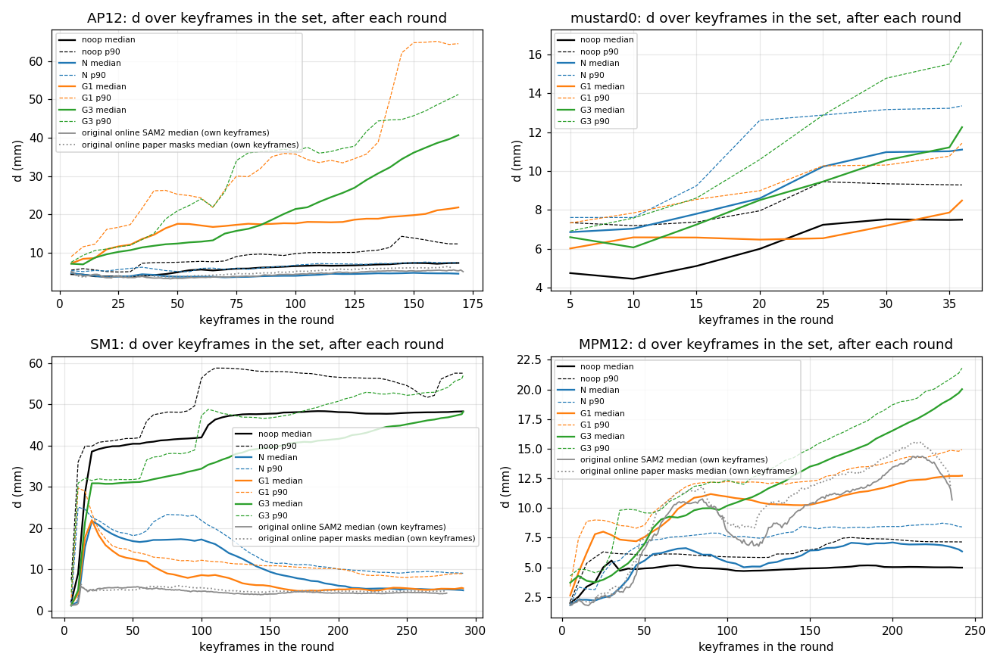
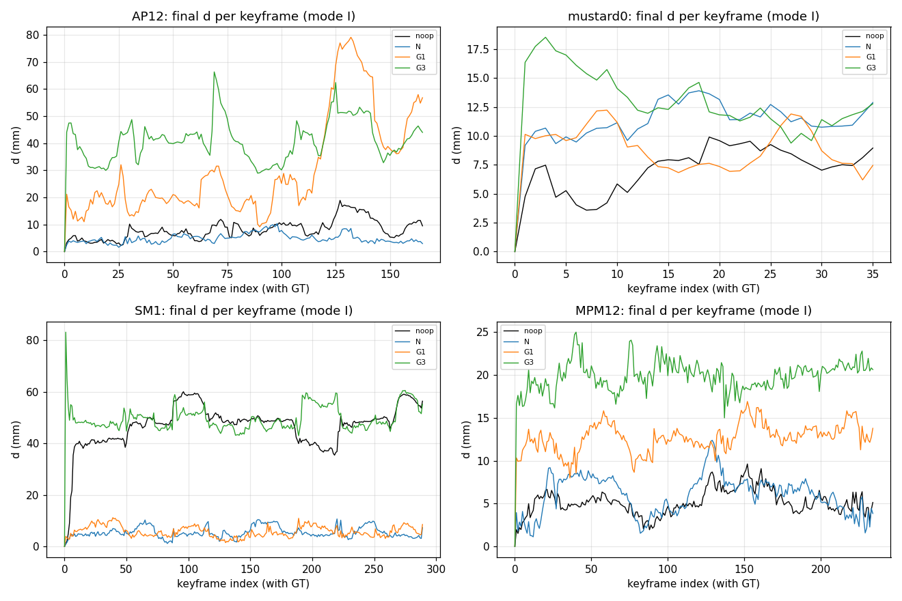

# EXP_BATCH_20260928 결과 — 4차 무인 배치: 공동 재적합 라운드(H6), 원본 NeRF 라운드 재생 vs GS (2026-09-28)

지시서 `EXP_BATCH_20260928_BRIEF.md` (브랜치 milestone5-v1, HEAD 8096fd0). 본 코드 무수정(새 파일만: `experiments/exp_round_inputs.py`, `experiments/exp_nerf_round.py`, `experiments/exp_gs_joint_refit.py`, `experiments/joint_refit_eval.py`, `experiments/joint_refit_unit_eval.py`, `experiments/analyze_joint_refit.py`, `experiments/original_round_reference.py`), 커밋 없음(지시서). 진행 기록 `logs/exp_batch_20260928/PROGRESS.md`, 자동 표 `logs/exp_batch_20260928/analysis/tables.md`, 판정 JSON `logs/exp_batch_20260928/analysis/verdicts.json`. 실행 106개(지도 재생 4 + 셀 102), 실패·재시도 0.

## 1. 한 페이지 요약

**핵심 표 — 모드 I(증분 재생) 최종 키프레임 d 중앙값 (mm, 괄호 = noop 대비 비율)과 참고 ADD (cm)**

| 시퀀스 | noop (트래커 단독 포즈) | N (원본 NeRF 라운드 재생) | G1 (prior 새 지도) | G3 (TSDF 새 지도) | 원본 온라인 SAM2 / 논문 마스크 (자기 키프레임) | 참고 ADD: 트래커 단독 / noop 9/27 / 원본 SAM2 / 원본 논문 / GS 본 코드 c297f6a |
|---|---|---|---|---|---|---|
| SM1 (붕괴) | 48.32 | **4.93 (0.10×)** | **5.43 (0.11×)** | 48.22 (1.00×) | 4.25 / 4.79 | 4.361 / 4.486 / 0.551 / 0.574 / 3.216 |
| AP12 | 7.36 | **4.57 (0.62×)** | 21.86 (2.97×) | 40.71 (5.53×) | 5.10 / 6.02 | 0.888 / 0.890 / 0.454 / 0.541 / 2.271 |
| MPM12 | 4.97 | 6.34 (1.28×) | 12.73 (2.56×) | 20.02 (4.03×) | 10.69 / 11.76 | 0.457 / 0.536 / 0.777 / 0.871 / 0.641 |
| mustard0 | 7.50 | 11.11 (1.48×) | 8.49 (1.13×) | 12.26 (1.63×) | – (라운드별 목록 없음) | 0.748 / 0.744 / 1.369 / 0.742 / 0.508 |

**Q1. 원본 NeRF 라운드가 오프라인 재생에서 키프레임 포즈를 GT 쪽으로 고치는가 — 규칙(P0) 판정은 "실패". 그러나 증분 재생은 원본의 시퀀스별 효과를 원본 수준으로 재현한다.**
* **P0 (i) 실패**: 모드 S 마지막 시점의 한 라운드(500스텝)가 d 중앙값을 바꾼 양은 AP12 0 %, mustard0 +3 %, SM1 −1 %, MPM12 +4 %다(2000스텝 +7 / +6 / −1 / +9 %). 기준(20 % 이상, 3/4)에 한참 못 미친다.
* **P0 (ii) 실패**: 모드 I 최종 d 중앙값 / noop = SM1 0.10×, AP12 0.62×, MPM12 1.28×, mustard0 1.48×. 0.5× 이하는 SM1 하나다(기준: SM1 포함 2개).
* **원본 대비 재현 정도(판정 밖 참고)**: 같은 척도로 원본 온라인 실행을 채점하면(2절) 최종 키프레임 d가 SM1 4.25 / 4.79, AP12 5.10 / 6.02 mm다(SAM2 / 논문 마스크). 재생 N은 4.93, 4.57 mm로 같은 수준이다. 도움(SM1·AP12)과 해악(MPM12·mustard0)의 방향도 원본의 ADD(원본 vs 트래커 단독: MPM12 0.777 vs 0.457, mustard0 1.369 vs 0.748)와 같다. 원본도 라운드 하나의 효과는 거의 0이다(라운드당 d 중앙값 변화 평균 ±0.03 mm 이내). 규칙의 "절반" 기준은 원본 자신의 AP12 효과(자기 키프레임 기준 0.69–0.82×)보다 엄격했다.
* **메커니즘**: 효과는 한 라운드의 크기가 아니라 라운드의 반복에서 나온다. 라운드마다 새 키프레임을 전 키프레임과 함께 다시 맞춰, 오차가 포즈 체인으로 전파되기 전에 끊는다. AP12에서 새 키프레임은 라운드 안에서 5.39 → 4.46 mm(77 % 개선)로 고쳐지고, 기존 키프레임은 4.29 → 4.29 mm로 그대로다. SM1에서는 붕괴 점프가 체인으로 들어와 키프레임 20개에서 22 mm까지 오르지만, 이후 라운드가 전체를 끌어당겨 끝에 4.9 mm가 된다.

**Q2. GS 공동 재적합이 원본 효과를 재현하는가 — P0가 규칙상 실패라 P1은 판정하지 않는다(표만 남김). 요인 분해로 보면 배치 구성과 TSDF 새 지도는 효과가 없다. 효과는 트래커와 독립인 prior 지도(G1)에서만 나오지만, prior의 편향도 함께 전파된다.**
* **모드 S 한 라운드 요인 분해**(11셀, 짝지은 키프레임 부트스트랩 2σ):
  - 배치 구성(G0 → G0B): 잡음 이내 9셀, G0가 나음 2셀. 현재 온라인 지도에서 뷰 8장 배치는 효과가 없다.
  - TSDF 새 단일 층 지도(G0B → G3): 잡음 이내 8셀.
  - prior 새 지도(G0B → G1): G1이 나음 3셀, 나쁨 5셀.
  - prior 유무(G1 vs G3): 방향이 시퀀스마다 반대다. prior가 mustard0·SM1에서 낫고(mustard0 last 7.50 → 5.45 mm, 개선 72 %) AP12·MPM12에서 나쁘다(K40·K80 악화 81–85 %).
  - 반복 잡음: N 0.01 mm, G1 0.07 mm(AP12 last의 d 중앙값 차이).
* **모드 I**: 사전 규칙으로 고른 best G(G3)는 SM1을 못 고친다(1.00×). 정상 시퀀스는 크게 악화한다(AP12 5.53×, MPM12 4.03×). 두 번째 G(G1)는 **SM1을 N만큼 고친다(5.43 vs 4.93 mm)**. 대신 AP12 2.97×, MPM12 2.56×로 악화한다.
* **원인(관측 기반)**: G3의 지도는 현재 포즈로 만든 TSDF라 포즈 오차를 이미 담고 있다. 첫 라운드부터 교정이 약하고(SM1 키프레임 4: noop 9.0 → N 1.7, G3 5.3 mm), 이후 좋은 앞 키프레임까지 나쁜 쪽으로 끌려간다(1.0 → 5.1 mm, 4라운드). 라운드 안 포즈 이동량은 N과 비슷하다(새 키프레임 중앙값 1.93 vs 2.27 mm). 문제는 움직임의 양이 아니라 방향이다(GT 쪽으로 간 새 키프레임 47 % vs N 76 %). G1의 prior는 트래커와 독립이라 붕괴를 되돌린다. 그러나 prior 자체의 형상·정합 편향(단위 확인에서 GT 입력이 5.05 mm로 밀림, AP12 첫 라운드 4.5 → 7.2 mm)이 라운드마다 체인으로 쌓여 정상 시퀀스를 망가뜨린다.

**Q3. 증분 라운드가 SM1의 편향 누적을 막는가 — N과 G1은 막고, G3는 못 막는다.**
* SM1 최종 d 중앙값: noop 48.32, N 4.93(0.10×), G1 5.43(0.11×), G3 48.22(1.00×) mm. 원본 온라인은 4.25(SAM2) / 4.79(논문) mm.
* 한계: 오프라인 재생은 트래커의 상대 운동(붕괴 점프 포함)을 바꾸지 못한다. 그래서 체인 근사 c2w_corr(prev) · inv(c2w_trk(prev)) · c2w_trk(new)로 "보정된 포즈에서 이어 추적"을 흉내 낸다. 원본 온라인에서는 붕괴가 아예 일어나지 않는다(SM1 d 1–6 mm 유지). 재생은 무너진 뒤 되돌리는 것을 보였을 뿐이다.

**시스템 방향 (a)/(b)/(c)에 주는 의미**
* **(a) GS 피드백 계속 고치기**: 이번 GS 공동 재적합에서 SM1을 고친 것은 prior 지도(G1)뿐이다. 같은 설정이 정상 시퀀스에서 2.6–3.0배 악화한다. 현재 포즈로 만든 지도(G0/G0B/G3)는 한 라운드에서도 반복에서도 GT 쪽 기준이 되지 못한다(3차 결론과 같다). (a)를 계속하려면 "트래커와 독립이면서 편향이 작은 기준"이 먼저 필요하다. 이번에 그 후보가 정확한 prior(형상·정합)임이 더 분명해졌다.
* **(b) 하이브리드(포즈 = 원본 SDF 피드백, 복원 = GS)**: 원본 NeRF 라운드는 오프라인 재생에서도 SM1 붕괴를 되돌리고(0.10×) AP12를 개선한다(0.62×). 원본과 같은 해악(MPM12 1.28×, mustard0 1.48×)도 함께 가져온다. 비용: 라운드 15–27 s, 최대 1.7–3.5 GB(500스텝). 원본처럼 키프레임마다 돌리면 SM1 기준 약 275라운드다.
* **(c) 트래커 단독 + GS**: SM1 붕괴(48 mm)가 그대로 남는다. 정상 시퀀스(MPM12, mustard0)에서는 가장 낫다.

**사용자가 결정할 것**
1. **P0 해석**: 규칙대로 "오프라인 재생으로는 원본 효과가 재현되지 않음"으로 둘지 정해야 한다. 반대로 원본 온라인과의 시퀀스별 일치(방향·수준)를 근거로 "재현됨"으로 볼 수도 있다. "재현됨"으로 보면 P1 계산값(효력 없음)은 best G = G3 기준 실패다. "N 감소량 50 %"를 0/4 시퀀스에서 채웠고 SM1 조건도 ×다. G1로 바꿔 계산해도 실패다. SM1 조건(5.43 ≤ 1.5 × 4.93 = 7.40 mm)은 통과하지만, "N 감소량 50 %"는 1/4(mustard0)이고 악화률 조건은 경계에서 넘는다(25.77 % vs 한도 25.76 %).
2. **방향**: (b)를 택한다면 원본과 같은 MPM12·mustard0 해악을 받아들일지, 그 해악을 줄일 수단을 따로 찾을지 정해야 한다.
3. **(a)를 계속한다면**: G1의 prior 편향(형상·정합)을 줄이는 쪽을 먼저 볼지 정해야 한다. 이 배치에서는 새 실험을 추가하지 않았다.

## 2. 참고: 원본 BundleSDF 온라인 실행의 라운드 (같은 척도, 읽기 전용 채점)

원본 기준 실행(`~/Desktop/BundleSDF_baseline_outputs/full_eval_sam2_ho3d`(SAM2 마스크)와 `full_eval`(논문 마스크))의 라운드별 `poses_before_nerf.txt`(그 시점 트래커의 전 키프레임 포즈, 이전 써넣기 포함) / `poses_after_nerf.txt`를 이 배치의 d로 채점했다(`experiments/original_round_reference.py`, 게이지는 그 실행 자신의 첫 `ob_in_cam`). 키프레임은 실행마다 다르므로 중앙값끼리만 비교한다. YCB 기준 실행은 라운드별 키프레임 목록이 없어 mustard0는 없다.

| 시퀀스 | 마스크 | 라운드 수 | 라운드당 d 중앙값 변화 평균 (mm) | 라운드가 중앙값을 낮춘 비율 | 라운드당 개선 / 악화 키프레임 비율 중앙값 | 마지막 라운드 후 d 중앙값 / p90 | noop 최종 d 중앙값 |
|---|---|---|---|---|---|---|---|
| SM1 | SAM2 | 275 | -0.01 | 52 % | 1 % / 1 % | 4.25 / 8.33 | 48.32 |
| SM1 | 논문 | 275 | -0.01 | 50 % | 1 % / 1 % | 4.79 / 8.31 | 48.32 |
| AP12 | SAM2 | 167 | +0.00 | 46 % | 0 % / 0 % | 5.10 / 7.56 | 7.36 |
| AP12 | 논문 | 162 | +0.00 | 48 % | 0 % / 0 % | 6.02 / 8.11 | 7.36 |
| MPM12 | SAM2 | 232 | +0.01 | 44 % | 0 % / 1 % | 10.69 / 13.50 | 4.97 |
| MPM12 | 논문 | 231 | +0.03 | 37 % | 0 % / 0 % | 11.76 / 14.80 | 4.97 |

* 원본은 새 키프레임마다 라운드를 돈다(키프레임 5개부터). 라운드 하나가 키프레임 d 중앙값을 바꾸는 양은 평균 ±0.03 mm 이내이고, 대부분의 라운드에서 개선·악화 키프레임이 거의 없다.
* SM1(SAM2)의 처음 라운드: n=5 2.2→1.3, n=6 1.3→1.3, n=7 1.3→1.3, n=8 1.4→1.4, n=9 1.4→1.5, n=10 1.6→1.8, n=11 3.1→3.5, n=12 5.1→6.0 mm. 첫 라운드(n=5)가 키프레임 60 %를 고치고, 이후 d가 1–6 mm에 머문다. 원본 온라인 실행에는 noop의 붕괴(48 mm)가 아예 없다 — 원본의 SM1 효과는 무너진 뒤 되돌리는 것이 아니라 무너지지 않게 하는 것이다.
* MPM12에서는 원본의 키프레임 d(10.7–11.8 mm)가 noop(4.97 mm)보다 크다. ADD(원본 SAM2 0.777 / 논문 0.871 vs 트래커 단독 0.457 cm)와 같은 방향이다.

## 3. 구현과 스스로 정한 값

**입력(4개 시퀀스 공통)**: `outputs/exp_batch_20260927/noop/<ds>/<seq>` (읽기 전용; 트래커 단독 포즈로 GS 지도를 만든 3차 배치 실행). `experiments/exp_round_inputs.py` → `logs/exp_batch_20260928/inputs/<ds>_<seq>.json`.
* 키프레임 순서 = 마지막 사이클의 `nerf_frames.txt`. 키프레임 수 AP12 169, mustard0 36, SM1 291, MPM12 242 (GT 없는 키프레임 AP12 3, SM1 1, MPM12 7개는 채점에서 제외).
* 입력 포즈 `consume` = 키프레임이 처음 들어온 사이클의 `poses_before_gs.txt` (SO(3) 투영). 원본 `run_nerf`는 라운드 시점 트래커의 전 키프레임 현재 포즈(`p_dict['cam_in_obs']`)를 쓰는데, noop 실행에서 사이클 K의 포즈와 `consume`의 차이는 전 시퀀스·전 K에서 중앙값 0.00–0.01 mm, 최대 0.19 mm라 같다고 봤다.
* 시점 K의 라운드 = 키프레임 수가 처음 K 이상이 된 사이클(모든 시퀀스에서 20/40/80에 정확히 걸림)의 키프레임 0..K−1. "last" = 마지막 사이클(전체).
* 오차 척도: 3차와 같다(`experiments/joint_refit_eval.py`). d = GT 메시 점 20,000개 평균 변위(mm), 회전 = c2w 회전 차(°, 2 asin(|ΔR|/2√2)), 이동 = c2w 위치 차(mm; 카메라가 물체에서 멀어 d보다 훨씬 크다). 게이지 = `GroundTruth` 첫 프레임. 개선/악화 = d 변화 ≥ max(0.5 mm, 10 %).

**N 하네스** (`experiments/exp_nerf_round.py`, `bundlesdf` 컨테이너, 본 코드 import만):
* `bundlesdf.run_nerf`의 연속(continual) 경로를 그대로 옮겼다. 첫 라운드: `compute_scene_bounds`(마스크 사용, dbscan 값은 설정) → `sc_factor × 0.7`, `translation`, 옥트리 구름 = 그 실척 구름. 이후 라운드: 직전 구름 + 새 키프레임 역투영(`compute_scene_bounds_worker`) → 1 cm 복셀 → `find_biggest_cluster`. `preprocess_data` → **매 라운드 새 `NerfRunner`**(새 네트워크 + 새 PoseArray, 그 라운드의 모든 키프레임) → `train()` → `get_optimized_poses_in_real_world`(첫 키프레임 기준).
* 설정: HO3D는 원본 기준 실행의 마지막 라운드 `<frame>/nerf/config.yml`, mustard0는 `final/nerf/config.yml`(YCB 기준 실행에는 라운드별 설정이 없다). 바꾼 키는 `datadir`, `save_dir`, `n_step`, `sc_factor`, `translation`뿐.
* 입력 영상: 키프레임 `color/`(BGR→RGB), `depth_filtered/`(mm→m, SAM2 마스크 밖 0), `mask/`(SAM2, 값은 >0으로만 쓰인다).
* 변환 검증: `lrate_pose=0`으로 한 라운드 → 입력 = 출력, 최대 |Δ| 5.5e-8.

**GS arm** (`experiments/exp_gs_joint_refit.py`, gsplat 컨테이너, 러너 설정 = 온라인 실행 기본값 `config_gs_2dgs_1mm_lifecycle.yml`):
* 공통 포즈 최적화기: v1 `PoseDeltas`(원본 PoseArray 이식) 그대로 — 라운드마다 새 델타(0), 첫 키프레임 고정, Adam lr 0.01 → 라운드 끝 ×0.1, 기울기 무한대 노름 클립 0.1, 클램프 2 cm · 20°, 라운드 끝에 뷰 포즈로 굽는다. 모든 키프레임이 뷰다.
* 손실: 러너의 학습 손실 한 스텝을 그대로 복사(L1·DSSIM·depth·법선 일관성·distortion, 시작 스텝 조건 포함). 여러 뷰 배치(G0B/G1/G3)는 뷰 8장(전 키프레임에서 비복원 무작위)의 손실 평균으로 최적화기 1스텝.
* densification: 러너 설정에서 꺼져 있다(`refine_start_iter` 1e8) → 라운드 전후 Gaussian 수가 같다.
* **G0**: 사이클 K 직후의 온라인 지도(아래 재생으로 복원) + `GaussianRunner.train(steps, optimize_poses=True)`(뷰 1장/스텝 = 현재 온라인 방식). 라운드 시작 전 뷰 포즈를 입력 포즈로 갱신하고 최적화 상태를 온라인 갱신과 같이 초기화(`update_lr_scale`). lifecycle 상태는 온라인 지도 그대로(VERIFIED가 아닌 Gaussian은 러너처럼 고정).
* **G0B**: G0와 같은 지도, 뷰 8장/스텝.
* **G1**: `init_runner_like_online`(prior + 온라인 Sim(3) 정합, 학습 0스텝)으로 SAM3D prior surfel 20,000개만 둔 새 지도. 관측 append 없음, lifecycle 전이 없음, 전부 VERIFIED(학습 가능). 모드 I에서는 첫 라운드의 정합 결과를 캐시해 매 라운드 같은 prior surfel로 새로 시작한다(정합은 키프레임 0 기준 1회).
* **G3**: 입력 포즈로 `gaussian_global.tsdf_fuse`(복셀 2 mm, 절단 1 cm, 마스크 안 depth만) → 메시 꼭짓점 색 = 키프레임 역투영 점(4픽셀마다 1개) 중 최근접 점의 색 → `sample_surfels(20,000, 반경 ×0.75, seed 0)`(prior와 같은 변환 함수) → prior 초기화 경로(`initialize_from_prior`, 0스텝). 정규화 = surfel 중심, 반경 × 1.2. prior 없음, append 없음, 전부 VERIFIED.
* **G0/G0B 지도 복원**: 지시서가 입력으로 든 사이클별 `gs_state.ply`는 9/28 승인 정리에서 지워졌고, 표시용 PLY라 러너 상태를 복원할 수도 없다. 대신 3차 R0와 같은 재생(첫 사이클 `init_runner_like_online` 초기화 500스텝, 이후 사이클마다 저장 뷰 포즈를 noop 포즈로 갱신 → `update(500)`)으로 지도를 다시 만들고, 키프레임 K를 처음 받은 사이클 직후에 체크포인트로 저장했다(`outputs/exp_batch_20260928/g0maps/<ds>/<seq>/K<k>.pt`). 온라인 지도와는 GPU 비결정성만큼 다르다.
* 모드 I의 새 키프레임 초기 포즈 = `c2w_corr(prev) · inv(c2w_trk(prev)) · c2w_trk(new)` (prev = 집합의 가장 최근 키프레임; GS는 SO(3) 투영 후 사용).

**판정용으로 정한 값**
* best G 규칙(결과를 보기 전에 고정, `logs/exp_batch_20260928/pick_best_g.py`): G1·G3 중 모드 S 500스텝 11셀의 d 중앙값 감소율 평균이 큰 쪽; 차이 < 0.01이면 악화률 평균이 낮은 쪽. G0·G0B는 지시서대로 모드 I에서 제외.
* P0 (i)은 500스텝(원본 `n_step`)으로 판정하고 2000스텝은 참고로 적는다. P1의 "N 감소량의 50 %"는 마지막 시점 500스텝, d 중앙값 감소량(mm)으로, "악화률 N + 10 pt 이하"는 4개 시퀀스 평균으로 판정한다.
* 요인 분해: 같은 셀(시퀀스 × K, 500스텝)의 두 arm에 대해 Δ = 뒤 arm의 라운드 후 d 중앙값 − 앞 arm의 것, 키프레임을 짝지어 복원 추출 1,000회(seed 0)로 σ; |Δ| > 2σ면 차이 있음.

## 4. 단위 확인 (지시서 2, mustard0 키프레임 20개, 500스텝)

(1) GT 포즈 입력 → 라운드 후 d 중앙값 < 1 mm. (2) 키프레임 10에만 GT+3°(GT 메시 중심 기준 회전, 시드 3; d 2.82 mm) → 그 키프레임 d 감소, 나머지는 (1)과 비슷. G0/G0B의 지도는 같은 재생을 GT 포즈로 해서 만든 지도(20뷰, 40,945 Gaussian).

| arm | (1) GT 입력 → d 중앙값 (p90) | (2) KF10 d 전 → 후 | (2) 판정 | 참고: 자기 (1) 결과 대비 KF10 차이 2.82 → (제거율) | 나머지 d 중앙값 (2) vs (1) | 시간 |
|---|---|---|---|---|---|---|
| N | 3.51 mm (5.15) — 실패 | 2.82 → 2.34 | 통과 | 0.40 mm (86 %) | 3.73 vs 3.51 | 15 s, 1.7 GB |
| G0 | 1.49 mm (3.16) — 실패 | 2.82 → 2.00 | 통과 | 0.90 mm (68 %) | 1.61 vs 1.57 | 6 s |
| G0B | 2.43 mm (3.64) — 실패 | 2.82 → 2.23 | 통과 | 0.14 mm (95 %) | 2.64 vs 2.45 | 32 s |
| G1 | 5.05 mm (6.45) — 실패 | 2.82 → 6.42 | 실패 | 0.37 mm (87 %) | 4.91 vs 4.99 | 25 s |
| G3 | 4.23 mm (5.61) — 실패 | 2.82 → 3.79 | 실패 | 0.27 mm (90 %) | 4.18 vs 4.29 | 26 s |

* **(1)은 원본 N도 통과하지 못한다.** GT 마스크(`datasets/YCBInEOAT/mustard0/gt_mask`) + 원시 depth로 다시 돌려도 3.42 mm(p90 4.32)다(저장 depth는 SAM2 마스크 밖이 0이라 depth도 같이 바꿨다). 마스크 오차가 원인이 아니라, 원본 방법이 GT에서 한 라운드에 약 3.5 mm 떨어진 고정점으로 간다(GT 포즈와 depth 사이 불일치 또는 방법 고유 편향). 따라서 (1)은 구현 결함 검출 기준으로 쓸 수 없고, 하네스 정확성은 변환 검증(|Δ| 5.5e-8)으로 확인했다.
* **G1·G3의 (2) 실패는 교란을 못 고쳐서가 아니다.** 각 arm의 교란 없는 결과를 기준으로 재면 모든 arm이 3° 교란의 68–95 %를 없앤다. G1·G3은 모든 키프레임이 함께 4–5 mm 밀리는 공통 이동(새 지도의 고정점 편향) 때문에 GT 기준 d가 커졌다. 새 지도 자체의 오차: G1 중심 → GT 메시 중앙값 3.90 mm(prior 모양·정합), G3 2.33 mm(뷰 5 렌더 depth 잔차 2.39 mm).
* 판단: 단위 확인 "실패"를 그대로 기록하고 본 실행을 진행했다. 공동 재적합이 어긋난 키프레임을 다수 쪽으로 되돌리는 메커니즘(H6의 "긴장")은 모든 arm에서 동작한다. 남는 문제는 그 다수의 고정점이 GT가 아니라는 것이고, 이것이 본 실행의 핵심 판독 대상이다.

## 5. 모드 S — 단일 라운드

입력 = 키프레임 0..K−1의 noop 소비 시점 포즈, arm마다 1라운드. 전체 표(arm × 스텝 × 시퀀스 × K: 개선·악화, d 중앙값·p90 전→후, 회전·이동 중앙값, 시간, 메모리, Gaussian 수)는 부록 A.

### 5.1 모드 S 요약 행렬 (500 스텝, 칸 = 라운드 후 d 중앙값 mm (감소율) / 개선 %·악화 %)

| 시퀀스 | K | 전 | N | G0 | G0B | G1 | G3 |
|---|---|---|---|---|---|---|---|
| AP12 | 40 | 4.20 | 4.32 (-3 %) / 38·38 | 4.33 (-3 %) / 5·5 | 4.39 (-4 %) / 5·20 | 6.88 (-64 %) / 0·82 | 5.14 (-22 %) / 10·60 |
| AP12 | 80 | 5.90 | 5.04 (+15 %) / 55·21 | 6.05 (-2 %) / 6·8 | 6.12 (-4 %) / 6·10 | 8.10 (-37 %) / 5·84 | 5.66 (+4 %) / 29·49 |
| AP12 | last | 7.36 | 7.38 (-0 %) / 49·27 | 7.36 (+0 %) / 14·14 | 7.31 (+1 %) / 14·17 | 8.52 (-16 %) / 21·54 | 7.69 (-4 %) / 25·25 |
| mustard0 | 20 | 6.00 | 5.94 (+1 %) / 25·15 | 6.24 (-4 %) / 0·0 | 6.04 (-1 %) / 5·15 | 5.24 (+13 %) / 55·20 | 6.38 (-6 %) / 15·40 |
| mustard0 | last | 7.50 | 7.30 (+3 %) / 8·17 | 7.41 (+1 %) / 3·6 | 7.49 (+0 %) / 0·14 | 5.45 (+27 %) / 72·14 | 8.13 (-8 %) / 0·36 |
| SM1 | 40 | 39.90 | 37.65 (+6 %) / 3·5 | 39.78 (+0 %) / 0·5 | 39.70 (+1 %) / 0·5 | 39.69 (+1 %) / 13·10 | 39.61 (+1 %) / 0·13 |
| SM1 | 80 | 41.55 | 40.98 (+1 %) / 0·6 | 41.48 (+0 %) / 0·1 | 41.37 (+0 %) / 0·1 | 40.22 (+3 %) / 4·4 | 41.18 (+1 %) / 0·5 |
| SM1 | last | 48.32 | 48.78 (-1 %) / 0·2 | 48.24 (+0 %) / 0·1 | 48.42 (-0 %) / 0·1 | 47.08 (+3 %) / 0·1 | 48.12 (+0 %) / 0·1 |
| MPM12 | 40 | 4.89 | 3.69 (+25 %) / 57·25 | 4.89 (-0 %) / 2·8 | 5.19 (-6 %) / 2·20 | 6.04 (-23 %) / 0·85 | 5.05 (-3 %) / 8·10 |
| MPM12 | 80 | 4.98 | 4.71 (+5 %) / 48·18 | 4.93 (+1 %) / 8·8 | 5.27 (-6 %) / 0·9 | 6.36 (-28 %) / 0·81 | 4.84 (+3 %) / 19·8 |
| MPM12 | last | 4.97 | 4.78 (+4 %) / 38·17 | 5.06 (-2 %) / 12·17 | 5.03 (-1 %) / 3·7 | 5.17 (-4 %) / 13·35 | 5.07 (-2 %) / 9·13 |

### 5.2 스텝 수 효과 (마지막 시점, 라운드 후 d 중앙값 mm: 500 → 2000, 괄호 = 라운드 전 대비 감소율)

| arm | AP12 | mustard0 | SM1 | MPM12 |
|---|---|---|---|---|
| N | 7.38 (-0 %) → 6.86 (+7 %) | 7.30 (+3 %) → 7.05 (+6 %) | 48.78 (-1 %) → 48.91 (-1 %) | 4.78 (+4 %) → 4.54 (+9 %) |
| G1 | 8.52 (-16 %) → 9.60 (-30 %) | 5.45 (+27 %) → 5.63 (+25 %) | 47.08 (+3 %) → 47.50 (+2 %) | 5.17 (-4 %) → 5.34 (-7 %) |
| G3 | 7.69 (-4 %) → 8.22 (-12 %) | 8.13 (-8 %) → 8.23 (-10 %) | 48.12 (+0 %) → 48.07 (+1 %) | 5.07 (-2 %) → 5.64 (-13 %) |

* N만 스텝을 늘리면 조금 나아진다(+6…+9 %, SM1 제외). G1·G3은 2000스텝에서 더 나빠진다(AP12 G1 −16 → −30 %, G3 −4 → −12 %).

### 5.3 모드 S 반복 잡음 (AP12 마지막 시점, 500 스텝)

| arm | d 중앙값 원 / 반복 | 차이 mm | 키프레임별 |Δd| 중앙값 mm | 시간 s 원 / 반복 |
|---|---|---|---|---|
| N | 7.38 / 7.37 | 0.01 | 0.01 | 26 / 26 |
| G1 | 8.52 / 8.45 | 0.07 | 0.07 | 25 / 26 |

## 6. 모드 I — 증분 재생

### 6.1 모드 I — 증분 재생 (첫 라운드 5개, 이후 새 키프레임 5개마다; 대조 noop = 소비 시점 포즈)

| arm | 시퀀스 | 라운드 | 최종 d 중앙값 noop → arm (비율) | p90 noop → arm | noop 대비 개선 % · 악화 % | 참고: 원본 온라인 SAM2 / 논문 마스크 최종 d 중앙값 (자기 키프레임) | 총 시간 min | 라운드 평균 s | 최대 메모리 GB |
|---|---|---|---|---|---|---|---|---|---|
| N | AP12 | 34 | 7.36 → 4.57 (0.62×) | 12.34 → 7.40 | 75 · 11 | 5.10 / 6.02 | 10.9 | 19.3 | 3.5 |
| G1 | AP12 | 34 | 7.36 → 21.86 (2.97×) | 12.34 → 64.57 | 0 · 99 | 5.10 / 6.02 | 11.1 | 19.6 | 0.1 |
| G3 | AP12 | 34 | 7.36 → 40.71 (5.53×) | 12.34 → 51.33 | 0 · 99 | 5.10 / 6.02 | 12.0 | 21.1 | 0.1 |
| N | mustard0 | 8 | 7.50 → 11.11 (1.48×) | 9.29 → 13.35 | 0 · 97 | - | 1.9 | 14.5 | 1.7 |
| G1 | mustard0 | 8 | 7.50 → 8.49 (1.13×) | 9.29 → 11.43 | 25 · 50 | - | 2.7 | 20.6 | 0.1 |
| G3 | mustard0 | 8 | 7.50 → 12.26 (1.63×) | 9.29 → 16.68 | 0 · 97 | - | 3.0 | 22.6 | 0.1 |
| N | SM1 | 59 | 48.32 → 4.93 (0.10×) | 57.58 → 9.07 | 99 · 0 | 4.25 / 4.79 | 19.0 | 19.3 | 2.7 |
| G1 | SM1 | 59 | 48.32 → 5.43 (0.11×) | 57.58 → 9.01 | 99 · 1 | 4.25 / 4.79 | 18.8 | 19.1 | 0.1 |
| G3 | SM1 | 59 | 48.32 → 48.22 (1.00×) | 57.58 → 57.01 | 9 · 29 | 4.25 / 4.79 | 19.9 | 20.2 | 0.1 |
| N | MPM12 | 49 | 4.97 → 6.34 (1.28×) | 7.14 → 8.41 | 22 · 56 | 10.69 / 11.76 | 15.3 | 18.7 | 2.4 |
| G1 | MPM12 | 49 | 4.97 → 12.73 (2.56×) | 7.14 → 14.94 | 0 · 100 | 10.69 / 11.76 | 15.5 | 19.0 | 0.1 |
| G3 | MPM12 | 49 | 4.97 → 20.02 (4.03×) | 7.14 → 21.81 | 0 · 100 | 10.69 / 11.76 | 15.8 | 19.4 | 0.1 |



*그림 1*. 라운드마다 그 시점 집합의 d 중앙값(실선)과 p90(점선). 회색 = 원본 온라인 실행(자기 키프레임, 새 키프레임마다 라운드).



*그림 2*. 마지막 라운드 후 키프레임별 d (noop = 소비 시점 포즈). 라운드별 수치는 `logs/exp_batch_20260928/analysis/verdicts.json`의 `modeI`.

### 6.2 모드 I 라운드 분해 — 그 라운드에 새로 들어온 키프레임(체인 초기 포즈) vs 이미 있던 키프레임(직전 라운드 출력)

| arm | 시퀀스 | 새 키프레임: 라운드 전 → 후 d 중앙값 (라운드 안 감소 비율) | 기존 키프레임: 전 → 후 d 중앙값 (감소 비율) | 라운드 안 포즈 이동량 중앙값 mm 새 / 기존 |
|---|---|---|---|---|
| N | AP12 | 5.39 → 4.46 (77 %) | 4.29 → 4.29 (49 %) | 2.07 / 0.41 |
| G1 | AP12 | 20.69 → 21.64 (42 %) | 18.12 → 18.21 (44 %) | 7.06 / 1.42 |
| G3 | AP12 | 24.08 → 24.85 (34 %) | 27.00 → 28.10 (11 %) | 3.95 / 1.89 |
| N | mustard0 | 10.45 → 10.77 (14 %) | 9.95 → 10.35 (10 %) | 1.08 / 0.62 |
| G1 | mustard0 | 6.34 → 6.60 (50 %) | 6.90 → 7.46 (6 %) | 2.68 / 0.92 |
| G3 | mustard0 | 7.08 → 7.94 (17 %) | 9.56 → 10.97 (0 %) | 1.92 / 1.59 |
| N | SM1 | 11.09 → 9.37 (76 %) | 6.78 → 6.60 (71 %) | 2.27 / 0.52 |
| G1 | SM1 | 9.41 → 7.76 (82 %) | 5.74 → 5.69 (58 %) | 3.18 / 0.46 |
| G3 | SM1 | 40.46 → 41.05 (47 %) | 43.11 → 43.42 (13 %) | 1.93 / 0.74 |
| N | MPM12 | 5.86 → 5.74 (41 %) | 6.41 → 6.43 (45 %) | 1.03 / 0.32 |
| G1 | MPM12 | 10.27 → 10.41 (28 %) | 11.19 → 11.28 (33 %) | 1.09 / 0.40 |
| G3 | MPM12 | 11.52 → 11.96 (28 %) | 14.51 → 14.84 (16 %) | 0.84 / 0.58 |

(새 키프레임의 '라운드 전' = 체인 초기 포즈 c2w_corr(prev)·inv(c2w_trk(prev))·c2w_trk(new); 라운드마다 표본을 모두 모은 중앙값, 감소 비율 = 라운드 후 d가 전보다 작은 표본 비율)

* N은 새 키프레임을 라운드 안에서 GT 쪽으로 옮긴다(AP12 77 %, SM1 76 %). G3는 비슷한 양을 움직이지만 방향이 GT 쪽이 아니다(SM1 47 %, AP12 34 %).
* G1은 SM1에서 N보다도 새 키프레임을 잘 고친다(82 %). AP12에서는 새 키프레임을 라운드마다 7 mm씩 움직이는데(N 2 mm) GT 쪽 비율은 42 %다. 단위 확인에서 본 공통 이동(prior 고정점 쪽으로 끌림)과 같은 성격으로 보인다(해석).

## 7. 판정과 요인 분해

### 7.1 판정 P0 (재생이 원본 효과를 재현하는가)

(i) 모드 S 마지막 시점(500 스텝) N: d 중앙값 감소 ≥ 20 % 그리고 악화률 ≤ 20 %인 시퀀스 ≥ 3/4: AP12 -0 %·악화 27 % ×, mustard0 +3 %·악화 17 % ×, SM1 -1 %·악화 2 % ×, MPM12 +4 %·악화 17 % × → 실패

(ii) 모드 I N 최종 d 중앙값 ≤ noop의 0.5배인 시퀀스 ≥ 2 (SM1 포함): AP12 0.62× ×, mustard0 1.48× ×, SM1 0.10× ○, MPM12 1.28× × → 실패

**P0 실패**

### 7.2 판정 P1 (GS가 재현하는가) — P0 통과 시에만 효력

best G = G3 (규칙: `logs/exp_batch_20260928/pick_best_g.py`, 점수 G1 -0.114, G3 -0.034)

| 시퀀스 | N 감소 mm | G 감소 mm | G ≥ 0.5·N (N>0) | 악화 N / G |
|---|---|---|---|---|
| AP12 | -0.02 | -0.33 | × | 27 / 25 |
| mustard0 | +0.20 | -0.63 | × | 17 / 36 |
| SM1 | -0.45 | +0.20 | × | 2 / 1 |
| MPM12 | +0.20 | -0.09 | × | 17 / 13 |

악화률 평균 G ≤ N + 10 pt: ○; 모드 I SM1 최종 d G ≤ 1.5·N: 48.22 vs 4.93 mm ×

**P1 실패** (P0 실패 → 판정 효력 없음, 표만 남김)

* 두 번째 G(G1)로 계산해도 실패다: "N 감소량 50 %" 1/4(mustard0), 악화률 평균 25.77 % vs 한도 25.76 %(경계 초과), SM1 5.43 ≤ 7.40 mm만 ○.

### 7.3 요인 분해 (500스텝, 짝지은 키프레임 부트스트랩 1,000회, 2σ)

| 비교 | 셀 수 | 뒤가 나음 | 앞이 나음 | 잡음 이내 | Δ 평균 mm |
|---|---|---|---|---|---|
| G0->G0B (배치 구성) | 11 | 0 | 2 | 9 | 0.05 |
| G0B->G1 (새 단일 층 지도(prior)) | 11 | 3 | 5 | 3 | 0.22 |
| G0B->G3 (새 단일 층 지도(TSDF)) | 11 | 2 | 1 | 8 | 0.05 |
| G1->G3 (prior 유무) | 11 | 5 | 3 | 3 | -0.17 |
| N->G1 (N 대비) | 11 | 3 | 7 | 1 | 0.74 |
| N->G3 (N 대비) | 11 | 1 | 3 | 7 | 0.57 |

모드 S 반복 잡음(AP12 마지막 시점 d 중앙값 차이): N 0.01 mm, G1 0.07 mm

요인 분해 압축 행렬 (칸 = Δ mm; '뒤' = 뒤 arm이 2σ 밖으로 나음, '앞' = 앞 arm이 나음, 표시 없음 = 잡음 이내):

| 시퀀스 | K | G0->G0B | G0B->G1 | G0B->G3 | G1->G3 | N->G1 | N->G3 |
|---|---|---|---|---|---|---|---|
| AP12 | 40 | +0.06 | +2.49 (앞) | +0.75 (앞) | -1.74 (뒤) | +2.57 (앞) | +0.83 |
| AP12 | 80 | +0.07 | +1.98 (앞) | -0.46 | -2.44 (뒤) | +3.05 (앞) | +0.61 |
| AP12 | last | -0.05 | +1.21 (앞) | +0.38 | -0.83 (뒤) | +1.13 (앞) | +0.30 |
| mustard0 | 20 | -0.20 | -0.80 | +0.35 | +1.14 | -0.70 | +0.44 |
| mustard0 | last | +0.08 | -2.04 (뒤) | +0.64 | +2.68 (앞) | -1.85 (뒤) | +0.83 (앞) |
| SM1 | 40 | -0.08 | -0.01 | -0.09 | -0.08 | +2.05 (앞) | +1.96 (앞) |
| SM1 | 80 | -0.11 | -1.15 (뒤) | -0.19 | +0.96 (앞) | -0.76 (뒤) | +0.20 |
| SM1 | last | +0.18 (앞) | -1.35 (뒤) | -0.30 (뒤) | +1.05 (앞) | -1.70 (뒤) | -0.65 (뒤) |
| MPM12 | 40 | +0.30 | +0.84 (앞) | -0.14 | -0.98 (뒤) | +2.35 (앞) | +1.36 |
| MPM12 | 80 | +0.34 (앞) | +1.10 (앞) | -0.43 (뒤) | -1.53 (뒤) | +1.65 (앞) | +0.12 |
| MPM12 | last | -0.02 | +0.13 | +0.03 | -0.10 | +0.39 (앞) | +0.29 (앞) |

셀별 Δ·σ 전체 표는 부록 B.

* **배치 구성(G0 → G0B)**: 효과 없음(잡음 이내 9/11). 현재 온라인 지도에서는 뷰 8장을 섞어도 포즈가 거의 움직이지 않는다(G0·G0B 모두 마지막 시점 −2…+1 %).
* **새 단일 층 지도, TSDF(G0B → G3)**: 한 라운드에서는 효과 없음(잡음 이내 8/11). 모드 I에서는 해악이다(SM1 회복 없음, 정상 시퀀스 1.6–5.5×).
* **prior(G1 vs G3)**: 한 라운드에서 방향이 시퀀스마다 반대다(prior가 mustard0·SM1에서 나음 3셀, AP12·MPM12에서 나쁨 5셀). 모드 I에서는 SM1을 N만큼 고치고(0.11×) 정상 시퀀스를 2.6–3.0× 악화한다.
* **N 대비**: 한 라운드에서 N이 G1보다 나은 셀 7/11, G3보다 나은 셀 3/11(G3가 나은 셀 1). 어떤 G arm도 N의 모드 I 효과를 정상 시퀀스와 SM1에서 동시에 내지 못했다.

## 8. 비용 ((b)/(c) 결정용)

### 8.1 비용 (모드 S 500 스텝 마지막 시점의 라운드 시간 s / 최대 메모리 GB; (b)/(c) 결정용)

| arm | AP12 | mustard0 | SM1 | MPM12 |
|---|---|---|---|---|
| N | 26 / 3.5 | 16 / 1.7 | 27 / 2.6 | 25 / 2.4 |
| G0 | 12 / 0.7 | 6 / 0.1 | 9 / 0.2 | 8 / 0.2 |
| G0B | 65 / 0.8 | 34 / 0.1 | 40 / 0.3 | 34 / 0.2 |
| G1 | 25 / 0.1 | 24 / 0.1 | 26 / 0.1 | 25 / 0.1 |
| G3 | 25 / 0.1 | 25 / 0.1 | 24 / 0.1 | 23 / 0.1 |

### 8.2 모드 I 총 시간 (라운드 = 새 키프레임 5개마다; 6.1 표의 총 시간·라운드 평균·최대 메모리)

* N: SM1 59라운드 19.0 min, AP12 34라운드 10.9 min, MPM12 49라운드 15.3 min, mustard0 8라운드 1.9 min. 라운드 평균 14.5–19.3 s, 최대 1.7–3.5 GB.
* G1·G3: 라운드 평균 19–23 s(8뷰 × 500스텝), 최대 0.1 GB(20,000 surfel).
* 원본은 새 키프레임마다 라운드를 돈다(SM1 275, AP12 167, MPM12 232라운드). 같은 라운드 시간이면 5배 가까이 든다. 원본 온라인은 추적과 병렬 프로세스다.

## 9. 계획 이탈·판단·실패·미완, 재개 방법

1. **사이클별 `gs_state.ply` 없음**: G0/G0B 지도를 재생으로 복원했다(3절). 온라인 지도와는 GPU 비결정성만큼 다르다.
2. **mustard0 nerf 설정**: YCB 원본 기준 실행에는 라운드별 `nerf/config.yml`이 없어 `final/nerf/config.yml`을 썼다.
3. **단위 확인 (1)은 전 arm 실패, (2)는 G1·G3 실패**: 원인을 진단한 뒤 진행했다(4절). 진단용으로 N 하네스에 `--mask-dir/--depth-dir`를 추가했다(기본 동작 불변).
4. **실행 배치**:
   - 지도 재생 4개는 GPU1에서 병렬로 돌렸다. 지도 재생 시간은 보고하지 않는다.
   - N은 GPU0에서 단독으로 돌려 라운드 시간을 깨끗하게 쟀다.
   - N 체인이 끝난 뒤 GPU0에서 gsplat 컨테이너로 우선순위가 가장 낮은 두 항목을 돌렸다(G3 2000스텝, 두 번째 G의 모드 I). 작업 목록은 겹치지 않는다.
   - 두 GPU는 같은 모델(RTX 3090)이다. GPU0에는 데스크톱 화면 부하가 조금 있다.
5. **best G 선택과 결과가 엇갈림**: 사전 규칙은 모드 S 한 라운드 점수로 G3를 골랐다(평균 −3.4 % vs G1 −11.4 %). 그러나 모드 I에서 SM1을 고친 것은 G1이다. 지시서의 "두 번째 G 모드 I"까지 모두 돌렸으므로 두 결과가 다 있다. 한 라운드 점수는 증분 효과를 예측하지 못했다.
6. **참고 분석 추가(새 실행 아님)**: 원본 BundleSDF 온라인 실행(SAM2·논문 마스크)의 라운드별 포즈를 같은 척도로 채점했다(2절, 읽기 전용).
7. **실패·미완 없음**: 실행 106개(지도 재생 4 + 셀 102) 모두 완료했다. 재시도 0, 디스크 중지 0이다. 지시서의 생략 순서는 쓰지 않았다(시간 안에 전부 끝남). 매니페스트 106개(`logs/exp_batch_20260928/manifests/`).
8. **재개 방법**: `logs/exp_batch_20260928/progress`(KST)의 DONE/FAIL을 본다. 끝나지 않은 줄만 남긴 job 파일로 `chain.sh`를 다시 돌린다. `run_job.sh`는 완료 셀(result.json 또는 maps.json)을 SKIP하고, 미완 출력은 `outputs/exp_batch_20260928/_failed/`로 옮긴다(이번에는 생기지 않음).
   ```
   docker exec -d -e CONTAINER=<c> <c> bash -c "cd /home/kist/Desktop/BundleSAM3DGS && nohup bash logs/exp_batch_20260928/chain.sh <gpu> <jobfile> <name> > /dev/null 2>&1"
   ```
   컨테이너는 N = `bundlesdf`, G·지도 = `BundleSAM3DGS-gsplat-smoke`다. 표 다시 만들기: `/usr/bin/python3 experiments/analyze_joint_refit.py`(호스트).

## 10. 승인 필요

* **본 코드 반영 제안: 없음.** P0가 규칙상 실패라 P1을 판정하지 않았고, P1 계산값도 G3·G1 모두 실패다.
* **산출물 정리 제안**:
  - `outputs/exp_batch_20260928/g0maps/`(2.2 GB, G0/G0B 지도 체크포인트) 삭제를 제안한다. `exp_gs_joint_refit.py --mode maps`로 약 1시간이면 다시 만들 수 있다.
  - 결과 JSON(`N/ G0/ G0B/ G1/ G3/`, 약 37 MB), `unit/`(34 MB), `smoke/`(0.3 MB)은 유지를 제안한다.
  - `outputs/exp_batch_20260927/noop/`은 이번 배치의 입력이라 그대로 두었다.
* **커밋(승인 시)**: 지시서·결과 문서, `experiments/`의 새 스크립트 7개, `logs/exp_batch_20260928/`(gitignore라 `-f`, g0maps 제외). 제안 메시지: `exp: batch 4 (2026-09-28) — joint re-fit rounds (N replay / G0 / G0B / G1 / G3, modes S and I); main code untouched`.

## 11. 산출물 색인

| 무엇 | 어디 |
|---|---|
| 지시서 / 결과 문서 | `EXP_BATCH_20260928_BRIEF.md` / `EXP_BATCH_20260928_RESULTS.md` |
| 입력 JSON (키프레임·소비 포즈·GT·메시 점) | `logs/exp_batch_20260928/inputs/` (`experiments/exp_round_inputs.py`) |
| N 하네스 / GS arm·지도 재생 | `experiments/exp_nerf_round.py` / `experiments/exp_gs_joint_refit.py` |
| 채점·단위 판정·분석·원본 참고 | `experiments/joint_refit_eval.py`, `joint_refit_unit_eval.py`, `analyze_joint_refit.py`, `original_round_reference.py` |
| 셀 결과 (라운드별 입력·출력 포즈, 시간, 메모리, Gaussian 수) | `outputs/exp_batch_20260928/<arm>/<ds>/<seq>/S_K<K>_s<steps>[_rep1]/result.json`, 모드 I는 `I_s500/result.json` |
| G0/G0B 지도 (재생 복원) | `outputs/exp_batch_20260928/g0maps/<ds>/<seq>/K<k>.pt`, `maps.json` |
| 단위 확인 / 연기 확인 | `outputs/exp_batch_20260928/unit/`, `smoke/`; 판정 `logs/exp_batch_20260928/unit_tests/unit_results.txt` |
| 실행기·체인·대기·best G | `logs/exp_batch_20260928/{run_job.sh, chain.sh, wait_chain.sh, wait_gpu0_after.sh, pick_best_g.py, best_g.json, jobs/}` |
| 진행·매니페스트·실행 로그 | `logs/exp_batch_20260928/{PROGRESS.md, progress, manifests/, runs/}` |
| 자동 표·판정·그림·키프레임별 CSV | `logs/exp_batch_20260928/analysis/{tables.md, verdicts.json, modeI_curves.png, modeI_final_kf.png, original_rounds.json, per_kf/}` |

## 부록 A. 모드 S — arm × 시점 × 시퀀스 (한 라운드; d = GT 메시 점 평균 변위 mm, 개선/악화 = d 변화 ≥ max(0.5 mm, 10 %))

| arm | 스텝 | 시퀀스 | K (n) | 개선 % | 악화 % | d 중앙값 전→후 (감소율) | d p90 전→후 | 회전 중앙값 ° 전→후 | 이동 중앙값 mm 전→후 | 시간 s | 메모리 GB | Gaussian 전→후 |
|---|---|---|---|---|---|---|---|---|---|---|---|---|
| N | 500 | AP12 | 40 (40) | 38 | 38 | 4.20→4.32 (-3 %) | 7.46→6.20 | 2.39→3.31 | 16.1→20.9 | 18 | 2.9 | - |
| N | 500 | AP12 | 80 (80) | 55 | 21 | 5.90→5.04 (+15 %) | 9.52→7.14 | 4.45→2.81 | 32.7→18.3 | 20 | 3.1 | - |
| N | 500 | AP12 | last (169) | 49 | 27 | 7.36→7.38 (-0 %) | 12.34→9.17 | 5.35→4.86 | 42.6→34.4 | 26 | 3.5 | - |
| N | 500 | mustard0 | 20 (20) | 25 | 15 | 6.00→5.94 (+1 %) | 7.96→8.38 | 4.77→4.13 | 47.9→38.4 | 15 | 1.7 | - |
| N | 500 | mustard0 | last (36) | 8 | 17 | 7.50→7.30 (+3 %) | 9.29→8.58 | 7.01→7.31 | 58.3→62.4 | 16 | 1.7 | - |
| N | 500 | SM1 | 40 (40) | 3 | 5 | 39.90→37.65 (+6 %) | 41.46→38.83 | 70.69→66.57 | 454.6→425.6 | 16 | 2.1 | - |
| N | 500 | SM1 | 80 (80) | 0 | 6 | 41.55→40.98 (+1 %) | 48.15→46.62 | 72.94→71.91 | 473.5→472.4 | 18 | 2.2 | - |
| N | 500 | SM1 | last (291) | 0 | 2 | 48.32→48.78 (-1 %) | 57.58→56.82 | 85.48→87.43 | 522.7→528.2 | 27 | 2.6 | - |
| N | 500 | MPM12 | 40 (40) | 57 | 25 | 4.89→3.69 (+25 %) | 6.13→5.99 | 2.49→2.18 | 12.9→12.8 | 16 | 2.1 | - |
| N | 500 | MPM12 | 80 (80) | 48 | 18 | 4.98→4.71 (+5 %) | 6.02→5.71 | 5.29→2.44 | 28.1→13.5 | 18 | 2.1 | - |
| N | 500 | MPM12 | last (242) | 38 | 17 | 4.97→4.78 (+4 %) | 7.14→6.43 | 6.02→4.36 | 35.6→25.5 | 25 | 2.4 | - |
| N | 2000 | AP12 | 40 (40) | 40 | 38 | 4.20→4.15 (+1 %) | 7.46→5.88 | 2.39→3.20 | 16.1→20.6 | 58 | 2.9 | - |
| N | 2000 | AP12 | 80 (80) | 59 | 29 | 5.90→5.03 (+15 %) | 9.52→6.63 | 4.45→2.54 | 32.7→15.9 | 62 | 3.1 | - |
| N | 2000 | AP12 | last (169) | 52 | 28 | 7.36→6.86 (+7 %) | 12.34→8.52 | 5.35→4.60 | 42.6→30.5 | 68 | 3.5 | - |
| N | 2000 | mustard0 | 20 (20) | 25 | 15 | 6.00→5.84 (+3 %) | 7.96→8.28 | 4.77→4.05 | 47.9→39.8 | 57 | 1.7 | - |
| N | 2000 | mustard0 | last (36) | 31 | 17 | 7.50→7.05 (+6 %) | 9.29→8.65 | 7.01→7.52 | 58.3→63.3 | 58 | 1.7 | - |
| N | 2000 | SM1 | 40 (40) | 64 | 5 | 39.90→35.71 (+10 %) | 41.46→36.95 | 70.69→62.69 | 454.6→402.2 | 57 | 2.1 | - |
| N | 2000 | SM1 | 80 (80) | 0 | 6 | 41.55→40.08 (+4 %) | 48.15→45.75 | 72.94→69.28 | 473.5→458.7 | 59 | 2.2 | - |
| N | 2000 | SM1 | last (291) | 0 | 7 | 48.32→48.91 (-1 %) | 57.58→56.85 | 85.48→87.84 | 522.7→532.9 | 66 | 2.6 | - |
| N | 2000 | MPM12 | 40 (40) | 57 | 25 | 4.89→3.71 (+24 %) | 6.13→6.14 | 2.49→2.50 | 12.9→15.6 | 58 | 2.1 | - |
| N | 2000 | MPM12 | 80 (80) | 44 | 28 | 4.98→4.66 (+6 %) | 6.02→6.11 | 5.29→2.60 | 28.1→15.4 | 59 | 2.1 | - |
| N | 2000 | MPM12 | last (242) | 47 | 12 | 4.97→4.54 (+9 %) | 7.14→5.99 | 6.02→3.29 | 35.6→19.1 | 66 | 2.4 | - |
| G0 | 500 | AP12 | 40 (40) | 5 | 5 | 4.20→4.33 (-3 %) | 7.46→8.00 | 2.39→2.31 | 16.1→16.0 | 7 | 0.3 | 187837→187837 |
| G0 | 500 | AP12 | 80 (80) | 6 | 8 | 5.90→6.05 (-2 %) | 9.52→8.91 | 4.45→4.20 | 32.7→31.8 | 9 | 0.4 | 292717→292717 |
| G0 | 500 | AP12 | last (169) | 14 | 14 | 7.36→7.36 (+0 %) | 12.34→12.58 | 5.35→5.46 | 42.6→40.4 | 12 | 0.7 | 451301→451301 |
| G0 | 500 | mustard0 | 20 (20) | 0 | 0 | 6.00→6.24 (-4 %) | 7.96→8.14 | 4.77→4.66 | 47.9→46.2 | 5 | 0.1 | 37295→37295 |
| G0 | 500 | mustard0 | last (36) | 3 | 6 | 7.50→7.41 (+1 %) | 9.29→9.10 | 7.01→7.36 | 58.3→63.2 | 6 | 0.1 | 51254→51254 |
| G0 | 500 | SM1 | 40 (40) | 0 | 5 | 39.90→39.78 (+0 %) | 41.46→41.62 | 70.69→70.51 | 454.6→458.6 | 6 | 0.1 | 46009→46009 |
| G0 | 500 | SM1 | 80 (80) | 0 | 1 | 41.55→41.48 (+0 %) | 48.15→48.57 | 72.94→72.99 | 473.5→477.1 | 6 | 0.2 | 92437→92437 |
| G0 | 500 | SM1 | last (291) | 0 | 1 | 48.32→48.24 (+0 %) | 57.58→57.63 | 85.48→85.51 | 522.7→522.6 | 9 | 0.2 | 161135→161135 |
| G0 | 500 | MPM12 | 40 (40) | 2 | 8 | 4.89→4.89 (-0 %) | 6.13→6.14 | 2.49→2.07 | 12.9→11.3 | 5 | 0.1 | 58179→58179 |
| G0 | 500 | MPM12 | 80 (80) | 8 | 8 | 4.98→4.93 (+1 %) | 6.02→6.20 | 5.29→5.18 | 28.1→27.9 | 6 | 0.1 | 74586→74586 |
| G0 | 500 | MPM12 | last (242) | 12 | 17 | 4.97→5.06 (-2 %) | 7.14→7.25 | 6.02→5.93 | 35.6→34.1 | 8 | 0.2 | 112256→112256 |
| G0B | 500 | AP12 | 40 (40) | 5 | 20 | 4.20→4.39 (-4 %) | 7.46→8.05 | 2.39→2.32 | 16.1→16.8 | 42 | 0.4 | 187837→187837 |
| G0B | 500 | AP12 | 80 (80) | 6 | 10 | 5.90→6.12 (-4 %) | 9.52→9.12 | 4.45→4.19 | 32.7→31.9 | 52 | 0.5 | 292717→292717 |
| G0B | 500 | AP12 | last (169) | 14 | 17 | 7.36→7.31 (+1 %) | 12.34→12.79 | 5.35→5.37 | 42.6→38.8 | 65 | 0.8 | 451301→451301 |
| G0B | 500 | mustard0 | 20 (20) | 5 | 15 | 6.00→6.04 (-1 %) | 7.96→8.48 | 4.77→4.70 | 47.9→46.3 | 32 | 0.1 | 37295→37295 |
| G0B | 500 | mustard0 | last (36) | 0 | 14 | 7.50→7.49 (+0 %) | 9.29→8.97 | 7.01→7.32 | 58.3→65.9 | 34 | 0.1 | 51254→51254 |
| G0B | 500 | SM1 | 40 (40) | 0 | 5 | 39.90→39.70 (+1 %) | 41.46→41.14 | 70.69→70.20 | 454.6→454.3 | 27 | 0.1 | 46009→46009 |
| G0B | 500 | SM1 | 80 (80) | 0 | 1 | 41.55→41.37 (+0 %) | 48.15→49.07 | 72.94→72.82 | 473.5→476.9 | 31 | 0.2 | 92437→92437 |
| G0B | 500 | SM1 | last (291) | 0 | 1 | 48.32→48.42 (-0 %) | 57.58→57.64 | 85.48→85.59 | 522.7→520.2 | 40 | 0.3 | 161135→161135 |
| G0B | 500 | MPM12 | 40 (40) | 2 | 20 | 4.89→5.19 (-6 %) | 6.13→6.13 | 2.49→2.17 | 12.9→12.1 | 28 | 0.1 | 58179→58179 |
| G0B | 500 | MPM12 | 80 (80) | 0 | 9 | 4.98→5.27 (-6 %) | 6.02→5.99 | 5.29→5.27 | 28.1→28.5 | 30 | 0.2 | 74586→74586 |
| G0B | 500 | MPM12 | last (242) | 3 | 7 | 4.97→5.03 (-1 %) | 7.14→7.22 | 6.02→5.85 | 35.6→35.2 | 34 | 0.2 | 112256→112256 |
| G1 | 500 | AP12 | 40 (40) | 0 | 82 | 4.20→6.88 (-64 %) | 7.46→11.55 | 2.39→4.39 | 16.1→31.3 | 25 | 0.1 | 20000→20000 |
| G1 | 500 | AP12 | 80 (80) | 5 | 84 | 5.90→8.10 (-37 %) | 9.52→15.00 | 4.45→4.22 | 32.7→28.1 | 24 | 0.1 | 20000→20000 |
| G1 | 500 | AP12 | last (169) | 21 | 54 | 7.36→8.52 (-16 %) | 12.34→15.27 | 5.35→5.63 | 42.6→38.6 | 25 | 0.1 | 20000→20000 |
| G1 | 500 | mustard0 | 20 (20) | 55 | 20 | 6.00→5.24 (+13 %) | 7.96→5.96 | 4.77→4.20 | 47.9→42.1 | 25 | 0.1 | 20000→20000 |
| G1 | 500 | mustard0 | last (36) | 72 | 14 | 7.50→5.45 (+27 %) | 9.29→6.51 | 7.01→6.53 | 58.3→62.2 | 24 | 0.1 | 20000→20000 |
| G1 | 500 | SM1 | 40 (40) | 13 | 10 | 39.90→39.69 (+1 %) | 41.46→40.99 | 70.69→70.50 | 454.6→455.4 | 23 | 0.1 | 20000→20000 |
| G1 | 500 | SM1 | 80 (80) | 4 | 4 | 41.55→40.22 (+3 %) | 48.15→47.02 | 72.94→71.68 | 473.5→480.2 | 24 | 0.1 | 20000→20000 |
| G1 | 500 | SM1 | last (291) | 0 | 1 | 48.32→47.08 (+3 %) | 57.58→57.38 | 85.48→85.27 | 522.7→525.1 | 26 | 0.1 | 20000→20000 |
| G1 | 500 | MPM12 | 40 (40) | 0 | 85 | 4.89→6.04 (-23 %) | 6.13→7.31 | 2.49→2.75 | 12.9→15.2 | 24 | 0.1 | 20000→20000 |
| G1 | 500 | MPM12 | 80 (80) | 0 | 81 | 4.98→6.36 (-28 %) | 6.02→8.06 | 5.29→5.14 | 28.1→30.8 | 24 | 0.1 | 20000→20000 |
| G1 | 500 | MPM12 | last (242) | 13 | 35 | 4.97→5.17 (-4 %) | 7.14→7.75 | 6.02→6.24 | 35.6→40.2 | 25 | 0.1 | 20000→20000 |
| G1 | 2000 | AP12 | 40 (40) | 22 | 40 | 4.20→4.58 (-9 %) | 7.46→10.76 | 2.39→3.36 | 16.1→22.8 | 86 | 0.1 | 20000→20000 |
| G1 | 2000 | AP12 | 80 (80) | 0 | 91 | 5.90→10.53 (-78 %) | 9.52→18.78 | 4.45→5.34 | 32.7→33.6 | 84 | 0.1 | 20000→20000 |
| G1 | 2000 | AP12 | last (169) | 14 | 64 | 7.36→9.60 (-30 %) | 12.34→14.81 | 5.35→5.93 | 42.6→45.0 | 85 | 0.1 | 20000→20000 |
| G1 | 2000 | mustard0 | 20 (20) | 55 | 30 | 6.00→5.22 (+13 %) | 7.96→5.85 | 4.77→4.30 | 47.9→45.2 | 90 | 0.1 | 20000→20000 |
| G1 | 2000 | mustard0 | last (36) | 64 | 14 | 7.50→5.63 (+25 %) | 9.29→6.86 | 7.01→6.56 | 58.3→70.8 | 87 | 0.1 | 20000→20000 |
| G1 | 2000 | SM1 | 40 (40) | 15 | 15 | 39.90→39.12 (+2 %) | 41.46→40.01 | 70.69→70.16 | 454.6→453.8 | 79 | 0.1 | 20000→20000 |
| G1 | 2000 | SM1 | 80 (80) | 5 | 8 | 41.55→39.50 (+5 %) | 48.15→46.95 | 72.94→70.82 | 473.5→474.8 | 79 | 0.1 | 20000→20000 |
| G1 | 2000 | SM1 | last (291) | 1 | 2 | 48.32→47.50 (+2 %) | 57.58→57.08 | 85.48→87.53 | 522.7→525.2 | 82 | 0.1 | 20000→20000 |
| G1 | 2000 | MPM12 | 40 (40) | 0 | 72 | 4.89→5.81 (-19 %) | 6.13→6.95 | 2.49→2.62 | 12.9→14.3 | 79 | 0.1 | 20000→20000 |
| G1 | 2000 | MPM12 | 80 (80) | 0 | 85 | 4.98→6.49 (-30 %) | 6.02→7.57 | 5.29→5.47 | 28.1→31.1 | 82 | 0.1 | 20000→20000 |
| G1 | 2000 | MPM12 | last (242) | 17 | 40 | 4.97→5.34 (-7 %) | 7.14→7.70 | 6.02→6.04 | 35.6→37.9 | 82 | 0.1 | 20000→20000 |
| G3 | 500 | AP12 | 40 (40) | 10 | 60 | 4.20→5.14 (-22 %) | 7.46→8.31 | 2.39→3.54 | 16.1→26.1 | 23 | 0.1 | 20000→20000 |
| G3 | 500 | AP12 | 80 (80) | 29 | 49 | 5.90→5.66 (+4 %) | 9.52→15.77 | 4.45→3.67 | 32.7→29.1 | 24 | 0.1 | 20000→20000 |
| G3 | 500 | AP12 | last (169) | 25 | 25 | 7.36→7.69 (-4 %) | 12.34→13.95 | 5.35→5.48 | 42.6→39.8 | 25 | 0.1 | 20000→20000 |
| G3 | 500 | mustard0 | 20 (20) | 15 | 40 | 6.00→6.38 (-6 %) | 7.96→8.34 | 4.77→4.08 | 47.9→39.3 | 26 | 0.1 | 20000→20000 |
| G3 | 500 | mustard0 | last (36) | 0 | 36 | 7.50→8.13 (-8 %) | 9.29→9.22 | 7.01→7.72 | 58.3→74.1 | 25 | 0.1 | 20000→20000 |
| G3 | 500 | SM1 | 40 (40) | 0 | 13 | 39.90→39.61 (+1 %) | 41.46→40.93 | 70.69→70.03 | 454.6→455.4 | 22 | 0.1 | 20000→20000 |
| G3 | 500 | SM1 | 80 (80) | 0 | 5 | 41.55→41.18 (+1 %) | 48.15→48.13 | 72.94→72.52 | 473.5→476.4 | 22 | 0.1 | 20000→20000 |
| G3 | 500 | SM1 | last (291) | 0 | 1 | 48.32→48.12 (+0 %) | 57.58→57.35 | 85.48→85.27 | 522.7→520.0 | 24 | 0.1 | 20000→20000 |
| G3 | 500 | MPM12 | 40 (40) | 8 | 10 | 4.89→5.05 (-3 %) | 6.13→6.01 | 2.49→2.10 | 12.9→13.0 | 21 | 0.1 | 20000→20000 |
| G3 | 500 | MPM12 | 80 (80) | 19 | 8 | 4.98→4.84 (+3 %) | 6.02→6.06 | 5.29→5.20 | 28.1→28.2 | 21 | 0.1 | 20000→20000 |
| G3 | 500 | MPM12 | last (242) | 9 | 13 | 4.97→5.07 (-2 %) | 7.14→7.13 | 6.02→5.81 | 35.6→34.3 | 23 | 0.1 | 20000→20000 |
| G3 | 2000 | AP12 | 40 (40) | 5 | 75 | 4.20→6.11 (-45 %) | 7.46→10.02 | 2.39→3.82 | 16.1→24.3 | 80 | 0.1 | 20000→20000 |
| G3 | 2000 | AP12 | 80 (80) | 25 | 61 | 5.90→6.69 (-13 %) | 9.52→20.60 | 4.45→4.35 | 32.7→25.3 | 80 | 0.1 | 20000→20000 |
| G3 | 2000 | AP12 | last (169) | 28 | 37 | 7.36→8.22 (-12 %) | 12.34→15.00 | 5.35→5.92 | 42.6→40.1 | 82 | 0.1 | 20000→20000 |
| G3 | 2000 | mustard0 | 20 (20) | 30 | 30 | 6.00→6.07 (-1 %) | 7.96→8.18 | 4.77→3.68 | 47.9→37.2 | 95 | 0.1 | 20000→20000 |
| G3 | 2000 | mustard0 | last (36) | 0 | 42 | 7.50→8.23 (-10 %) | 9.29→9.20 | 7.01→7.94 | 58.3→75.2 | 90 | 0.1 | 20000→20000 |
| G3 | 2000 | SM1 | 40 (40) | 0 | 15 | 39.90→39.18 (+2 %) | 41.46→40.19 | 70.69→69.04 | 454.6→447.2 | 79 | 0.1 | 20000→20000 |
| G3 | 2000 | SM1 | 80 (80) | 0 | 8 | 41.55→40.89 (+2 %) | 48.15→48.05 | 72.94→71.83 | 473.5→475.2 | 77 | 0.1 | 20000→20000 |
| G3 | 2000 | SM1 | last (291) | 0 | 2 | 48.32→48.07 (+1 %) | 57.58→57.19 | 85.48→85.43 | 522.7→518.0 | 78 | 0.1 | 20000→20000 |
| G3 | 2000 | MPM12 | 40 (40) | 25 | 18 | 4.89→4.64 (+5 %) | 6.13→6.12 | 2.49→2.03 | 12.9→12.4 | 77 | 0.1 | 20000→20000 |
| G3 | 2000 | MPM12 | 80 (80) | 30 | 26 | 4.98→4.85 (+3 %) | 6.02→6.23 | 5.29→4.77 | 28.1→27.8 | 74 | 0.1 | 20000→20000 |
| G3 | 2000 | MPM12 | last (242) | 8 | 45 | 4.97→5.64 (-13 %) | 7.14→8.12 | 6.02→5.78 | 35.6→33.6 | 72 | 0.1 | 20000→20000 |

## 부록 B. 요인 분해 (500 스텝; Δ = 뒤 arm의 라운드 후 d 중앙값 − 앞 arm의 것, 음수 = 뒤 arm이 GT에 더 가까움; σ = 짝지은 키프레임 부트스트랩 1,000회) — 셀별 전체

| 비교 (요인) | 시퀀스 | K | Δ mm | σ mm | 판정 (|Δ| > 2σ) |
|---|---|---|---|---|---|
| G0 → G0B (배치 구성) | AP12 | 40 | +0.06 | 0.10 | 잡음 이내 |
| G0 → G0B (배치 구성) | AP12 | 80 | +0.07 | 0.20 | 잡음 이내 |
| G0 → G0B (배치 구성) | AP12 | last | -0.05 | 0.15 | 잡음 이내 |
| G0 → G0B (배치 구성) | mustard0 | 20 | -0.20 | 0.13 | 잡음 이내 |
| G0 → G0B (배치 구성) | mustard0 | last | +0.08 | 0.14 | 잡음 이내 |
| G0 → G0B (배치 구성) | SM1 | 40 | -0.08 | 0.10 | 잡음 이내 |
| G0 → G0B (배치 구성) | SM1 | 80 | -0.11 | 0.12 | 잡음 이내 |
| G0 → G0B (배치 구성) | SM1 | last | +0.18 | 0.08 | 앞이 나음 |
| G0 → G0B (배치 구성) | MPM12 | 40 | +0.30 | 0.16 | 잡음 이내 |
| G0 → G0B (배치 구성) | MPM12 | 80 | +0.34 | 0.09 | 앞이 나음 |
| G0 → G0B (배치 구성) | MPM12 | last | -0.02 | 0.11 | 잡음 이내 |
| G0B → G1 (새 단일 층 지도(prior)) | AP12 | 40 | +2.49 | 0.70 | 앞이 나음 |
| G0B → G1 (새 단일 층 지도(prior)) | AP12 | 80 | +1.98 | 0.46 | 앞이 나음 |
| G0B → G1 (새 단일 층 지도(prior)) | AP12 | last | +1.21 | 0.36 | 앞이 나음 |
| G0B → G1 (새 단일 층 지도(prior)) | mustard0 | 20 | -0.80 | 0.81 | 잡음 이내 |
| G0B → G1 (새 단일 층 지도(prior)) | mustard0 | last | -2.04 | 0.27 | 뒤가 나음 |
| G0B → G1 (새 단일 층 지도(prior)) | SM1 | 40 | -0.01 | 0.64 | 잡음 이내 |
| G0B → G1 (새 단일 층 지도(prior)) | SM1 | 80 | -1.15 | 0.35 | 뒤가 나음 |
| G0B → G1 (새 단일 층 지도(prior)) | SM1 | last | -1.35 | 0.36 | 뒤가 나음 |
| G0B → G1 (새 단일 층 지도(prior)) | MPM12 | 40 | +0.84 | 0.25 | 앞이 나음 |
| G0B → G1 (새 단일 층 지도(prior)) | MPM12 | 80 | +1.10 | 0.22 | 앞이 나음 |
| G0B → G1 (새 단일 층 지도(prior)) | MPM12 | last | +0.13 | 0.09 | 잡음 이내 |
| G0B → G3 (새 단일 층 지도(TSDF)) | AP12 | 40 | +0.75 | 0.36 | 앞이 나음 |
| G0B → G3 (새 단일 층 지도(TSDF)) | AP12 | 80 | -0.46 | 0.42 | 잡음 이내 |
| G0B → G3 (새 단일 층 지도(TSDF)) | AP12 | last | +0.38 | 0.22 | 잡음 이내 |
| G0B → G3 (새 단일 층 지도(TSDF)) | mustard0 | 20 | +0.35 | 0.60 | 잡음 이내 |
| G0B → G3 (새 단일 층 지도(TSDF)) | mustard0 | last | +0.64 | 0.34 | 잡음 이내 |
| G0B → G3 (새 단일 층 지도(TSDF)) | SM1 | 40 | -0.09 | 0.15 | 잡음 이내 |
| G0B → G3 (새 단일 층 지도(TSDF)) | SM1 | 80 | -0.19 | 0.12 | 잡음 이내 |
| G0B → G3 (새 단일 층 지도(TSDF)) | SM1 | last | -0.30 | 0.06 | 뒤가 나음 |
| G0B → G3 (새 단일 층 지도(TSDF)) | MPM12 | 40 | -0.14 | 0.32 | 잡음 이내 |
| G0B → G3 (새 단일 층 지도(TSDF)) | MPM12 | 80 | -0.43 | 0.10 | 뒤가 나음 |
| G0B → G3 (새 단일 층 지도(TSDF)) | MPM12 | last | +0.03 | 0.09 | 잡음 이내 |
| G1 → G3 (prior 유무) | AP12 | 40 | -1.74 | 0.70 | 뒤가 나음 |
| G1 → G3 (prior 유무) | AP12 | 80 | -2.44 | 0.43 | 뒤가 나음 |
| G1 → G3 (prior 유무) | AP12 | last | -0.83 | 0.37 | 뒤가 나음 |
| G1 → G3 (prior 유무) | mustard0 | 20 | +1.14 | 0.64 | 잡음 이내 |
| G1 → G3 (prior 유무) | mustard0 | last | +2.68 | 0.26 | 앞이 나음 |
| G1 → G3 (prior 유무) | SM1 | 40 | -0.08 | 0.64 | 잡음 이내 |
| G1 → G3 (prior 유무) | SM1 | 80 | +0.96 | 0.34 | 앞이 나음 |
| G1 → G3 (prior 유무) | SM1 | last | +1.05 | 0.34 | 앞이 나음 |
| G1 → G3 (prior 유무) | MPM12 | 40 | -0.98 | 0.29 | 뒤가 나음 |
| G1 → G3 (prior 유무) | MPM12 | 80 | -1.53 | 0.26 | 뒤가 나음 |
| G1 → G3 (prior 유무) | MPM12 | last | -0.10 | 0.11 | 잡음 이내 |
| N → G1 (N 대비) | AP12 | 40 | +2.57 | 0.80 | 앞이 나음 |
| N → G1 (N 대비) | AP12 | 80 | +3.05 | 0.49 | 앞이 나음 |
| N → G1 (N 대비) | AP12 | last | +1.13 | 0.38 | 앞이 나음 |
| N → G1 (N 대비) | mustard0 | 20 | -0.70 | 0.71 | 잡음 이내 |
| N → G1 (N 대비) | mustard0 | last | -1.85 | 0.25 | 뒤가 나음 |
| N → G1 (N 대비) | SM1 | 40 | +2.05 | 0.61 | 앞이 나음 |
| N → G1 (N 대비) | SM1 | 80 | -0.76 | 0.32 | 뒤가 나음 |
| N → G1 (N 대비) | SM1 | last | -1.70 | 0.35 | 뒤가 나음 |
| N → G1 (N 대비) | MPM12 | 40 | +2.35 | 1.11 | 앞이 나음 |
| N → G1 (N 대비) | MPM12 | 80 | +1.65 | 0.32 | 앞이 나음 |
| N → G1 (N 대비) | MPM12 | last | +0.39 | 0.14 | 앞이 나음 |
| N → G3 (N 대비) | AP12 | 40 | +0.83 | 0.42 | 잡음 이내 |
| N → G3 (N 대비) | AP12 | 80 | +0.61 | 0.42 | 잡음 이내 |
| N → G3 (N 대비) | AP12 | last | +0.30 | 0.28 | 잡음 이내 |
| N → G3 (N 대비) | mustard0 | 20 | +0.44 | 0.60 | 잡음 이내 |
| N → G3 (N 대비) | mustard0 | last | +0.83 | 0.32 | 앞이 나음 |
| N → G3 (N 대비) | SM1 | 40 | +1.96 | 0.15 | 앞이 나음 |
| N → G3 (N 대비) | SM1 | 80 | +0.20 | 0.19 | 잡음 이내 |
| N → G3 (N 대비) | SM1 | last | -0.65 | 0.09 | 뒤가 나음 |
| N → G3 (N 대비) | MPM12 | 40 | +1.36 | 1.08 | 잡음 이내 |
| N → G3 (N 대비) | MPM12 | 80 | +0.12 | 0.20 | 잡음 이내 |
| N → G3 (N 대비) | MPM12 | last | +0.29 | 0.14 | 앞이 나음 |
